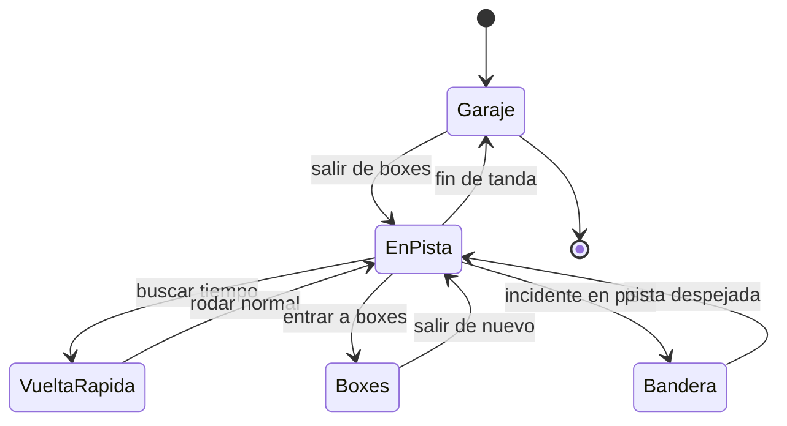

# 🎮 Diseno de simulacion de la Formula 1

[🏠 Inicio](../../../README.md) · [🏎️ Curso: Formula 1](../README.md) · 🎮 Simulacion

## Objetivo de la simulacion

Que el usuario aprenda a frenar tarde y recto, seguir la trazada, gestionar la
energia ERS, cuidar los neumaticos y respetar las banderas, de forma segura y
progresiva.

## Nivel de realismo

- Nivel elegido: se ofrece del 1 al 3 (ver `docs/03-niveles-de-realismo.md`).
- Justificacion: el monoplaza es el vehiculo terrestre mas exigente del
  repositorio; se recomienda dominar antes el curso de automoviles.

## Variables principales

| Variable | Tipo | Rango | Afecta a | Comentarios |
| --- | --- | --- | --- | --- |
| Velocidad | numerica | 0-350 km/h | Movimiento y aerodinamica | Central para todo. |
| Marcha | discreta | N,1..8 | Aceleracion y freno motor | Caja secuencial. |
| Carga aerodinamica | numerica | baja-alta | Agarre en curva | Depende del reglaje. |
| Energia ERS | numerica | 0-100% | Impulso disponible | Se gasta y recupera por vuelta. |
| Adherencia | numerica | 0-1 | Freno, giro, aceleracion | Baja con lluvia y goma fria. |
| Temperatura de gomas | numerica | rango en grados | Agarre | Ventana estrecha optima. |
| Desgaste de gomas | numerica | 0-100% | Rendimiento y estrategia | Obliga a parar en boxes. |
| Combustible | numerica | 0-100% | Peso y autonomia | Menos combustible, mas rapido. |

## Ciclo basico

1. Leer entrada del usuario (acelerador, freno, marcha, direccion, DRS, ERS).
2. Actualizar unidad de potencia y estado de energia.
3. Calcular fuerzas: propulsion, frenada, carga aerodinamica y adherencia.
4. Aplicar restricciones del entorno (asfalto, clima, zonas DRS).
5. Actualizar velocidad, posicion, temperatura y desgaste.
6. Refrescar pantalla del volante y retroalimentacion (sonido, vibracion).

## Modos de juego futuros

- Tutorial guiado del volante y los pedales.
- Practica libre para aprender la trazada.
- Vuelta cronometrada con delta de referencia.
- Gestion de energia y neumaticos en tandas largas.
- Escenarios de lluvia y coche de seguridad, sin contenido sensible.

## Elementos fuera de alcance

- Presentar conduccion temeraria como objetivo del juego.
- Datos que permitan alterar sistemas reales de un monoplaza.
- Reproducir accidentes de forma gratuita o sensacionalista.

## Pendientes

- [ ] Definir valores por defecto de cada variable por tipo de circuito.
- [ ] Prototipar el ciclo basico en un motor simple.
- [ ] Ajustar el modelo de degradacion de neumaticos.
- [ ] Agregar fuentes tecnicas publicas a [`manuales/fuentes.md`](../../../manuales/fuentes.md).

---

[⬅️ Anterior: Reglamentos](../reglamentos/reglamentos-formula-1.md) · [➡️ Siguiente: Recursos](../recursos/recursos-formula-1.md)
