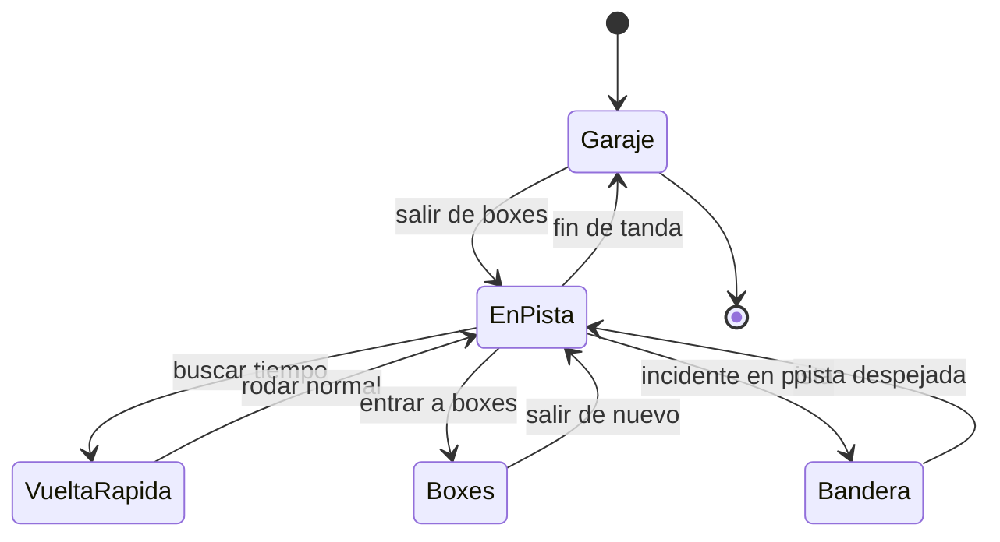

# 🎮 Diseño de simulación de la Fórmula 1

[🏠 Inicio](../../../README.md) · [🏎️ Curso: Fórmula 1](../README.md) · 🎮 Simulación

## Objetivo de la simulación

Que el usuario aprenda a frenar tarde y recto, seguir la trazada, gestionar la
energía ERS, cuidar los neumáticos y respetar las banderas, de forma segura y
progresiva.

## Nivel de realismo

- Nivel elegido: se ofrece del 1 al 3 (ver `docs/03-niveles-de-realismo.md`).
- Justificación: el monoplaza es el vehículo terrestre más exigente del
  repositorio; se recomienda dominar antes el curso de automóviles.

## Variables principales

| Variable | Tipo | Rango | Afecta a | Comentarios |
| --- | --- | --- | --- | --- |
| Velocidad | numérica | 0-350 km/h | Movimiento y aerodinámica | Central para todo. |
| Marcha | discreta | N,1..8 | Aceleración y freno motor | Caja secuencial. |
| Carga aerodinámica | numérica | baja-alta | Agarre en curva | Depende del reglaje. |
| Energía ERS | numérica | 0-100% | Impulso disponible | Se gasta y recupera por vuelta. |
| Adherencia | numérica | 0-1 | Freno, giro, aceleración | Baja con lluvia y goma fría. |
| Temperatura de gomas | numérica | rango en grados | Agarre | Ventana estrecha óptima. |
| Desgaste de gomas | numérica | 0-100% | Rendimiento y estrategia | Obliga a parar en boxes. |
| Combustible | numérica | 0-100% | Peso y autonomía | Menos combustible, más rápido. |

## Ciclo básico

1. Leer entrada del usuario (acelerador, freno, marcha, dirección, DRS, ERS).
2. Actualizar unidad de potencia y estado de energía.
3. Calcular fuerzas: propulsión, frenada, carga aerodinámica y adherencia.
4. Aplicar restricciones del entorno (asfalto, clima, zonas DRS).
5. Actualizar velocidad, posición, temperatura y desgaste.
6. Refrescar pantalla del volante y retroalimentación (sonido, vibración).

## Modos de juego futuros

- Tutorial guiado del volante y los pedales.
- Práctica libre para aprender la trazada.
- Vuelta cronometrada con delta de referencia.
- Gestión de energía y neumáticos en tandas largas.
- Escenarios de lluvia y coche de seguridad, sin contenido sensible.

## Elementos fuera de alcance

- Presentar conducción temeraria como objetivo del juego.
- Datos que permitan alterar sistemas reales de un monoplaza.
- Reproducir accidentes de forma gratuita o sensacionalista.

## Pendientes

- [ ] Definir valores por defecto de cada variable por tipo de circuito.
- [ ] Prototipar el ciclo básico en un motor simple.
- [ ] Ajustar el modelo de degradación de neumáticos.
- [ ] Agregar fuentes técnicas públicas a [`manuales/fuentes.md`](../../../manuales/fuentes.md).

---

[⬅️ Anterior: Reglamentos](../reglamentos/reglamentos-formula-1.md) · [➡️ Siguiente: Recursos](../recursos/recursos-formula-1.md)
