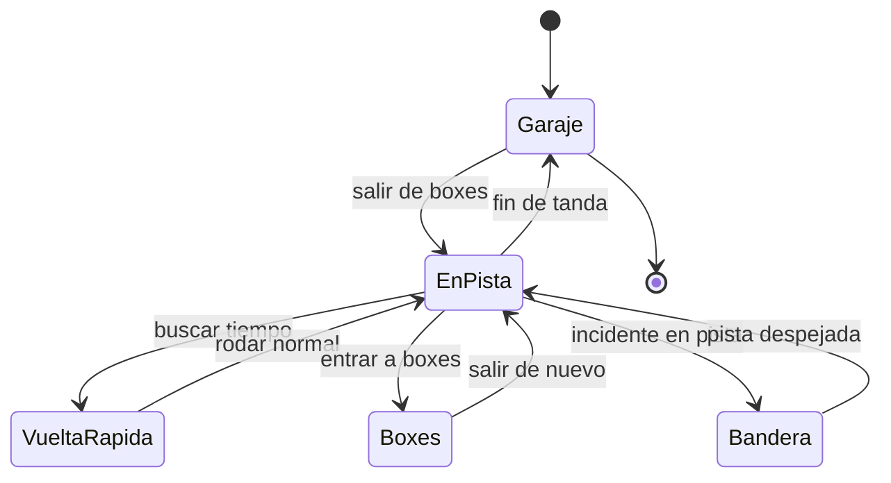
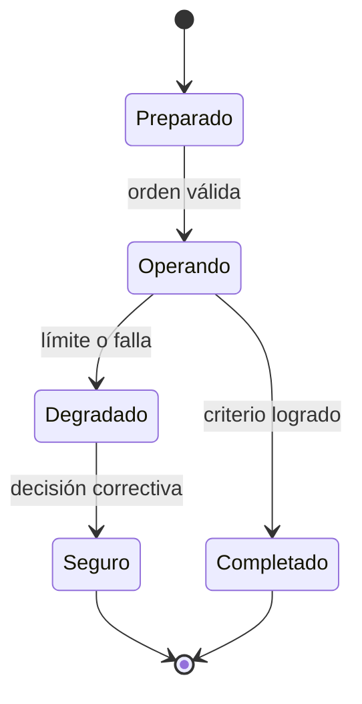

<!-- clase-meta
tipo_documento: clase
clase: 9
codigo: FORMULA1-09
curso: formula-1
titulo: "Diseño de simulación de la Fórmula 1"
modalidad: "laboratorio de diseño"
duracion_minutos: 90
nivel: introductorio
prerrequisito: FORMULA1-08
competencia: "modelado_de_simulacion"
resultados_aprendizaje:
  - "Explicar objetivo, variables, estados, ciclo y escenarios de simulación con vocabulario propio de Fórmula 1."
  - "Aplicar esos conceptos a una decisión segura o a un escenario de simulación de Fórmula 1."
evidencia: "Ficha de escenario y diagrama de estados."
criterio_aprobacion: "El modelo es específico de la máquina, medible, seguro y trazable a clases anteriores."
fuentes: manuales/fuentes.md
ultima_revision: 2026-09-10
-->

# 🎮 Diseño de simulación de la Fórmula 1

[🏠 Inicio](../../../README.md) · [🏎️ Curso: Fórmula 1](../README.md) · 🎮 Simulación

```mermaid
stateDiagram-v2
    [*] --> Garaje
    Garaje --> EnPista: salir de boxes
    EnPista --> VueltaRapida: buscar tiempo
    VueltaRapida --> EnPista: rodar normal
    EnPista --> Boxes: entrar a boxes
    Boxes --> EnPista: salir de nuevo
    EnPista --> Bandera: incidente en pista
    Bandera --> EnPista: pista despejada
    EnPista --> Garaje: fin de tanda
    Garaje --> [*]
```

## Objetivo de la simulación

Que el usuario aprenda a frenar tarde y recto, seguir la trazada, gestionar la
energía ERS, cuidar los neumáticos y respetar las banderas, de forma segura y
progresiva.

## Nivel de realismo

- Nivel elegido: se ofrece del 1 al 3 (ver `docs/03-niveles-de-realismo.md`).
- Justificación: el monoplaza es el vehículo terrestre más exigente del
  repositorio; se recomienda dominar antes el curso de automóviles.

## Variables principales

| Variable | Tipo | Rango | Afecta a | Comentarios |
| --- | --- | --- | --- | --- |
| Velocidad | numérica | 0-350 km/h | Movimiento y aerodinámica | Central para todo. |
| Marcha | discreta | N,1..8 | Aceleración y freno motor | Caja secuencial. |
| Carga aerodinámica | numérica | baja-alta | Agarre en curva | Depende del reglaje. |
| Energía ERS | numérica | 0-100% | Impulso disponible | Se gasta y recupera por vuelta. |
| Adherencia | numérica | 0-1 | Freno, giro, aceleración | Baja con lluvia y goma fría. |
| Temperatura de gomas | numérica | rango en grados | Agarre | Ventana estrecha óptima. |
| Desgaste de gomas | numérica | 0-100% | Rendimiento y estrategia | Obliga a parar en boxes. |
| Combustible | numérica | 0-100% | Peso y autonomía | Menos combustible, más rápido. |

## Ciclo básico

1. Leer entrada del usuario (acelerador, freno, marcha, dirección, DRS, ERS).
2. Actualizar unidad de potencia y estado de energía.
3. Calcular fuerzas: propulsión, frenada, carga aerodinámica y adherencia.
4. Aplicar restricciones del entorno (asfalto, clima, zonas DRS).
5. Actualizar velocidad, posición, temperatura y desgaste.
6. Refrescar pantalla del volante y retroalimentación (sonido, vibración).

## Modos de juego futuros

- Tutorial guiado del volante y los pedales.
- Práctica libre para aprender la trazada.
- Vuelta cronometrada con delta de referencia.
- Gestión de energía y neumáticos en tandas largas.
- Escenarios de lluvia y coche de seguridad, sin contenido sensible.

## Elementos fuera de alcance

- Presentar conducción temeraria como objetivo del juego.
- Datos que permitan alterar sistemas reales de un monoplaza.
- Reproducir accidentes de forma gratuita o sensacionalista.

## Pendientes

- [ ] Definir valores por defecto de cada variable por tipo de circuito.
- [ ] Prototipar el ciclo básico en un motor simple.
- [ ] Ajustar el modelo de degradación de neumáticos.
- [ ] Agregar fuentes técnicas públicas a [`manuales/fuentes.md`](../../../manuales/fuentes.md).

## 🧭 Guía de estudio aplicada

### Pregunta guía

¿Cómo ayuda **Objetivo de la simulación, Nivel de realismo, Variables principales y Ciclo básico** a **modelar entrada y salida de una curva rápida durante una tanda con neumáticos degradados como estados, variables y decisiones observables**?

### Explicación razonada

Una simulación de Fórmula 1 es educativa si representa decisiones y consecuencias. Como mínimo debe modelar el estado de unidad de potencia, la respuesta de caja secuencial, la transición en diferencial y el resultado en neumáticos. El escenario «entrada y salida de una curva rápida durante una tanda con neumáticos degradados» es valioso porque obliga a observar, formular una hipótesis, actuar y comprobar.

```mermaid
stateDiagram-v2
    [*] --> Preparado
    Preparado --> Operando: orden válida
    Operando --> Degradado: límite o falla
    Degradado --> Seguro: decisión correctiva
    Operando --> Completado: criterio logrado
    Seguro --> [*]
    Completado --> [*]
```

Esta clase se conecta con el resto del curso mediante **interacción entre carga aerodinámica, temperatura del neumático y balance del monoplaza**. El hilo de
seguridad consiste en reconocer a tiempo **sobrepasar el agarre disponible al cambiar el balance con freno, volante o acelerador** y poder justificar la decisión
**sacrificar velocidad de entrada para conservar estabilidad y tracción de salida**; en clases posteriores cambiará el ángulo de análisis, no esa relación causal.
La lectura funcional común sigue **unidad de potencia → caja secuencial → diferencial → neumáticos**, de modo que cada concepto pueda
ubicarse dentro del funcionamiento completo y no quede como un dato aislado.

**Apoyo documental:** [Formula 1 Regulations](https://www.fia.com/regulations/formula-1) aporta reglamento, arquitectura y seguridad de Fórmula 1;
[Vehicle Safety](https://www.nhtsa.gov/vehicle-safety) se usa para seguridad de vehículos terrestres. Estas fuentes
se contrastan con el alcance de la clase y no sustituyen un manual de equipo concreto.

### Caso resuelto: de la observación a la decisión

1. **Estado inicial:** representa entrada y salida de una curva rápida durante una tanda con neumáticos degradados con valores observables para **unidad de potencia**, **caja secuencial**, **diferencial** y **neumáticos**.
2. **Decisión del estudiante:** ofrece una elección que cambie el estado, no una animación automática.
3. **Consecuencia:** modela la tendencia hacia **sobrepasar el agarre disponible al cambiar el balance con freno, volante o acelerador** y una señal previa que permita corregir.
4. **Cierre:** evalúa la explicación de la decisión, además de si el estudiante “ganó” el escenario.

### Comprueba tu comprensión

1. ¿Qué cuatro estados mínimos necesita el escenario «entrada y salida de una curva rápida durante una tanda con neumáticos degradados»?
2. ¿Qué variable anticipa **sobrepasar el agarre disponible al cambiar el balance con freno, volante o acelerador** antes de llegar al estado de falla?
3. ¿Cómo evaluarías la explicación del estudiante y no solo el resultado final?

Orientación para revisar tus respuestas

- La primera respuesta debe relacionar el eslabón elegido con un efecto posterior, no solo nombrarlo.
- La segunda debe proponer una señal medible u observable y explicar qué tendencia sería preocupante.
- La tercera debe cambiar al menos una variable de capacidad, mando, entorno o margen de seguridad.

## 🎓 Cierre de clase

- **Actividad:** Diseña un escenario educativo de Fórmula 1 basado en objetivo, variables, estados, ciclo y escenarios de simulación, con entradas, estados, variables y criterio de cierre.
- **Evidencia:** Ficha de escenario y diagrama de estados.
- **Criterio de aprobación:** El modelo es específico de la máquina, medible, seguro y trazable a clases anteriores.
- **Transferencia:** explica qué cambiaría al pasar a otra variante de esta máquina.

### Fuentes de esta clase

- [FIA-F1-2026](https://www.fia.com/regulations/formula-1): Formula 1 Regulations, FIA. Uso: reglamento, arquitectura y seguridad de Fórmula 1.
- [US-NHTSA](https://www.nhtsa.gov/vehicle-safety): Vehicle Safety, NHTSA. Uso: seguridad de vehículos terrestres.
- [NASA-FLIGHT](https://www1.grc.nasa.gov/beginners-guide-to-aeronautics/): Beginner's Guide to Aeronautics, NASA. Uso: contraste con física y vuelo reales.

> Las fuentes sostienen el marco conceptual y normativo; esta clase no reemplaza el manual
> del fabricante, la formación certificada ni la habilitación exigida para operar equipos reales.

---

[⬅️ Anterior: Reglamentos](../reglamentos/reglamentos-formula-1.md) · [➡️ Siguiente: Recursos](../recursos/recursos-formula-1.md)
