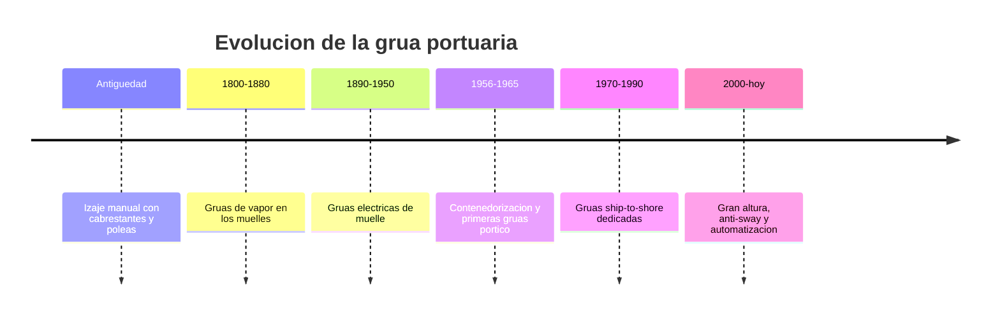

# 📜 Historia de la grua portuaria

[🏠 Inicio](../../../README.md) · [⚓ Curso: Grua portuaria](../README.md) · 📜 Historia

## Origen

El movimiento de carga en los puertos comenzo con el esfuerzo humano y animal,
apoyado en cabrestantes, poleas y planos inclinados. Cada bulto se manipulaba de
forma individual, lo que hacia la carga y descarga de un buque lenta, costosa y
peligrosa. La necesidad de mover mas peso en menos tiempo empujo la mecanizacion
del muelle.

## Linea de tiempo

| Periodo | Hito | Importancia |
| --- | --- | --- |
| Antiguedad | Izaje manual con poleas y cabrestantes | Primeras maquinas simples de izaje. |
| 1800-1880 | Gruas de vapor en los muelles | Fuerza mecanica constante en el puerto. |
| 1890-1950 | Gruas electricas de muelle | Control mas fino y limpio que el vapor. |
| 1956-1965 | Contenedorizacion y primeras gruas portico | Nace la caja estandar y su izaje. |
| 1970-1990 | Gruas ship-to-shore dedicadas | Maquinas disenadas solo para contenedores. |
| 2000-presente | Gran altura, anti-sway y automatizacion | Mas productividad y buques mayores. |

## Evolucion tecnologica

- **Estructura**: del brazo simple de vapor al gran portico de acero sobre rieles.
- **Propulsion**: del vapor a los motores electricos alimentados desde el muelle.
- **Carga**: del bulto suelto al contenedor ISO manipulado con spreader.
- **Control**: de palancas mecanicas a mandos electricos y sistemas anti-sway.
- **Seguridad**: enclavamientos, limites de carga y sensores de posicion.
- **Automatizacion**: patios y gruas semiautomaticas en terminales modernos.

## Tipos representativos

| Tipo | Uso tipico | Caracteristica destacada |
| --- | --- | --- |
| Portico ship-to-shore STS | Muelle de contenedores | Pluma sobre el buque y trolley con spreader. |
| Grua movil portuaria | Puertos multiproposito | Autopropulsada, versatil, sin rieles fijos. |
| RTG de patio | Apilado en el terminal | Portico sobre neumaticos que recorre bloques. |
| RMG de patio | Apilado sobre rieles | Portico ferroviario de patio, muy preciso. |
| Grua de pluma | Carga general y granel | Brazo giratorio de alcance variable. |

## Impacto social y economico

La contenedorizacion, apoyada en la grua portico, transformo el comercio
mundial: redujo drasticamente el tiempo y el costo de cargar un buque y permitio
cadenas logisticas globales. El puerto dejo de ser un cuello de botella y paso a
medir su eficiencia en contenedores por hora, con la grua ship-to-shore como
maquina central de esa productividad.

## Fuentes

- Registrar aqui las fuentes publicas consultadas.
- Enlazar cada fuente tambien en [`manuales/fuentes.md`](../../../manuales/fuentes.md).

---

[🎓 Portada del curso](../README.md) · [➡️ Siguiente: Caracteristicas](../operacion/caracteristicas-grua-portuaria.md)
