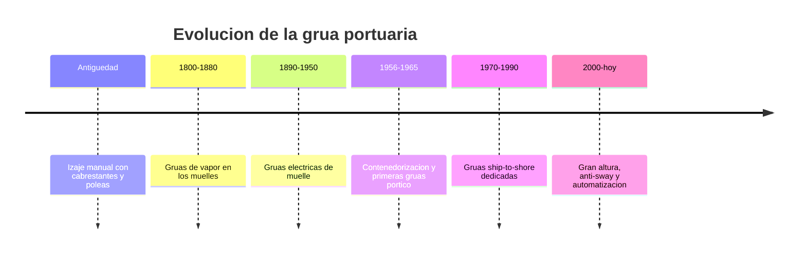

# 📜 Historia de la grúa portuaria

[🏠 Inicio](../../../README.md) · [⚓ Curso: Grúa portuaria](../README.md) · 📜 Historia

## Origen

El movimiento de carga en los puertos comenzó con el esfuerzo humano y animal,
apoyado en cabrestantes, poleas y planos inclinados. Cada bulto se manipulaba de
forma individual, lo que hacia la carga y descarga de un buque lenta, costosa y
peligrosa. La necesidad de mover más peso en menos tiempo empujo la mecanización
del muelle.

## Línea de tiempo

| Periodo | Hito | Importancia |
| --- | --- | --- |
| Antiguedad | Izaje manual con poleas y cabrestantes | Primeras máquinas simples de izaje. |
| 1800-1880 | Grúas de vapor en los muelles | Fuerza mecánica constante en el puerto. |
| 1890-1950 | Grúas eléctricas de muelle | Control más fino y limpio que el vapor. |
| 1956-1965 | Contenedorización y primeras grúas pórtico | Nace la caja estandar y su izaje. |
| 1970-1990 | Grúas ship-to-shore dedicadas | Máquinas disenadas solo para contenedores. |
| 2000-presente | Gran altura, anti-sway y automatización | Más productividad y buques mayores. |

## Evolución tecnológica

- **Estructura**: del brazo simple de vapor al gran pórtico de acero sobre rieles.
- **Propulsión**: del vapor a los motores eléctricos alimentados desde el muelle.
- **Carga**: del bulto suelto al contenedor ISO manipulado con spreader.
- **Control**: de palancas mecánicas a mandos eléctricos y sistemas anti-sway.
- **Seguridad**: enclavamientos, límites de carga y sensores de posición.
- **Automatización**: patios y grúas semiautomaticas en terminales modernos.

## Tipos representativos

| Tipo | Uso típico | Característica destacada |
| --- | --- | --- |
| Pórtico ship-to-shore STS | Muelle de contenedores | Pluma sobre el buque y trolley con spreader. |
| Grúa móvil portuaria | Puertos multiproposito | Autopropulsada, versátil, sin rieles fijos. |
| RTG de patio | Apilado en el terminal | Pórtico sobre neumáticos que recorre bloques. |
| RMG de patio | Apilado sobre rieles | Pórtico ferroviario de patio, muy preciso. |
| Grúa de pluma | Carga general y granel | Brazo giratorio de alcance variable. |

## Impacto social y económico

La contenedorización, apoyada en la grúa pórtico, transformó el comercio
mundial: redujo drasticamente el tiempo y el costo de cargar un buque y permitió
cadenas logísticas globales. El puerto dejó de ser un cuello de botella y paso a
medir su eficiencia en contenedores por hora, con la grúa ship-to-shore como
máquina central de esa productividad.

## Fuentes

- Registrar aquí las fuentes públicas consultadas.
- Enlazar cada fuente también en [`manuales/fuentes.md`](../../../manuales/fuentes.md).

---

[🎓 Portada del curso](../README.md) · [➡️ Siguiente: Características](../operacion/caracteristicas-grua-portuaria.md)
