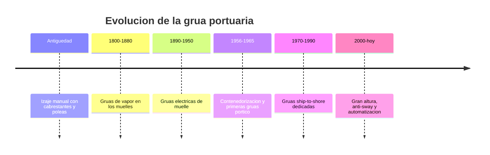

<!-- clase-meta
tipo_documento: clase
clase: 1
codigo: GRUAPORTUARI-01
curso: grua-portuaria
titulo: "Historia de la grúa portuaria"
modalidad: "teórica dialogada"
duracion_minutos: 45
nivel: introductorio
prerrequisito: ninguno
competencia: "contexto_historico"
resultados_aprendizaje:
  - "Explicar origen, evolución tecnológica, variantes representativas e impacto con vocabulario propio de Grúa portuaria."
  - "Aplicar esos conceptos a una decisión segura o a un escenario de simulación de Grúa portuaria."
evidencia: "Línea de tiempo comentada con cuatro hitos o más."
criterio_aprobacion: "Los hitos están ordenados, son pertinentes y dos relaciones de causa y efecto quedan justificadas."
fuentes: manuales/fuentes.md
ultima_revision: 2026-09-10
-->

# 📜 Historia de la grúa portuaria

[🏠 Inicio](../../../README.md) · [⚓ Curso: Grúa portuaria](../README.md) · 📜 Historia

```mermaid
timeline
    title Evolucion de la grua portuaria
    Antiguedad : Izaje manual con cabrestantes y poleas
    1800-1880 : Gruas de vapor en los muelles
    1890-1950 : Gruas electricas de muelle
    1956-1965 : Contenedorizacion y primeras gruas portico
    1970-1990 : Gruas ship-to-shore dedicadas
    2000-hoy : Gran altura, anti-sway y automatizacion
```

## Origen

El movimiento de carga en los puertos comenzó con el esfuerzo humano y animal,
apoyado en cabrestantes, poleas y planos inclinados. Cada bulto se manipulaba de
forma individual, lo que hacia la carga y descarga de un buque lenta, costosa y
peligrosa. La necesidad de mover más peso en menos tiempo empujo la mecanización
del muelle.

## Línea de tiempo

| Periodo | Hito | Importancia |
| --- | --- | --- |
| Antiguedad | Izaje manual con poleas y cabrestantes | Primeras máquinas simples de izaje. |
| 1800-1880 | Grúas de vapor en los muelles | Fuerza mecánica constante en el puerto. |
| 1890-1950 | Grúas eléctricas de muelle | Control más fino y limpio que el vapor. |
| 1956-1965 | Contenedorización y primeras grúas pórtico | Nace la caja estandar y su izaje. |
| 1970-1990 | Grúas ship-to-shore dedicadas | Máquinas disenadas solo para contenedores. |
| 2000-presente | Gran altura, anti-sway y automatización | Más productividad y buques mayores. |

## Evolución tecnológica

- **Estructura**: del brazo simple de vapor al gran pórtico de acero sobre rieles.
- **Propulsión**: del vapor a los motores eléctricos alimentados desde el muelle.
- **Carga**: del bulto suelto al contenedor ISO manipulado con spreader.
- **Control**: de palancas mecánicas a mandos eléctricos y sistemas anti-sway.
- **Seguridad**: enclavamientos, límites de carga y sensores de posición.
- **Automatización**: patios y grúas semiautomaticas en terminales modernos.

## Tipos representativos

| Tipo | Uso típico | Característica destacada |
| --- | --- | --- |
| Pórtico ship-to-shore STS | Muelle de contenedores | Pluma sobre el buque y trolley con spreader. |
| Grúa móvil portuaria | Puertos multiproposito | Autopropulsada, versátil, sin rieles fijos. |
| RTG de patio | Apilado en el terminal | Pórtico sobre neumáticos que recorre bloques. |
| RMG de patio | Apilado sobre rieles | Pórtico ferroviario de patio, muy preciso. |
| Grúa de pluma | Carga general y granel | Brazo giratorio de alcance variable. |

## Impacto social y económico

La contenedorización, apoyada en la grúa pórtico, transformó el comercio
mundial: redujo drasticamente el tiempo y el costo de cargar un buque y permitió
cadenas logísticas globales. El puerto dejó de ser un cuello de botella y paso a
medir su eficiencia en contenedores por hora, con la grúa ship-to-shore como
máquina central de esa productividad.

## 🧭 Guía de estudio aplicada

### Pregunta guía

¿Cómo ayuda **Origen, Línea de tiempo, Evolución tecnológica y Tipos representativos** a **explicar cómo la evolución hizo posibles alternativas como grúa pórtico STS frente a grúa móvil portuaria**?

### Explicación razonada

La evolución de Grúa portuaria se comprende mejor como una sucesión de respuestas a problemas, no como una lista de fechas. Los cambios en alimentación, accionamientos, carro y cables y spreader y contenedor alteraron qué podía hacer la máquina, quién podía usarla y qué riesgos debían controlarse. El contraste «grúa pórtico STS frente a grúa móvil portuaria» permite observar qué decisiones de diseño permanecieron y cuáles cambiaron con la tecnología y el propósito.

Esta clase se conecta con el resto del curso mediante **control del péndulo y productividad sin superar límites estructurales ni de viento**. El hilo de
seguridad consiste en reconocer a tiempo **oscilación, enganche incompleto o ingreso de personas al área de caída** y poder justificar la decisión
**detener o suavizar el ciclo según viento, señalización y estabilidad de la carga**; en clases posteriores cambiará el ángulo de análisis, no esa relación causal.
La lectura funcional común sigue **alimentación → accionamientos → carro y cables → spreader y contenedor**, de modo que cada concepto pueda
ubicarse dentro del funcionamiento completo y no quede como un dato aislado.

**Apoyo documental:** [Crane, Derrick and Hoist Safety](https://www.osha.gov/cranes-derricks) aporta izaje, riesgos y controles;
[Safety of Navigation](https://www.imo.org/en/ourwork/safety/pages/navigationdefault.aspx) se usa para navegación, SOLAS, COLREG y STCW. Estas fuentes
se contrastan con el alcance de la clase y no sustituyen un manual de equipo concreto.

### Caso resuelto: de la observación a la decisión

1. **Situar:** ordena los hitos que explican cómo se llegó a **grúa pórtico STS frente a grúa móvil portuaria** y describe la necesidad que impulsó cada cambio.
2. **Relacionar:** explica qué se modificó en **alimentación**, **accionamientos**, **carro y cables** o **spreader y contenedor**; una fecha sin mecanismo no basta.
3. **Interpretar:** vincula el cambio con una capacidad nueva y también con el riesgo **oscilación, enganche incompleto o ingreso de personas al área de caída**.
4. **Transferir:** usa la evolución para justificar por qué hoy conviene **detener o suavizar el ciclo según viento, señalización y estabilidad de la carga**.

### Comprueba tu comprensión

1. ¿Qué necesidad histórica impulsó un cambio en **alimentación** o **accionamientos**?
2. ¿Qué hito modificó la relación entre capacidad y **oscilación, enganche incompleto o ingreso de personas al área de caída**?
3. ¿Por qué **grúa pórtico STS frente a grúa móvil portuaria** no puede explicarse como una simple diferencia estética?

Orientación para revisar tus respuestas

- La primera respuesta debe relacionar el eslabón elegido con un efecto posterior, no solo nombrarlo.
- La segunda debe proponer una señal medible u observable y explicar qué tendencia sería preocupante.
- La tercera debe cambiar al menos una variable de capacidad, mando, entorno o margen de seguridad.

## 🎓 Cierre de clase

- **Actividad:** Construye una línea de tiempo de Grúa portuaria y explica cómo dos cambios históricos transformaron su función o su puesto de mando.
- **Evidencia:** Línea de tiempo comentada con cuatro hitos o más.
- **Criterio de aprobación:** Los hitos están ordenados, son pertinentes y dos relaciones de causa y efecto quedan justificadas.
- **Transferencia:** explica qué cambiaría al pasar a otra variante de esta máquina.

### Fuentes de esta clase

- [OSHA-CRANES](https://www.osha.gov/cranes-derricks): Crane, Derrick and Hoist Safety, OSHA. Uso: izaje, riesgos y controles.
- [IMO-NAV](https://www.imo.org/en/ourwork/safety/pages/navigationdefault.aspx): Safety of Navigation, International Maritime Organization. Uso: navegación, SOLAS, COLREG y STCW.
- [CL-DIRECTEMAR](https://www.directemar.cl/directemar/marco-normativo): Marco normativo, DIRECTEMAR. Uso: marco marítimo chileno.

> Las fuentes sostienen el marco conceptual y normativo; esta clase no reemplaza el manual
> del fabricante, la formación certificada ni la habilitación exigida para operar equipos reales.

---

[🎓 Portada del curso](../README.md) · [➡️ Siguiente: Características](../operacion/caracteristicas-grua-portuaria.md)
