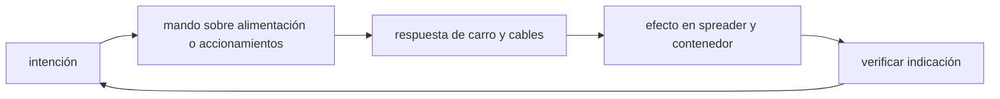

<!-- clase-meta
tipo_documento: clase
clase: 5
codigo: GRUAPORTUARI-05
curso: grua-portuaria
titulo: "Mandos e instrumentos de la grúa portuaria"
modalidad: "taller de simulación"
duracion_minutos: 60
nivel: introductorio
prerrequisito: GRUAPORTUARI-04
competencia: "lectura_y_mando"
resultados_aprendizaje:
  - "Explicar controles, instrumentos, entradas y estados del sistema con vocabulario propio de Grúa portuaria."
  - "Aplicar esos conceptos a una decisión segura o a un escenario de simulación de Grúa portuaria."
evidencia: "Mapa de mandos y resolución de dos estados del tablero."
criterio_aprobacion: "Reconoce los controles críticos y responde a los estados sin introducir acciones inseguras."
fuentes: manuales/fuentes.md
ultima_revision: 2026-09-10
-->

# 🎛️ Mandos e instrumentos de la grúa portuaria

[🏠 Inicio](../../../README.md) · [⚓ Curso: Grúa portuaria](../README.md) · 🎛️ Mandos

## Vista general

El puesto de mando de una grúa pórtico ship-to-shore es una cabina que suele ir
montada en el trolley, mirando hacia abajo el punto de izaje. El operador
controla los movimientos con dos joysticks proporcionales, apoyados en pedales y
botonera para el spreader, mientras vigila una consola de instrumentos con la
carga, la posición y el viento. A diferencia de un vehículo de calle, aquí la
prioridad no es la velocidad sino la precisión del posicionamiento y el control
del balanceo de la carga.

## Mapa de controles

| Zona | Control | Tipo | Función | Prioridad | Comentarios |
| --- | --- | --- | --- | --- | --- |
| Joystick izquierdo | Traslación del trolley | Joystick proporcional | Mover el carro entre buque y muelle | Alta | Define el alcance horizontal del izaje. |
| Joystick izquierdo | Traslación del gantry | Joystick proporcional | Mover el pórtico sobre los rieles | Alta | Reposiciona la grúa frente a otra bahía. |
| Joystick derecho | Izaje hoist | Joystick proporcional | Subir y bajar el spreader | Alta | Controla el izaje vertical de la carga. |
| Joystick derecho | Anti-sway | Botón o modo | Activar el control de balanceo | Alta | Estabiliza el contenedor colgado. |
| Botonera | Spreader bajar/subir twist-locks | Botones | Trabar y liberar el contenedor | Alta | Solo iza con la carga trabada. |
| Botonera | Telescopiado del spreader | Botones | Ajustar a 20, 40 o 45 pies | Alta | Debe coincidir con el contenedor. |
| Consola | Abatimiento de la pluma | Palanca | Subir o bajar el boom | Media | Se opera con la grúa sin carga. |
| Consola | Parada de emergencia | Botón hongo | Cortar todos los movimientos | Alta | Detiene la operación de inmediato. |
| Cabina | Instrumentos y cámaras | Pantalla | Mostrar estado y vistas | Alta | Ver sección de instrumentos. |

## Instrumentos principales

| Instrumento | Mide o muestra | Unidad | Importancia | Notas |
| --- | --- | --- | --- | --- |
| Indicador de carga | Peso izado por el spreader | t | Alta | Debe respetar el límite de la grúa. |
| Límite de carga | Carga actual vs máxima | % | Alta | Avisa y corta al acercarse al límite. |
| Posición del trolley | Distancia del carro sobre la viga | m | Alta | Ubica el punto de izaje. |
| Altura del spreader | Posición vertical del izaje | m | Alta | Evita topes y colisiones. |
| Estado de twist-locks | Trabado o liberado | luz | Alta | Habilita o impide el izaje. |
| Anemómetro | Velocidad del viento | km/h o m/s | Alta | El viento define el límite operacional. |
| Posición del gantry | Ubicación en el muelle | m o bahía | Media | Alinea la grúa con la bodega. |
| Cámaras | Vistas del spreader y del apoyo | imagen | Alta | Apoyan el posicionamiento fino. |

## Entradas de simulación

| Acción | Teclado | Controlador | Pantalla táctil | Comentarios |
| --- | --- | --- | --- | --- |
| Trasladar trolley | Flechas izq/der | Stick izquierdo horizontal | Zona trolley | Proporcional, no on/off. |
| Trasladar gantry | Teclas A/D | Stick izquierdo vertical | Zona gantry | Movimiento lento sobre rieles. |
| Izar o bajar | Flechas arriba/abajo | Stick derecho vertical | Zona hoist | Controla el izaje vertical. |
| Trabar twist-locks | Tecla T | Botón derecho | Botón spreader | Requerido para izar. |
| Telescopiar spreader | Teclas R/F | Cruceta | Panel spreader | Ajusta a la longitud del contenedor. |
| Activar anti-sway | Tecla Z | Botón lateral | Botón anti-sway | Estabiliza el balanceo. |
| Parada de emergencia | Barra espaciadora | Botón dedicado | Botón rojo | Corta todos los movimientos. |

## Estados del sistema

| Estado | Descripción | Indicadores | Acciones disponibles |
| --- | --- | --- | --- |
| Apagado | Grúa sin energía | Consola off | Encender, planificar. |
| Preparada | Energizada, pluma abajo | Instrumentos activos | Posicionar gantry y trolley. |
| Enganchando | Spreader sobre el contenedor | Sensores de asiento | Trabar twist-locks. |
| Izando | Levantando o moviendo carga | Carga y anti-sway activos | Izar, trasladar, posicionar. |
| Emergencia | Sobrecarga, viento o falla | Alarma y luz roja | Parar, bajar carga, asegurar. |

## Observaciones ergonomicas y de seguridad

- El indicador de carga y el anemómetro deben estar siempre visibles en la cabina.
- Los joysticks proporcionales evitan movimientos bruscos que balancean la carga.
- El sistema debe impedir el izaje si los twist-locks no están trabados.
- La cabina en el trolley da visión directa hacia abajo, apoyada por cámaras.
- La parada de emergencia debe ser grande, roja y accesible sin mirar.
- En simulación conviene mostrar la posición del trolley y el estado del spreader
  de forma continua, para que el usuario relacione cada movimiento con la carga.

## 🧭 Guía de estudio aplicada

### Pregunta guía

¿Cómo ayuda **Vista general, Mapa de controles, Instrumentos principales y Entradas de simulación** a **interpretar mandos e indicaciones durante traslado de un contenedor desde buque con ráfagas laterales**?

### Explicación razonada

Un mando no se aprende memorizando su nombre, sino recorriendo el ciclo intención → acción → indicación → verificación. En Grúa portuaria, el operador actúa sobre alimentación o accionamientos, observa la respuesta en carro y cables y confirma el efecto en spreader y contenedor. Una indicación inesperada exige detener la secuencia mental, identificar el modo activo y evitar una segunda orden que agrave el estado.

Esta clase se conecta con el resto del curso mediante **control del péndulo y productividad sin superar límites estructurales ni de viento**. El hilo de
seguridad consiste en reconocer a tiempo **oscilación, enganche incompleto o ingreso de personas al área de caída** y poder justificar la decisión
**detener o suavizar el ciclo según viento, señalización y estabilidad de la carga**; en clases posteriores cambiará el ángulo de análisis, no esa relación causal.
La lectura funcional común sigue **alimentación → accionamientos → carro y cables → spreader y contenedor**, de modo que cada concepto pueda
ubicarse dentro del funcionamiento completo y no quede como un dato aislado.

**Apoyo documental:** [Crane, Derrick and Hoist Safety](https://www.osha.gov/cranes-derricks) aporta izaje, riesgos y controles;
[Safety of Navigation](https://www.imo.org/en/ourwork/safety/pages/navigationdefault.aspx) se usa para navegación, SOLAS, COLREG y STCW. Estas fuentes
se contrastan con el alcance de la clase y no sustituyen un manual de equipo concreto.

### Caso resuelto: de la observación a la decisión

1. **Intención:** formula qué cambio se necesita durante **traslado de un contenedor desde buque con ráfagas laterales**.
2. **Mando:** identifica el control que actúa sobre **alimentación** o **accionamientos** y el modo que debe estar activo.
3. **Lectura:** localiza la indicación que confirma la respuesta de **carro y cables** y el efecto en **spreader y contenedor**.
4. **Verificación:** si la lectura no coincide, no acumules órdenes; estabiliza e investiga el estado.

### Comprueba tu comprensión

1. ¿Qué mando inicia la respuesta y qué instrumento confirma que el modo correcto está activo?
2. ¿Qué indicación temprana advertiría **oscilación, enganche incompleto o ingreso de personas al área de caída**?
3. ¿Qué secuencia usarías si la respuesta de **spreader y contenedor** no coincide con la orden?

Orientación para revisar tus respuestas

- La primera respuesta debe relacionar el eslabón elegido con un efecto posterior, no solo nombrarlo.
- La segunda debe proponer una señal medible u observable y explicar qué tendencia sería preocupante.
- La tercera debe cambiar al menos una variable de capacidad, mando, entorno o margen de seguridad.

## 🎓 Cierre de clase

- **Actividad:** Recorre el puesto de mando simulado de Grúa portuaria: localiza los controles de controles, instrumentos, entradas y estados del sistema y asocia cada indicación con una decisión.
- **Evidencia:** Mapa de mandos y resolución de dos estados del tablero.
- **Criterio de aprobación:** Reconoce los controles críticos y responde a los estados sin introducir acciones inseguras.
- **Transferencia:** explica qué cambiaría al pasar a otra variante de esta máquina.

### Fuentes de esta clase

- [OSHA-CRANES](https://www.osha.gov/cranes-derricks): Crane, Derrick and Hoist Safety, OSHA. Uso: izaje, riesgos y controles.
- [IMO-NAV](https://www.imo.org/en/ourwork/safety/pages/navigationdefault.aspx): Safety of Navigation, International Maritime Organization. Uso: navegación, SOLAS, COLREG y STCW.
- [CL-DIRECTEMAR](https://www.directemar.cl/directemar/marco-normativo): Marco normativo, DIRECTEMAR. Uso: marco marítimo chileno.

> Las fuentes sostienen el marco conceptual y normativo; esta clase no reemplaza el manual
> del fabricante, la formación certificada ni la habilitación exigida para operar equipos reales.

---

[⬅️ Anterior: Sistemas mecánicos](../operacion/sistemas-mecanicos-grua-portuaria.md) · [➡️ Siguiente: Principios y operación](../operacion/principios-grua-portuaria.md)
