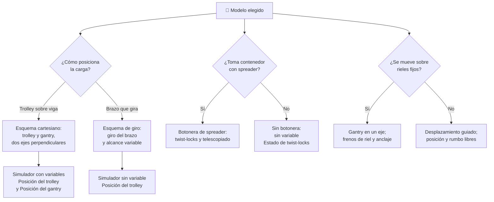

# 🧩 Modelos y variantes de la grúa portuaria

[🏠 Inicio](../../../README.md) · [⚓ Curso: Grúa portuaria](../README.md) · 🧩 Modelos

El [Módulo 2](../operacion/caracteristicas-grua-portuaria.md) ya dijo qué tipos de
grúa portuaria existen y para qué sirve cada uno: pórtico STS, móvil portuaria,
RTG, RMG y grúa de pluma. Este módulo responde a lo siguiente: **no todas se
manejan igual**, y esa diferencia no es de matiz. Cambia qué mandos tiene la
máquina y, por tanto, qué debe modelar el simulador.

> 🎯 **La idea que sostiene el módulo.** "Una grúa portuaria" no es una sola
> máquina desde el punto de vista del mando. Una grúa de pluma no tiene trolley
> ni gantry sobre rieles: no es que los tenga más lentos, es que **no existen**;
> en su lugar hay un brazo que gira. Un simulador que presente un solo esquema de
> control está representando una grúa concreta —la STS— aunque diga
> representarlas todas.

---

## 🧭 Por qué el modelo decide el simulador

El [Módulo 5](../mandos/manual-mandos-grua-portuaria.md) describe un puesto de
mando con el **joystick izquierdo** repartido entre traslación del trolley y
traslación del gantry, el derecho en el izaje, y una **botonera de spreader** con
twist-locks y telescopiado. El
[Módulo 9](../simulacion/diseno-simulador-grua-portuaria.md) expone las variables
`Posición del trolley` (0-60 m), `Posición del gantry` (0-400 m) y
`Estado de twist-locks` (trabado/libre). Ambos describen una grúa **pórtico STS
sobre rieles, con spreader de contenedores**.

En una grúa de pluma que mueve carga general o granel no hay spreader: la tecla
`T` de la botonera no traba nada y la variable `Estado de twist-locks` no tiene
valores que tomar. Y su posición no se describe con un trolley que avanza en
metros sobre una viga, sino con un brazo que gira: `Posición del trolley` deja de
ser la coordenada correcta. Si el simulador se construye sobre el esquema STS y
luego se le "añade" una grúa de pluma, el resultado es una grúa de pluma con
twist-locks, que no existe.

---

## 🗂️ Qué cambia en el manejo

| Modelo | Qué cambia al operarla |
| --- | --- |
| Pórtico STS | La referencia del curso: cabina en el trolley mirando hacia abajo, ciclo buque-muelle, energía desde el muelle sin combustible a bordo. |
| Grúa móvil portuaria | Autopropulsada y sin vía fija: el operador elige dónde estacionarla y desde qué apoyo trabaja, en lugar de recibir una vía ya trazada. |
| RTG | Pórtico sobre neumáticos: se mueve por el patio entre bloques y debe mantenerse alineado con el bloque, tarea que en la STS resuelven los rieles. |
| RMG | Pórtico sobre rieles, muy preciso: el guiado es fijo como en la STS, pero el ciclo es de apilado en patio, no de descarga de buque. |
| Grúa de pluma | Brazo giratorio de alcance variable: la carga se posiciona girando y variando alcance, no recorriendo una viga recta. |
| Anti-sway activo vs. desactivado | Con anti-sway el balanceo lo corrige la máquina; sin él, el operador debe anticipar cada arranque y cada frenado. Es el grado de asistencia que el curso documenta. |

---

## 🎛️ Qué cambia en el mando

| Modelo | Qué mando aparece o desaparece | Consecuencia |
| --- | --- | --- |
| Pórtico STS | Ninguno: el mapa de controles del Módulo 5 aplica tal cual. | Es el caso base contra el que se comparan los demás. |
| Grúa móvil portuaria | **Desaparecen** la traslación del gantry sobre rieles y el abatimiento de la pluma como maniobra de vano. **Aparece** el mando de desplazamiento autopropulsado. | El eje "a lo largo del muelle" deja de ser una guía y pasa a ser conducción libre. |
| RTG | **Desaparece** el abatimiento de la pluma. La traslación del pórtico **cambia de naturaleza**: sobre neumáticos hay que guiar el rumbo, no solo avanzar por el riel. | El joystick de gantry deja de ser un eje de una dimensión. |
| RMG | **Desaparece** el abatimiento de la pluma. El resto del mapa se conserva. | Cambian los recorridos, no los controles. |
| Grúa de pluma | **Desaparecen** la traslación del trolley, la del gantry y toda la botonera del spreader (twist-locks y telescopiado). **Aparece** el giro del brazo y la variación de alcance. | Se pasa de dos ejes perpendiculares a giro más alcance: es otro esquema de control, no otro ajuste. |
| Anti-sway desactivado | El botón o modo anti-sway del joystick derecho **existe pero no actúa**. | La corrección del balanceo vuelve por completo al operador. |

En todos los casos se conservan la parada de emergencia, el indicador de carga y
el anemómetro: son la base de seguridad común que el Módulo 5 exige mantener
siempre visible y accesible.

---

## 🎮 Qué cambia en el simulador

Contrastado con las variables del
[Módulo 9](../simulacion/diseno-simulador-grua-portuaria.md):

| Modelo | Variables que cambian | Esquema de control |
| --- | --- | --- |
| Pórtico STS | Ninguna: es el caso base. | El del Módulo 5. |
| Grúa móvil portuaria | `Posición del gantry` deja de ser una coordenada sobre riel y pasa a ser una posición libre en el muelle. `Viento` gana peso: sin frenos de riel ni anclaje, el límite operacional se apoya en otro sustento. | El mismo en el izaje; distinto en el desplazamiento de la máquina. |
| RTG | `Posición del gantry` **se desdobla**: ya no basta un valor en metros a lo largo de una vía, hace falta también el rumbo sobre el patio. | El mismo, con una entrada extra de guiado. |
| RMG | `Posición del trolley` y `Posición del gantry` **cambian de rango**: el recorrido es el del bloque de patio, no el de la viga sobre el buque. | El mismo. |
| Grúa de pluma | `Posición del trolley` **se elimina** y se sustituye por giro más alcance. `Estado de twist-locks` **desaparece**: sin spreader no hay perno que trabar. `Peso de la carga` deja de sumar el peso propio del spreader. | Sin entradas de trolley, gantry ni spreader; con giro del brazo. |
| Anti-sway desactivado | `Balanceo de la carga` conserva su rango, pero deja de reducirse solo: pasa a depender por completo de la suavidad de la entrada del usuario. | El mismo, con el modo anti-sway inerte. |

Los rangos que el Módulo 9 declara —trolley 0-60 m, spreader 0-40 m, carga
0-50 t, balanceo -30..30 grados, viento 0-30 m/s, gantry 0-400 m— describen la
STS. El propio Módulo 9 deja pendiente **definir valores por defecto de cada
variable por tipo de grúa portuaria**: este módulo dice por qué ese pendiente no
se resuelve copiando la tabla y cambiando números.

---

## 🗺️ Del modelo al esquema de control

---

## ⚠️ Qué modelos no comparten simulador

Dos familias no se resuelven con un ajuste de parámetros, porque su esquema de
control es otro:

- **La grúa de pluma** frente a las de contenedores: desaparecen tres entradas
  —trolley, gantry y botonera del spreader—, aparece el giro del brazo y dos
  variables declaradas se quedan sin contenido. Es un modo de control distinto,
  no una dificultad distinta.
- **Las grúas sin vía fija** —la móvil portuaria y la RTG sobre neumáticos—
  frente a las de riel: la posición de la máquina deja de ser un número sobre una
  guía y pasa a necesitar rumbo. La entrada de gantry del Módulo 5 no la
  representa.

La STS y la RMG sí caben en un mismo simulador ajustando rangos: comparten
pórtico sobre rieles, trolley, spreader y twist-locks, y se diferencian en el
recorrido y en el destino de la carga. Eso encaja con los
[niveles de realismo](../../../docs/03-niveles-de-realismo.md) que el curso usa:
en el nivel 1 casi todas se comportan igual, y las diferencias emergen a medida
que el nivel sube.

Queda una pregunta que este módulo **no puede cerrar**: si cada familia exige una
habilitación distinta del operador. El
[Módulo 8](../reglamentos/reglamentos-grua-portuaria.md) marca el detalle de la
certificación como **(por confirmar)**, y mientras siga así, el simulador puede
separar esquemas de control pero no afirmar qué acredita cada uno.

---

[⬅️ Anterior: Características](../operacion/caracteristicas-grua-portuaria.md) · [➡️ Siguiente: Sistemas mecánicos](../operacion/sistemas-mecanicos-grua-portuaria.md)
