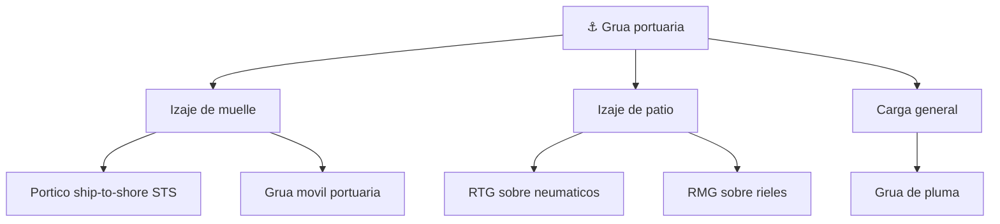

# 📋 Caracteristicas funcionales de la grua portuaria

[🏠 Inicio](../../../README.md) · [⚓ Curso: Grua portuaria](../README.md) · 📋 Caracteristicas

Que es una grua portuaria, que tipos existen y para que sirve cada uno. Este
modulo da el contexto antes de abrir la mecanica del portico (Modulo 3).

---

## 🧭 Definicion

Una grua portuaria de contenedores es una grua de gran porte que carga y descarga
buques portacontenedores en el muelle. La variante central es la grua portico
ship-to-shore STS: una estructura fija que se apoya sobre rieles del muelle, se
proyecta sobre el agua con una pluma y mueve un carro con un spreader que engancha
cada contenedor por sus esquinas. A diferencia de una grua movil, no se desplaza
por carretera: trabaja siempre sobre su via de carriles a lo largo del muelle.

---

## 🧬 Caracteristicas clave

| Caracteristica | Descripcion |
| --- | --- |
| Estructura fija sobre rieles | Se traslada solo a lo largo del muelle por sus carriles. |
| Gran porte | Alcanza toda la manga del buque y varias alturas de contenedores. |
| Ciclo repetitivo | Repite el movimiento buque-muelle contenedor tras contenedor. |
| Manejo del contenedor ISO | Toma cajas normalizadas con un spreader de twist-locks. |
| Accionamiento electrico | Recibe energia desde el muelle, sin combustible a bordo. |
| Control del balanceo | Sistemas anti-sway reducen el bamboleo de la carga. |
| Precision de posicionamiento | Debe encajar el contenedor en celdas y camiones. |

---

## 🗂️ Tipos de grua portuaria

| Tipo | Uso tipico | Rasgo destacado |
| --- | --- | --- |
| Portico STS | Descarga de buques en el muelle | Pluma sobre el agua y trolley con spreader. |
| Grua movil portuaria | Puertos multiproposito | Autopropulsada, sin via fija. |
| RTG | Apilado en bloques de patio | Portico sobre neumaticos, movil. |
| RMG | Apilado sobre rieles de patio | Portico ferroviario, muy preciso. |
| Grua de pluma | Carga general y granel | Brazo giratorio de alcance variable. |

---

## 📦 El contenedor ISO y el spreader

El contenedor ISO es una caja metalica normalizada que permite mover carga entre
buque, camion y tren sin manipular su contenido. Sus medidas se cuentan en
unidades TEU.

| Concepto | Descripcion |
| --- | --- |
| TEU | Twenty-foot Equivalent Unit; contenedor estandar de 20 pies. |
| FEU | Forty-foot Equivalent Unit; contenedor de 40 pies, equivale a 2 TEU. |
| Esquinas de bloqueo | Piezas en las 4 esquinas superiores donde engancha el spreader. |
| Spreader | Marco telescopico con twist-locks que agarra el contenedor por las esquinas. |
| Twist-lock | Perno giratorio que traba y destraba el contenedor en el spreader. |
| Apilado | Los contenedores se apilan en celdas del buque y en bloques del patio. |

El spreader se ajusta a la longitud del contenedor (20, 40 o 45 pies), baja sobre
la caja, calza sus twist-locks en las esquinas y gira los pernos para trabar la
carga antes de izarla.

---

## 🎯 Para que se usa

- Descargar contenedores desde el buque hacia el muelle.
- Cargar contenedores desde el muelle hacia el buque.
- Alimentar el flujo de camiones y patio del terminal.
- Sostener la productividad medida en contenedores por hora.
- Mover carga estandarizada de forma segura y repetible.

---

[⬅️ Anterior: Historia](../historia/historia-grua-portuaria.md) · [➡️ Siguiente: Sistemas mecanicos](sistemas-mecanicos-grua-portuaria.md)
