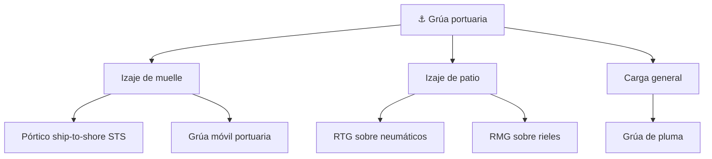

# 📋 Características funcionales de la grúa portuaria

[🏠 Inicio](../../../README.md) · [⚓ Curso: Grúa portuaria](../README.md) · 📋 Características

Que es una grúa portuaria, que tipos existen y para que sirve cada uno. Este
módulo da el contexto antes de abrir la mecánica del pórtico (Módulo 4).

---

## 🧭 Definición

Una grúa portuaria de contenedores es una grúa de gran porte que carga y descarga
buques portacontenedores en el muelle. La variante central es la grúa pórtico
ship-to-shore STS: una estructura fija que se apoya sobre rieles del muelle, se
proyecta sobre el agua con una pluma y mueve un carro con un spreader que engancha
cada contenedor por sus esquinas. A diferencia de una grúa móvil, no se desplaza
por carretera: trabaja siempre sobre su vía de carriles a lo largo del muelle.

---

## 🧬 Características clave

| Característica | Descripción |
| --- | --- |
| Estructura fija sobre rieles | Se traslada solo a lo largo del muelle por sus carriles. |
| Gran porte | Alcanza toda la manga del buque y varias alturas de contenedores. |
| Ciclo repetitivo | Repite el movimiento buque-muelle contenedor tras contenedor. |
| Manejo del contenedor ISO | Toma cajas normalizadas con un spreader de twist-locks. |
| Accionamiento eléctrico | Recibe energía desde el muelle, sin combustible a bordo. |
| Control del balanceo | Sistemas anti-sway reducen el bamboleo de la carga. |
| Precisión de posicionamiento | Debe encajar el contenedor en celdas y camiones. |

---

## 🗂️ Tipos de grúa portuaria

```mermaid
flowchart TD
    Grua[⚓ Grúa portuaria] --> Muelle[Izaje de muelle]
    Grua --> Patio[Izaje de patio]
    Grua --> General[Carga general]
    Muelle --> STS[Pórtico ship-to-shore STS]
    Muelle --> Movil[Grúa móvil portuaria]
    Patio --> RTG[RTG sobre neumáticos]
    Patio --> RMG[RMG sobre rieles]
    General --> Pluma[Grúa de pluma]
```

| Tipo | Uso típico | Rasgo destacado |
| --- | --- | --- |
| Pórtico STS | Descarga de buques en el muelle | Pluma sobre el agua y trolley con spreader. |
| Grúa móvil portuaria | Puertos multiproposito | Autopropulsada, sin vía fija. |
| RTG | Apilado en bloques de patio | Pórtico sobre neumáticos, móvil. |
| RMG | Apilado sobre rieles de patio | Pórtico ferroviario, muy preciso. |
| Grúa de pluma | Carga general y granel | Brazo giratorio de alcance variable. |

---

## 📦 El contenedor ISO y el spreader

El contenedor ISO es una caja metálica normalizada que permite mover carga entre
buque, camión y tren sin manipular su contenido. Sus medidas se cuentan en
unidades TEU.

| Concepto | Descripción |
| --- | --- |
| TEU | Twenty-foot Equivalent Unit; contenedor estandar de 20 pies. |
| FEU | Forty-foot Equivalent Unit; contenedor de 40 pies, equivale a 2 TEU. |
| Esquinas de bloqueo | Piezas en las 4 esquinas superiores donde engancha el spreader. |
| Spreader | Marco telescópico con twist-locks que agarra el contenedor por las esquinas. |
| Twist-lock | Perno giratorio que traba y destraba el contenedor en el spreader. |
| Apilado | Los contenedores se apilan en celdas del buque y en bloques del patio. |

El spreader se ajusta a la longitud del contenedor (20, 40 o 45 pies), baja sobre
la caja, calza sus twist-locks en las esquinas y gira los pernos para trabar la
carga antes de izarla.

---

## 🎯 Para qué se usa

- Descargar contenedores desde el buque hacia el muelle.
- Cargar contenedores desde el muelle hacia el buque.
- Alimentar el flujo de camiones y patio del terminal.
- Sostener la productividad medida en contenedores por hora.
- Mover carga estandarizada de forma segura y repetible.

## 🎓 Cierre de clase

- **Actividad:** Compara variantes de Grúa portuaria mediante los ejes «definición, rasgos funcionales, tipos y usos» y elige una para un caso de uso razonado.
- **Evidencia:** Matriz comparativa y decisión justificada.
- **Criterio de aprobación:** La elección considera función, límites, mando y efecto en la simulación; no se apoya solo en preferencias.
- **Transferencia:** explica qué cambiaría al pasar a otra variante de esta máquina.

### Fuentes de esta clase

- [OSHA-CRANES](https://www.osha.gov/cranes-derricks): Crane, Derrick and Hoist Safety, OSHA. Uso: izaje, riesgos y controles.
- [IMO-NAV](https://www.imo.org/en/ourwork/safety/pages/navigationdefault.aspx): Safety of Navigation, International Maritime Organization. Uso: navegación, SOLAS, COLREG y STCW.
- [CL-DIRECTEMAR](https://www.directemar.cl/directemar/marco-normativo): Marco normativo, DIRECTEMAR. Uso: marco marítimo chileno.

> Las fuentes sostienen el marco conceptual y normativo; esta clase no reemplaza el manual
> del fabricante, la formación certificada ni la habilitación exigida para operar equipos reales.

---

[⬅️ Anterior: Historia](../historia/historia-grua-portuaria.md) · [➡️ Siguiente: Modelos y variantes](../modelos/modelos-grua-portuaria.md)
