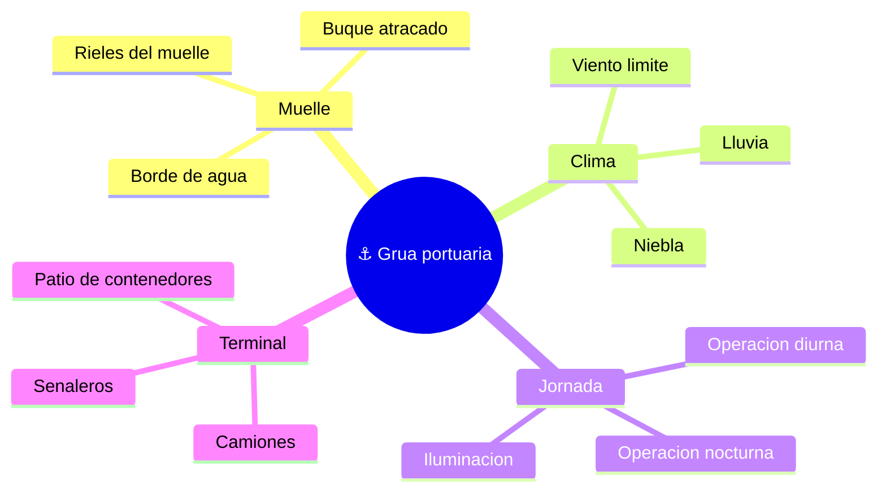

# 🌍 Entornos de trabajo de la grua portuaria

[🏠 Inicio](../../../README.md) · [⚓ Curso: Grua portuaria](../README.md) · 🌍 Entornos

Donde opera una grua portuaria y como cambia la operacion segun el entorno. El
terminal de contenedores impone reglas, riesgos y ajustes propios, y en
simulacion se traduce en escenarios diferentes.

---

## 🗺️ Entornos principales

| Entorno | Caracteristicas | Riesgos tipicos | Ajuste de operacion |
| --- | --- | --- | --- |
| Muelle | Rieles, buque atracado, borde de agua. | Caida al agua, golpe al buque. | Posicionamiento preciso, anti-sway. |
| Viento | Carga colgada expuesta al viento. | Balanceo, deriva de la carga. | Respetar limite del anemometro. |
| Operacion nocturna | Baja visibilidad, jornada continua. | Errores por fatiga y poca luz. | Iluminacion, camaras, ritmo controlado. |
| Coordinacion con camiones | Flujo de vehiculos bajo la grua. | Atropello, deposito sobre camion mal ubicado. | Senalero, area de exclusion. |
| Patio de contenedores | Apilado y traslado en tierra. | Choque de contenedores, mal apilado. | Coordinacion con gruas de patio. |

---

## 🌦️ Factores del entorno

- **Viento**: es el factor critico; por encima del limite del anemometro se
  detiene la operacion porque la carga colgada se vuelve incontrolable.
- **Visibilidad**: lluvia, niebla y noche reducen la vision del punto de apoyo;
  la iluminacion y las camaras la complementan.
- **Superficie del muelle**: los rieles deben estar libres y firmes para el
  gantry; el borde de agua exige margen de seguridad.
- **Coordinacion humana**: camiones, senaleros y personal de tierra comparten el
  area de trabajo y exigen area de exclusion y comunicacion.

---

## 🎮 Traduccion a simulacion

Cada entorno es un escenario con su clima, jornada y flujo de camiones. Ver como
se modela en el [Modulo 8: Diseno de simulacion](../simulacion/diseno-simulador-grua-portuaria.md).

---

[⬅️ Anterior: Principios y operacion](principios-grua-portuaria.md) · [➡️ Siguiente: Reglamentos](../reglamentos/reglamentos-grua-portuaria.md)
