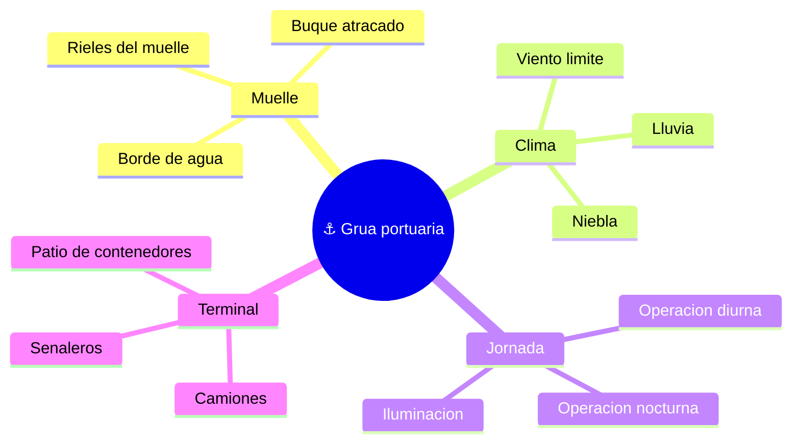

# 🌍 Entornos de trabajo de la grúa portuaria

[🏠 Inicio](../../../README.md) · [⚓ Curso: Grúa portuaria](../README.md) · 🌍 Entornos

Dónde opera una grúa portuaria y cómo cambia la operación según el entorno. El
terminal de contenedores impone reglas, riesgos y ajustes propios, y en
simulación se traduce en escenarios diferentes.

---

## 🗺️ Entornos principales

| Entorno | Características | Riesgos típicos | Ajuste de operación |
| --- | --- | --- | --- |
| Muelle | Rieles, buque atracado, borde de agua. | Caída al agua, golpe al buque. | Posicionamiento preciso, anti-sway. |
| Viento | Carga colgada expuesta al viento. | Balanceo, deriva de la carga. | Respetar límite del anemómetro. |
| Operación nocturna | Baja visibilidad, jornada continua. | Errores por fatiga y poca luz. | Iluminación, cámaras, ritmo controlado. |
| Coordinación con camiones | Flujo de vehículos bajo la grúa. | Atropello, depósito sobre camión mal ubicado. | Señalero, área de exclusión. |
| Patio de contenedores | Apilado y traslado en tierra. | Choque de contenedores, mal apilado. | Coordinación con grúas de patio. |

---

## 🌦️ Factores del entorno

- **Viento**: es el factor crítico; por encima del límite del anemómetro se
  detiene la operación porque la carga colgada se vuelve incontrolable.
- **Visibilidad**: lluvia, niebla y noche reducen la visión del punto de apoyo;
  la iluminación y las cámaras la complementan.
- **Superficie del muelle**: los rieles deben estar libres y firmes para el
  gantry; el borde de agua exige margen de seguridad.
- **Coordinación humana**: camiones, señaleros y personal de tierra comparten el
  área de trabajo y exigen área de exclusión y comunicación.

---

## 🎮 Traducción a simulación

Cada entorno es un escenario con su clima, jornada y flujo de camiones. Ver como
se modela en el [Módulo 9: Diseño de simulación](../simulacion/diseno-simulador-grua-portuaria.md).

---

[⬅️ Anterior: Principios y operación](principios-grua-portuaria.md) · [➡️ Siguiente: Reglamentos](../reglamentos/reglamentos-grua-portuaria.md)
