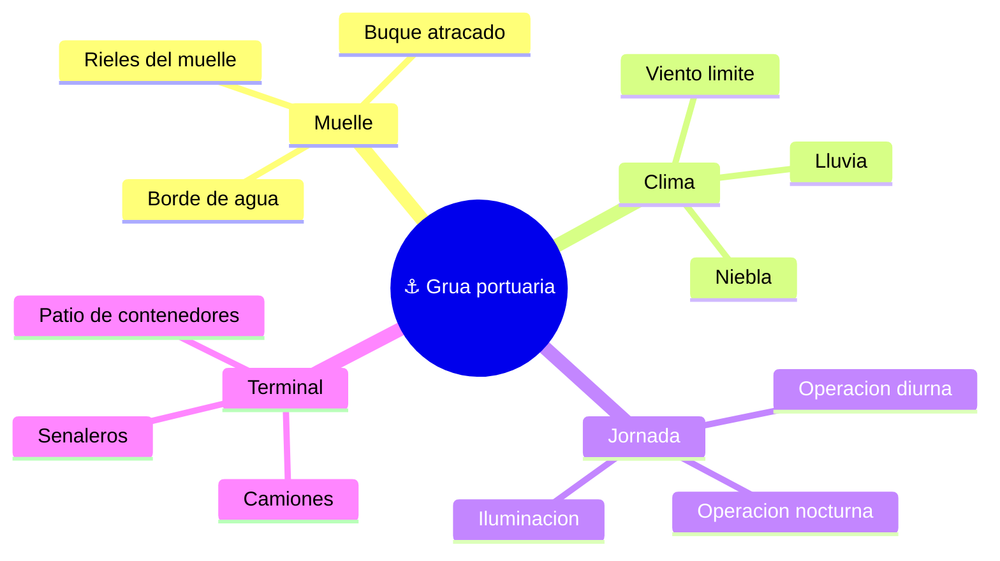

<!-- clase-meta
tipo_documento: clase
clase: 7
codigo: GRUAPORTUARI-07
curso: grua-portuaria
titulo: "Entornos de trabajo de la grúa portuaria"
modalidad: "análisis de escenarios"
duracion_minutos: 60
nivel: introductorio
prerrequisito: GRUAPORTUARI-06
competencia: "adaptacion_al_entorno"
resultados_aprendizaje:
  - "Explicar entornos, factores ambientales, riesgos y respuesta de simulación con vocabulario propio de Grúa portuaria."
  - "Aplicar esos conceptos a una decisión segura o a un escenario de simulación de Grúa portuaria."
evidencia: "Matriz entorno–cambio–riesgo–respuesta."
criterio_aprobacion: "Cada respuesta se adapta al entorno y distingue riesgos que no son intercambiables entre escenarios."
fuentes: manuales/fuentes.md
ultima_revision: 2026-09-10
-->

# 🌍 Entornos de trabajo de la grúa portuaria

[🏠 Inicio](../../../README.md) · [⚓ Curso: Grúa portuaria](../README.md) · 🌍 Entornos

Dónde opera una grúa portuaria y cómo cambia la operación según el entorno. El
terminal de contenedores impone reglas, riesgos y ajustes propios, y en
simulación se traduce en escenarios diferentes.

---

## 🗺️ Entornos principales

```mermaid
mindmap
  root((⚓ Grua portuaria))
    Muelle
      Rieles del muelle
      Buque atracado
      Borde de agua
    Clima
      Viento limite
      Lluvia
      Niebla
    Jornada
      Operacion diurna
      Operacion nocturna
      Iluminacion
    Terminal
      Camiones
      Patio de contenedores
      Senaleros
```

| Entorno | Características | Riesgos típicos | Ajuste de operación |
| --- | --- | --- | --- |
| Muelle | Rieles, buque atracado, borde de agua. | Caída al agua, golpe al buque. | Posicionamiento preciso, anti-sway. |
| Viento | Carga colgada expuesta al viento. | Balanceo, deriva de la carga. | Respetar límite del anemómetro. |
| Operación nocturna | Baja visibilidad, jornada continua. | Errores por fatiga y poca luz. | Iluminación, cámaras, ritmo controlado. |
| Coordinación con camiones | Flujo de vehículos bajo la grúa. | Atropello, depósito sobre camión mal ubicado. | Señalero, área de exclusión. |
| Patio de contenedores | Apilado y traslado en tierra. | Choque de contenedores, mal apilado. | Coordinación con grúas de patio. |

---

## 🌦️ Factores del entorno

- **Viento**: es el factor crítico; por encima del límite del anemómetro se
  detiene la operación porque la carga colgada se vuelve incontrolable.
- **Visibilidad**: lluvia, niebla y noche reducen la visión del punto de apoyo;
  la iluminación y las cámaras la complementan.
- **Superficie del muelle**: los rieles deben estar libres y firmes para el
  gantry; el borde de agua exige margen de seguridad.
- **Coordinación humana**: camiones, señaleros y personal de tierra comparten el
  área de trabajo y exigen área de exclusión y comunicación.

---

## 🎮 Traducción a simulación

Cada entorno es un escenario con su clima, jornada y flujo de camiones. Ver como
se modela en el [Clase 9: Diseño de simulación](../simulacion/diseno-simulador-grua-portuaria.md).

## 🧭 Guía de estudio aplicada

### Pregunta guía

¿Cómo ayuda **Entornos principales, Factores del entorno, Traducción a simulación y Guía de estudio aplicada** a **adaptar traslado de un contenedor desde buque con ráfagas laterales a tres condiciones ambientales distintas**?

### Explicación razonada

El entorno no es decoración: modifica las fuerzas, la percepción y el tiempo disponible. En el caso «traslado de un contenedor desde buque con ráfagas laterales», cambia el comportamiento de spreader y contenedor y aumenta la probabilidad de oscilación, enganche incompleto o ingreso de personas al área de caída. La respuesta correcta empieza por reconocer qué variable cambió y después adaptar límites, ruta o misión.

Esta clase se conecta con el resto del curso mediante **control del péndulo y productividad sin superar límites estructurales ni de viento**. El hilo de
seguridad consiste en reconocer a tiempo **oscilación, enganche incompleto o ingreso de personas al área de caída** y poder justificar la decisión
**detener o suavizar el ciclo según viento, señalización y estabilidad de la carga**; en clases posteriores cambiará el ángulo de análisis, no esa relación causal.
La lectura funcional común sigue **alimentación → accionamientos → carro y cables → spreader y contenedor**, de modo que cada concepto pueda
ubicarse dentro del funcionamiento completo y no quede como un dato aislado.

**Apoyo documental:** [Crane, Derrick and Hoist Safety](https://www.osha.gov/cranes-derricks) aporta izaje, riesgos y controles;
[Safety of Navigation](https://www.imo.org/en/ourwork/safety/pages/navigationdefault.aspx) se usa para navegación, SOLAS, COLREG y STCW. Estas fuentes
se contrastan con el alcance de la clase y no sustituyen un manual de equipo concreto.

### Caso resuelto: de la observación a la decisión

1. **Escenario base:** conserva la misión «traslado de un contenedor desde buque con ráfagas laterales» para poder comparar.
2. **Cambiar una condición:** modifica sucesivamente superficie o medio, visibilidad y perturbación externa.
3. **Recalcular margen:** explica cómo cada cambio afecta **spreader y contenedor** y acerca o aleja **oscilación, enganche incompleto o ingreso de personas al área de caída**.
4. **Adaptar:** cambia límite, ruta, configuración o incluso cancela; no mantengas la misma respuesta por hábito.

### Comprueba tu comprensión

1. ¿Cómo cambiaría **spreader y contenedor** si empeora la perturbación externa?
2. ¿Qué condición ambiental acerca más el escenario a **oscilación, enganche incompleto o ingreso de personas al área de caída**?
3. ¿Cuándo adaptarías la maniobra y cuándo la cancelarías?

Orientación para revisar tus respuestas

- La primera respuesta debe relacionar el eslabón elegido con un efecto posterior, no solo nombrarlo.
- La segunda debe proponer una señal medible u observable y explicar qué tendencia sería preocupante.
- La tercera debe cambiar al menos una variable de capacidad, mando, entorno o margen de seguridad.

## 🎓 Cierre de clase

- **Actividad:** Contrasta tres entornos de Grúa portuaria a partir de entornos, factores ambientales, riesgos y respuesta de simulación y determina cómo cambian variables, percepción, riesgos y respuesta.
- **Evidencia:** Matriz entorno–cambio–riesgo–respuesta.
- **Criterio de aprobación:** Cada respuesta se adapta al entorno y distingue riesgos que no son intercambiables entre escenarios.
- **Transferencia:** explica qué cambiaría al pasar a otra variante de esta máquina.

### Fuentes de esta clase

- [OSHA-CRANES](https://www.osha.gov/cranes-derricks): Crane, Derrick and Hoist Safety, OSHA. Uso: izaje, riesgos y controles.
- [IMO-NAV](https://www.imo.org/en/ourwork/safety/pages/navigationdefault.aspx): Safety of Navigation, International Maritime Organization. Uso: navegación, SOLAS, COLREG y STCW.
- [CL-DIRECTEMAR](https://www.directemar.cl/directemar/marco-normativo): Marco normativo, DIRECTEMAR. Uso: marco marítimo chileno.

> Las fuentes sostienen el marco conceptual y normativo; esta clase no reemplaza el manual
> del fabricante, la formación certificada ni la habilitación exigida para operar equipos reales.

---

[⬅️ Anterior: Principios y operación](principios-grua-portuaria.md) · [➡️ Siguiente: Reglamentos](../reglamentos/reglamentos-grua-portuaria.md)
