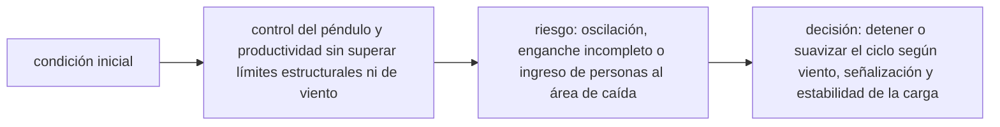

<!-- clase-meta
tipo_documento: clase
clase: 6
codigo: GRUAPORTUARI-06
curso: grua-portuaria
titulo: "Principios y operación de la grúa portuaria"
modalidad: "resolución de problemas"
duracion_minutos: 90
nivel: introductorio
prerrequisito: GRUAPORTUARI-05
competencia: "razonamiento_operacional"
resultados_aprendizaje:
  - "Explicar principios físicos, fases de operación, decisiones y errores frecuentes con vocabulario propio de Grúa portuaria."
  - "Aplicar esos conceptos a una decisión segura o a un escenario de simulación de Grúa portuaria."
evidencia: "Resolución argumentada de un escenario operacional."
criterio_aprobacion: "Aplica los principios correctos, anticipa consecuencias y respeta los límites del curso."
fuentes: manuales/fuentes.md
ultima_revision: 2026-09-10
-->

# 🧪 Principios y operación de la grúa portuaria

[🏠 Inicio](../../../README.md) · [⚓ Curso: Grúa portuaria](../README.md) · 🧪 Principios

Documento general y educativo. No sustituye la formación certificada del operador
ni el manual del fabricante. Describe cómo se opera una grúa pórtico en
simulación y que principios físicos conviene representar.

## Principios de funcionamiento

- **Estabilidad del pórtico**: la grúa se apoya en dos rieles del muelle; su peso
  propio y su anclaje mantienen el equilibrio aunque la pluma se proyecte sobre el
  agua. El punto de vuelco es la línea del riel del lado de la carga.
- **Límites de carga**: el spreader y la grúa tienen una carga máxima. El peso del
  contenedor más el del spreader nunca debe superar ese límite.
- **Control del balanceo**: la carga cuelga como un péndulo; todo arranque o
  frenado brusco del trolley la hace bambolear. El anti-sway y los movimientos
  suaves mantienen la carga quieta.
- **Precisión de posicionamiento**: el éxito del ciclo depende de encajar el
  contenedor en su celda o sobre el camión sin golpear las guías.
- **Ciclo repetitivo**: la productividad se logra repitiendo un mismo ciclo de
  forma estable y segura, no con velocidad puntual.

## Fases de operación

| Fase | Que ocurre | Puntos clave |
| --- | --- | --- |
| Inspección previa | Revisión básica | Cables, spreader, twist-locks, anemómetro, frenos. |
| Energizado | Poner la grúa en servicio | Alimentación conectada, instrumentos activos. |
| Posicionamiento | Alinear con la bahía | Gantry a la bodega, pluma en horizontal. |
| Enganche | Tomar el contenedor | Trolley sobre la celda, bajar spreader, trabar twist-locks. |
| Izaje y traslado | Mover la carga | Izar con anti-sway, trasladar el trolley al muelle. |
| Depósito | Dejar la carga | Bajar sobre camión o acopio, liberar twist-locks. |
| Cierre | Dejar segura | Pluma arriba, frenos de riel, grúa asegurada. |

## Control del balanceo: idea general

1. Iniciar el movimiento del trolley de forma **suave**, sin tirones.
2. Mantener el **anti-sway** activo durante el traslado de la carga.
3. Anticipar el frenado para que el contenedor llegue quieto al punto de apoyo.
4. Bajar la carga con velocidad reducida en el tramo final.
5. Confirmar el asiento del contenedor antes de liberar los twist-locks.

## Errores comunes que la simulación puede enseñar a evitar

- Arrancar o frenar el trolley de golpe y provocar balanceo de la carga.
- Izar sin confirmar que los twist-locks están trabados.
- Operar con viento por sobre el límite del anemómetro.
- Superar el límite de carga sumando el peso del spreader.
- Bajar el contenedor rápido y golpear las guías de la celda.
- Descuidar el área de exclusión y al personal en tierra.

## Relación con los niveles de realismo

- **Nivel 1 (educativo)**: posicionar, izar, trasladar y depositar un contenedor.
- **Nivel 2 (simplificado)**: agregar balanceo de la carga, límite de carga y viento.
- **Nivel 3 (técnico)**: sumar anti-sway, enclavamientos, precisión de celda y
  ciclo cronometrado.

Ver [`docs/03-niveles-de-realismo.md`](../../../docs/03-niveles-de-realismo.md) para el detalle de cada nivel.

## 🧭 Guía de estudio aplicada

### Pregunta guía

¿Cómo ayuda **Principios de funcionamiento, Fases de operación, Control del balanceo: idea general y Errores comunes que la simulación puede enseñar a evitar** a **resolver traslado de un contenedor desde buque con ráfagas laterales sin agotar el margen operacional**?

### Explicación razonada

El principio rector puede resumirse así: control del péndulo y productividad sin superar límites estructurales ni de viento. Esto explica por qué una misma orden produce resultados distintos cuando cambian velocidad, carga, configuración o entorno. Operar bien consiste en leer la tendencia antes de agotar el margen y tomar esta decisión: detener o suavizar el ciclo según viento, señalización y estabilidad de la carga.

Esta clase se conecta con el resto del curso mediante **control del péndulo y productividad sin superar límites estructurales ni de viento**. El hilo de
seguridad consiste en reconocer a tiempo **oscilación, enganche incompleto o ingreso de personas al área de caída** y poder justificar la decisión
**detener o suavizar el ciclo según viento, señalización y estabilidad de la carga**; en clases posteriores cambiará el ángulo de análisis, no esa relación causal.
La lectura funcional común sigue **alimentación → accionamientos → carro y cables → spreader y contenedor**, de modo que cada concepto pueda
ubicarse dentro del funcionamiento completo y no quede como un dato aislado.

**Apoyo documental:** [Crane, Derrick and Hoist Safety](https://www.osha.gov/cranes-derricks) aporta izaje, riesgos y controles;
[Safety of Navigation](https://www.imo.org/en/ourwork/safety/pages/navigationdefault.aspx) se usa para navegación, SOLAS, COLREG y STCW. Estas fuentes
se contrastan con el alcance de la clase y no sustituyen un manual de equipo concreto.

### Caso resuelto: de la observación a la decisión

1. **Datos:** reconoce condiciones, configuración y margen disponibles en **traslado de un contenedor desde buque con ráfagas laterales**.
2. **Modelo:** aplica **control del péndulo y productividad sin superar límites estructurales ni de viento** para predecir una tendencia antes de actuar.
3. **Riesgo:** explica mediante qué cadena de causas podría ocurrir **oscilación, enganche incompleto o ingreso de personas al área de caída**.
4. **Decisión:** ejecuta mentalmente **detener o suavizar el ciclo según viento, señalización y estabilidad de la carga** y define qué observación confirmaría que funcionó.

### Comprueba tu comprensión

1. ¿Qué variable del principio «control del péndulo y productividad sin superar límites estructurales ni de viento» cambia primero en el caso?
2. ¿Cómo se propaga ese cambio hasta **spreader y contenedor**?
3. ¿Qué evidencia confirmaría que **detener o suavizar el ciclo según viento, señalización y estabilidad de la carga** conservó margen operacional?

Orientación para revisar tus respuestas

- La primera respuesta debe relacionar el eslabón elegido con un efecto posterior, no solo nombrarlo.
- La segunda debe proponer una señal medible u observable y explicar qué tendencia sería preocupante.
- La tercera debe cambiar al menos una variable de capacidad, mando, entorno o margen de seguridad.

## 🎓 Cierre de clase

- **Actividad:** Resuelve un escenario de Grúa portuaria explicando, paso a paso, cómo intervienen principios físicos, fases de operación, decisiones y errores frecuentes.
- **Evidencia:** Resolución argumentada de un escenario operacional.
- **Criterio de aprobación:** Aplica los principios correctos, anticipa consecuencias y respeta los límites del curso.
- **Transferencia:** explica qué cambiaría al pasar a otra variante de esta máquina.

### Fuentes de esta clase

- [OSHA-CRANES](https://www.osha.gov/cranes-derricks): Crane, Derrick and Hoist Safety, OSHA. Uso: izaje, riesgos y controles.
- [IMO-NAV](https://www.imo.org/en/ourwork/safety/pages/navigationdefault.aspx): Safety of Navigation, International Maritime Organization. Uso: navegación, SOLAS, COLREG y STCW.
- [CL-DIRECTEMAR](https://www.directemar.cl/directemar/marco-normativo): Marco normativo, DIRECTEMAR. Uso: marco marítimo chileno.

> Las fuentes sostienen el marco conceptual y normativo; esta clase no reemplaza el manual
> del fabricante, la formación certificada ni la habilitación exigida para operar equipos reales.

---

[⬅️ Anterior: Mandos](../mandos/manual-mandos-grua-portuaria.md) · [➡️ Siguiente: Entornos de trabajo](entornos-grua-portuaria.md)
