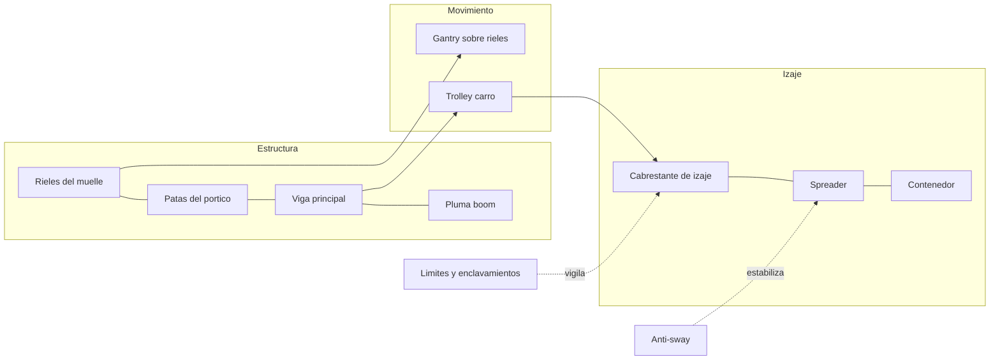
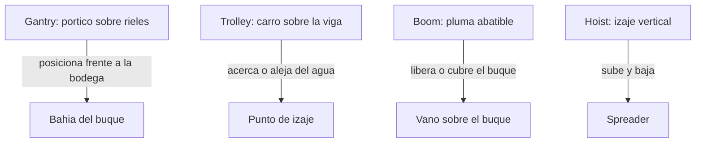
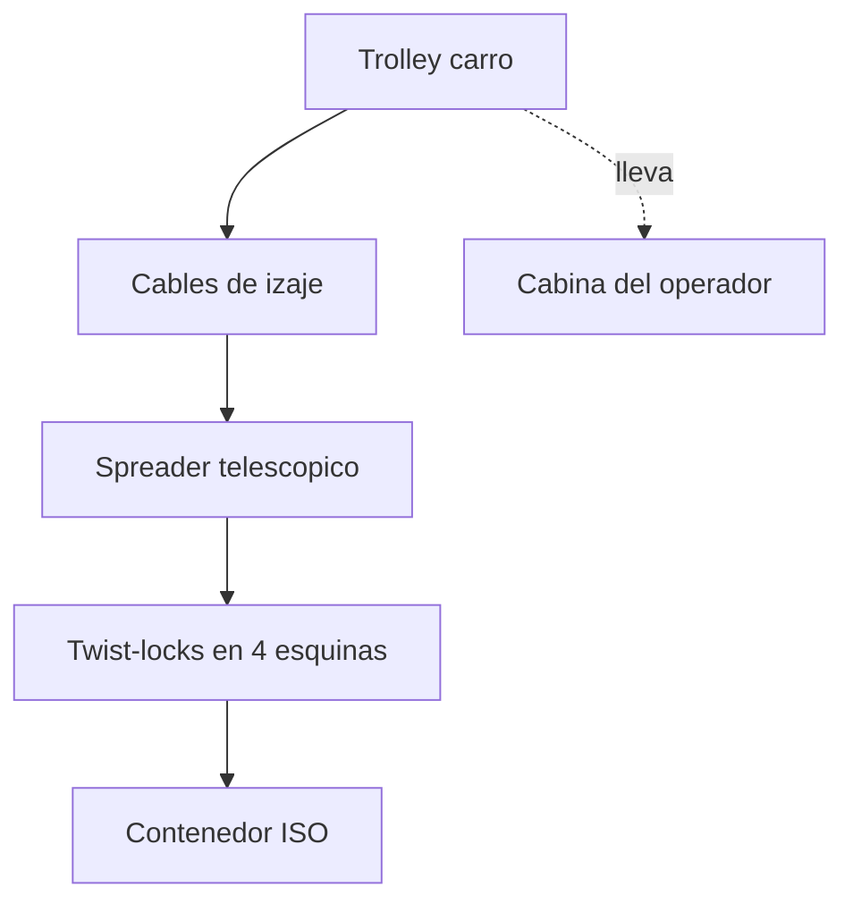
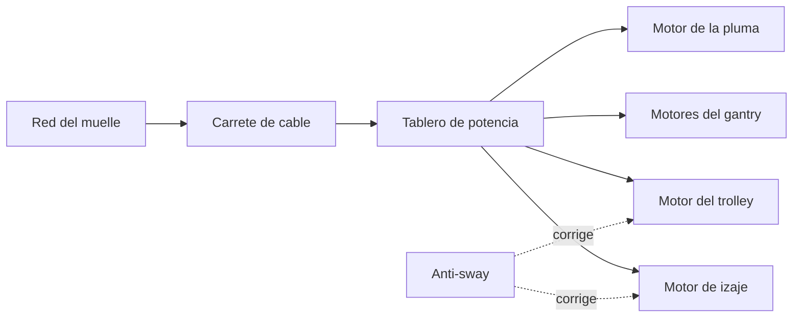

# 🔧 Sistemas mecanicos de la grua portuaria

[🏠 Inicio](../../../README.md) · [⚓ Curso: Grua portuaria](../README.md) · 🔧 Sistemas mecanicos

Este modulo abre la grua portico por dentro y es el corazon del curso. Explica
como se sostiene la estructura sobre los rieles del muelle, como el trolley lleva
el spreader hasta el contenedor y como se mueve cada eje del izaje. Es la base
tecnica para entender los mandos (Modulo 4) y los principios de operacion
(Modulo 5).

---

## 1. 🏗️ Estructura del portico

El portico ship-to-shore es una gran estructura de acero con forma de marco. Se
apoya sobre patas que descansan en bogies con ruedas sobre los rieles del muelle,
y una viga horizontal en altura que cruza desde tierra hasta sobre el agua. Sobre
esa viga corre el trolley.

| Elemento | Funcion |
| --- | --- |
| Patas y bogies | Sostienen el portico y ruedan sobre los rieles del muelle. |
| Viga principal | Camino horizontal por donde corre el trolley. |
| Pluma boom | Prolongacion de la viga que se proyecta sobre el buque. |
| Portico trasero | Lado de tierra, sobre el muelle y los camiones. |
| Tirantes y torre | Sostienen la viga y la pluma desde arriba. |

La pluma se abate: se levanta a posicion vertical cuando la grua no opera o para
dejar pasar el buque, y se baja a horizontal para trabajar sobre las bodegas. Al
apoyarse en dos rieles paralelos, el punto de vuelco de la grua es la linea del
riel del lado de la carga; el peso propio de la estructura y su anclaje mantienen
el equilibrio sobre el agua.

---

## 2. 🛤️ Traslacion sobre rieles: gantry, trolley y boom

La grua tiene tres traslaciones principales, cada una en un eje distinto. Es util
distinguirlas porque los mandos (Modulo 4) las controlan por separado.

| Traslacion | Eje | Que mueve | Cuando se usa |
| --- | --- | --- | --- |
| Gantry | A lo largo del muelle | Todo el portico sobre los rieles | Para alinear la grua con otra bahia del buque. |
| Trolley | Perpendicular al muelle | El carro sobre la viga | Para acercar o alejar la carga del agua. |
| Boom | Vertical, abatible | La pluma sobre el buque | Para liberar el gabarito del buque al maniobrar. |
| Hoist | Vertical | El spreader y la carga | Para subir y bajar el contenedor. |

- **Gantry (traslacion del portico)**: motores en los bogies mueven la grua
  completa por los rieles, con velocidad baja y frenos de riel para fijarla.
- **Trolley (traslacion del carro)**: el carro corre por la viga llevando el
  spreader entre el buque y el muelle; define el alcance horizontal del izaje.
- **Boom (abatimiento de la pluma)**: cabrestantes o cilindros levantan la pluma
  a vertical para el paso del buque y la bajan a horizontal para operar.

---

## 3. 🚋 Trolley y spreader

El trolley es el carro que corre por la viga; suele llevar la cabina del operador
mirando hacia abajo. Del trolley cuelga el spreader mediante el cable de izaje.

- **Spreader telescopico**: marco que se extiende o recoge para ajustarse a 20,
  40 o 45 pies de contenedor.
- **Twist-locks**: cuatro pernos giratorios que entran en las esquinas del
  contenedor y giran para trabar o liberar la carga.
- **Flippers / guias**: patas guia en las esquinas del spreader que centran la
  caja al descender.
- **Cabina en el trolley**: el operador viaja con el carro y mira hacia abajo el
  punto de izaje, lo que da vision directa sobre el contenedor.

| Parametro del spreader | Que es | Efecto |
| --- | --- | --- |
| Longitud | Extension telescopica en pies | Debe coincidir con el contenedor a tomar. |
| Peso propio | Masa del spreader | Se suma a la carga que ve el izaje. |
| Estado de twist-locks | Trabado o liberado | Habilita o impide el izaje seguro. |
| Sensores de asiento | Confirman apoyo en las 4 esquinas | Evitan izar mal calzado. |

---

## 4. ⚙️ Cabrestantes: hoist, trolley y gantry

Los movimientos se accionan con cabrestantes y motores electricos. El de izaje
(hoist) sube y baja el spreader; el de traslacion del carro (trolley) lo desplaza
por la viga; el de traslacion del portico (gantry) mueve la grua por los rieles.

| Cabrestante / accionamiento | Que mueve | Direccion | Nota |
| --- | --- | --- | --- |
| Hoist de izaje | Spreader y contenedor | Vertical | Enrolla los cables desde el trolley. |
| Traslacion del trolley | Carro sobre la viga | Horizontal, hacia el agua | Define el alcance del izaje. |
| Traslacion del gantry | Portico sobre rieles | A lo largo del muelle | Reposiciona toda la grua. |
| Abatimiento de boom | Pluma | Vertical, abatible | Levanta o baja la pluma. |

El izaje usa varios ramales de cable que pasan por poleas entre el trolley y el
spreader, repartiendo el peso del contenedor. La velocidad de cada motor la regula
el operador con los joysticks, de forma proporcional al desplazamiento del mando.

---

## 5. 📦 Contenedores, celdas y apilado

La carga que maneja la grua esta normalizada, lo que permite un ciclo repetitivo.
Conocer sus dimensiones y como se apila ayuda a entender el posicionamiento.

| Concepto | Descripcion |
| --- | --- |
| TEU | Contenedor de 20 pies; unidad de medida del trafico. |
| FEU | Contenedor de 40 pies; equivale a 2 TEU. |
| Esquinas ISO | Cuatro cajas de esquina normalizadas donde engancha el spreader. |
| Celdas del buque | Guias verticales en las bodegas que alinean el apilado. |
| Alturas de apilado | Los contenedores se apilan varios niveles en bodega y cubierta. |
| Bloque de patio | Agrupacion de contenedores apilados en el terminal. |

El buque portacontenedores tiene celdas guia que reciben la caja y la centran al
bajar; en cubierta los contenedores se aseguran con twist-locks y barras. El
operador debe posicionar el spreader con precision para que la caja entre en su
celda sin golpear las guias.

---

## 6. ⚡ Accionamiento electrico y anti-sway

La grua STS moderna es electrica: recibe energia desde el muelle por un carrete de
cable o una barra colectora y alimenta los motores de cada movimiento. No lleva
combustible a bordo.

| Componente | Funcion |
| --- | --- |
| Alimentacion del muelle | Entrega energia electrica a la grua sin combustible a bordo. |
| Carrete de cable | Enrolla el cable de energia mientras la grua se traslada. |
| Tablero de potencia | Distribuye energia a cada motor de movimiento. |
| Variadores | Regulan velocidad y par de los motores electricos. |
| Sistema anti-sway | Ajusta el trolley y el izaje para frenar el balanceo de la carga. |

El **anti-sway** (anti-balanceo) mide u anticipa el bamboleo del contenedor
colgado y corrige los movimientos del trolley y del izaje para que la carga
llegue quieta al punto de apoyo. Reduce el tiempo de posicionamiento y evita
golpes contra el buque o las guias.

---

## 7. 🔒 Enclavamientos, limites de carga y seguridad

La grua incorpora enclavamientos y limites que impiden maniobras inseguras. Son
la base del modelo de seguridad que la simulacion debe representar.

| Dispositivo | Que hace |
| --- | --- |
| Limite de carga | Impide izar por encima de la capacidad del spreader y de la grua. |
| Fin de carrera de izaje | Detiene el spreader antes del tope superior o del suelo. |
| Fin de carrera de trolley | Frena el carro en los extremos de la viga. |
| Sensor de twist-locks | Solo habilita el izaje con la carga trabada. |
| Anemometro y limite de viento | Detiene la operacion si el viento supera el limite. |
| Frenos de riel y anclaje | Fijan la grua contra el desplazamiento por viento. |
| Parada de emergencia | Corta todos los movimientos de inmediato. |

Ademas de proteger la maquina, estos limites protegen al personal en tierra: la
grua no debe izar sin la carga bien trabada, ni mover el contenedor si el viento
excede el umbral operacional.

---

## 🔁 Ciclo de descarga buque a muelle

El trabajo de la grua es un ciclo repetitivo. Un ciclo tipico de descarga sigue
estos pasos:

1. El **gantry** posiciona la grua frente a la bahia del buque a descargar.
2. El **trolley** lleva el spreader sobre la celda del contenedor objetivo.
3. El **hoist** baja el spreader y los **twist-locks** traban el contenedor.
4. El hoist iza el contenedor fuera de la celda, con **anti-sway** activo.
5. El trolley traslada la carga desde el buque hacia el muelle.
6. El hoist baja el contenedor sobre el camion o la zona de acopio.
7. Los twist-locks liberan la caja y el spreader sube vacio.
8. La grua repite el ciclo con el siguiente contenedor.

Con esto entendido, el [Modulo 4: Mandos](../mandos/manual-mandos-grua-portuaria.md)
muestra como el operador acciona cada uno de estos sistemas.

---

[⬅️ Anterior: Caracteristicas](caracteristicas-grua-portuaria.md) · [➡️ Siguiente: Mandos e instrumentos](../mandos/manual-mandos-grua-portuaria.md)
