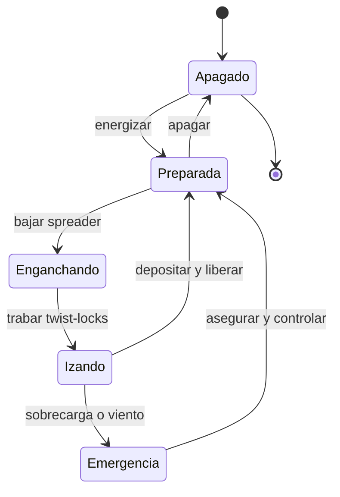

# 🎮 Diseno de simulacion de la grua portuaria

[🏠 Inicio](../../../README.md) · [⚓ Curso: Grua portuaria](../README.md) · 🎮 Simulacion

## Objetivo de la simulacion

Que el usuario aprenda a posicionar la grua, enganchar un contenedor con el
spreader, izarlo controlando el balanceo, trasladarlo del buque al muelle y
depositarlo con precision, respetando el limite de carga y el limite de viento,
de forma segura y progresiva.

## Nivel de realismo

- Nivel elegido: se ofrece del 1 al 3 (ver `docs/03-niveles-de-realismo.md`).
- Justificacion: la grua portuaria permite ensenar estabilidad, limites de carga y
  control del balanceo en un ciclo repetitivo, con mayor complejidad de
  posicionamiento que una grua movil por su operacion sobre rieles fijos.

## Variables principales

| Variable | Tipo | Rango | Afecta a | Comentarios |
| --- | --- | --- | --- | --- |
| Posicion del trolley | numerica | 0-60 m | Alcance del izaje | Punto sobre buque o muelle. |
| Altura del spreader | numerica | 0-40 m | Izaje vertical | Limitada por fin de carrera. |
| Peso de la carga | numerica | 0-50 t | Limite de carga | Suma el peso del spreader. |
| Balanceo de la carga | numerica | -30..30 grados | Precision y seguridad | Se reduce con anti-sway. |
| Viento | numerica | 0-30 m/s | Limite operacional | Sobre el umbral se detiene. |
| Estado de twist-locks | discreta | trabado/libre | Habilitacion del izaje | Requerido para izar. |
| Posicion del gantry | numerica | 0-400 m | Alineacion con la bahia | A lo largo del muelle. |

## Ciclo basico

1. Leer entrada del usuario (trolley, gantry, izaje, spreader, anti-sway).
2. Actualizar posicion de la grua, del trolley y del spreader.
3. Calcular el peso izado y compararlo con el limite de carga.
4. Modelar el balanceo de la carga y la accion del anti-sway.
5. Aplicar restricciones del entorno (viento, area de exclusion).
6. Refrescar instrumentos y retroalimentacion (carga, viento, camaras, alarmas).

## Modos de juego futuros

- Tutorial guiado de mandos y del spreader.
- Practica libre de descarga de un buque.
- Misiones educativas de posicionamiento preciso en celdas.
- Desafios de ciclo cronometrado con seguridad.
- Situaciones de riesgo controladas (viento en aumento, carga mal calzada) sin contenido sensible.

## Elementos fuera de alcance

- Maniobras inseguras presentadas como recomendables.
- Operacion temeraria con personal en el area de exclusion como objetivo del juego.
- Datos tecnicos que permitan alterar sistemas reales de una grua.

## Pendientes

- [ ] Definir valores por defecto de cada variable por tipo de grua portuaria.
- [ ] Prototipar el ciclo de descarga en un motor simple.
- [ ] Ajustar el modelo de balanceo y de anti-sway.
- [ ] Agregar fuentes tecnicas publicas a [`manuales/fuentes.md`](../../../manuales/fuentes.md).

---

[⬅️ Anterior: Reglamentos](../reglamentos/reglamentos-grua-portuaria.md) · [➡️ Siguiente: Recursos](../recursos/recursos-grua-portuaria.md)
