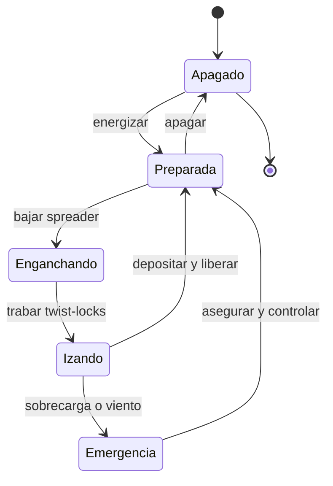

# 🎮 Diseño de simulación de la grúa portuaria

[🏠 Inicio](../../../README.md) · [⚓ Curso: Grúa portuaria](../README.md) · 🎮 Simulación

## Objetivo de la simulación

Que el usuario aprenda a posicionar la grúa, enganchar un contenedor con el
spreader, izarlo controlando el balanceo, trasladarlo del buque al muelle y
depositarlo con precisión, respetando el límite de carga y el límite de viento,
de forma segura y progresiva.

## Nivel de realismo

- Nivel elegido: se ofrece del 1 al 3 (ver `docs/03-niveles-de-realismo.md`).
- Justificación: la grúa portuaria permite enseñar estabilidad, límites de carga y
  control del balanceo en un ciclo repetitivo, con mayor complejidad de
  posicionamiento que una grúa móvil por su operación sobre rieles fijos.

## Variables principales

| Variable | Tipo | Rango | Afecta a | Comentarios |
| --- | --- | --- | --- | --- |
| Posición del trolley | numérica | 0-60 m | Alcance del izaje | Punto sobre buque o muelle. |
| Altura del spreader | numérica | 0-40 m | Izaje vertical | Limitada por fin de carrera. |
| Peso de la carga | numérica | 0-50 t | Límite de carga | Suma el peso del spreader. |
| Balanceo de la carga | numérica | -30..30 grados | Precisión y seguridad | Se reduce con anti-sway. |
| Viento | numérica | 0-30 m/s | Límite operacional | Sobre el umbral se detiene. |
| Estado de twist-locks | discreta | trabado/libre | Habilitación del izaje | Requerido para izar. |
| Posición del gantry | numérica | 0-400 m | Alineación con la bahía | A lo largo del muelle. |

## Ciclo básico

1. Leer entrada del usuario (trolley, gantry, izaje, spreader, anti-sway).
2. Actualizar posición de la grúa, del trolley y del spreader.
3. Calcular el peso izado y compararlo con el límite de carga.
4. Modelar el balanceo de la carga y la acción del anti-sway.
5. Aplicar restricciones del entorno (viento, área de exclusión).
6. Refrescar instrumentos y retroalimentación (carga, viento, cámaras, alarmas).

## Modos de juego futuros

- Tutorial guiado de mandos y del spreader.
- Práctica libre de descarga de un buque.
- Misiones educativas de posicionamiento preciso en celdas.
- Desafíos de ciclo cronometrado con seguridad.
- Situaciones de riesgo controladas (viento en aumento, carga mal calzada) sin contenido sensible.

## Elementos fuera de alcance

- Maniobras inseguras presentadas como recomendables.
- Operación temeraria con personal en el área de exclusión como objetivo del juego.
- Datos técnicos que permitan alterar sistemas reales de una grúa.

## Pendientes

- [ ] Definir valores por defecto de cada variable por tipo de grúa portuaria.
- [ ] Prototipar el ciclo de descarga en un motor simple.
- [ ] Ajustar el modelo de balanceo y de anti-sway.
- [ ] Agregar fuentes técnicas públicas a [`manuales/fuentes.md`](../../../manuales/fuentes.md).

---

[⬅️ Anterior: Reglamentos](../reglamentos/reglamentos-grua-portuaria.md) · [➡️ Siguiente: Recursos](../recursos/recursos-grua-portuaria.md)
