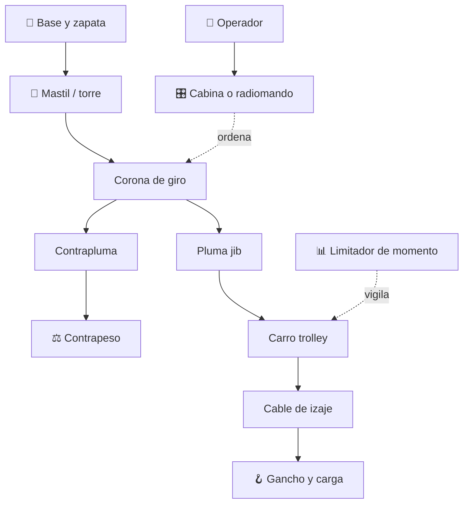

# 🗼 Curso: Grua torre

[🏠 Inicio](../../README.md) · [🚙 Catalogo de vehiculos](../README.md) · [🎓 Guia de curso](../../docs/08-guia-de-estilo-y-curso.md)

> **Curso de la grua torre de construccion.** Documenta la grua torre de
> principio a fin: historia, caracteristicas, mecanica del izaje en altura,
> mandos, fisica de momentos, entornos de obra, marco de seguridad laboral
> chileno y diseno de simulacion. Es una grua fija, no circula por via publica.

---

## 🎯 Objetivos de aprendizaje

Al terminar este curso deberias poder:

- Explicar como una grua torre iza cargas en altura manteniendo el equilibrio.
- Identificar sus sistemas mecanicos (mastil, pluma, contrapluma, carro, giro).
- Reconocer todos los mandos e instrumentos y su funcion.
- Comprender la fisica del momento de carga y por que el radio limita el peso.
- Conocer el marco de seguridad laboral chileno aplicable al izaje fijo.
- Traducir todo lo anterior en variables de un simulador educativo.

---

## 🗺️ Mapa del vehiculo

---

## 📚 Modulos del curso

| # | Modulo | Contenido | Enlace |
| :-: | --- | --- | --- |
| 1 | 📜 Historia | Origen y evolucion de la grua torre, linea de tiempo. | [Abrir](historia/historia-grua-torre.md) |
| 2 | 📋 Caracteristicas | Que es, tipos de grua torre y para que sirve cada uno. | [Abrir](operacion/caracteristicas-grua-torre.md) |
| 3 | 🔧 Sistemas mecanicos | Mastil, pluma, contrapeso, carro, giro, momento, trepado. | [Abrir](operacion/sistemas-mecanicos-grua-torre.md) |
| 4 | 🎛️ Mandos e instrumentos | Cabina, radiomando, palancas y limitadores. | [Abrir](mandos/manual-mandos-grua-torre.md) |
| 5 | 🧪 Principios y operacion | Equilibrio de momentos y fases de izaje. | [Abrir](operacion/principios-grua-torre.md) |
| 6 | 🌍 Entornos de trabajo | Obra en altura, ciudad densa, viento, montaje. | [Abrir](operacion/entornos-grua-torre.md) |
| 7 | ⚖️ Reglamentos | Marco chileno: seguridad laboral e izaje fijo. | [Abrir](reglamentos/reglamentos-grua-torre.md) |
| 8 | 🎮 Diseno de simulacion | Variables, ciclo y modos de juego. | [Abrir](simulacion/diseno-simulador-grua-torre.md) |
| 9 | 🧰 Recursos | Glosario, enlaces y diagramas. | [Abrir](recursos/recursos-grua-torre.md) |

---

## 🧩 Requisitos previos

Conviene haber revisado antes el curso de gruas moviles, porque la grua torre
comparte la fisica del momento de carga (peso por radio) pero la lleva a una
estructura fija de gran altura. Marco legal comun en
[⚖️ docs/07-marco-legal-chile.md](../../docs/07-marco-legal-chile.md).

---

[➡️ Empezar por el Modulo 1: Historia](historia/historia-grua-torre.md)
