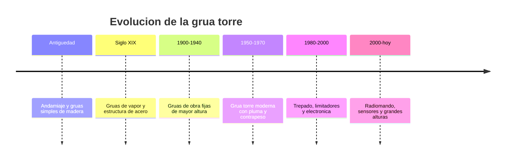

# 📜 Historia de la grúa torre

[🏠 Inicio](../../../README.md) · [🗼 Curso: Grúa torre](../README.md) · 📜 Historia

## Origen

La grúa torre desciende de los sistemas de izaje más antiguos: el andamiaje y las
grúas simples de madera con las que se levantaban bloques en la construcción. Con
el acero y la máquina de vapor aparecieron grúas fijas más altas y potentes. La
grúa torre moderna, tal como se conoce hoy, se consolida a mediados del siglo XX
para dar servicio a la construcción en altura de edificios y estructuras.

## Línea de tiempo

| Periodo | Hito | Importancia |
| --- | --- | --- |
| Antiguedad | Andamiaje y grúas simples de madera | Primer izaje asistido en obra. |
| Siglo XIX | Grúas de vapor y estructura de acero | Más altura y capacidad. |
| 1900-1940 | Grúas de obra fijas más altas | Construcción vertical incipiente. |
| 1950-1970 | Grúa torre moderna con contrapeso | Estandar de la obra en altura. |
| 1980-2000 | Trepado, limitadores, electrónica | Más seguridad y alturas mayores. |
| 2000-presente | Radiomando y sensores | Operación remota y monitoreo. |

## Evolución tecnológica

- **Materiales**: de la madera y el acero remachado a estructuras reticuladas soldadas.
- **Estructura**: mástiles cada vez más altos gracias al arriostramiento al edificio.
- **Montaje**: del ensamblaje manual al trepado (telescopado) por jaula.
- **Mandos**: de la cabina en altura al mando a distancia por radio.
- **Seguridad**: limitadores de carga y de momento, anemómetros, finales de carrera.
- **Monitoreo**: sensores de viento, carga y radio con registro de la operación.

## Tipos representativos

| Tipo | Uso típico | Característica destacada |
| --- | --- | --- |
| Pluma horizontal | Edificios y obra general | Carro que corre por la pluma. |
| Pluma abatible | Ciudad densa y espacios estrechos | La pluma sube para no invadir vecinos. |
| Auto-montante | Obras pequeñas y rápidas | Se despliega sola sin gran montaje. |
| Arriostrada al edificio | Torres de gran altura | Anclada al edificio para crecer. |
| Autoestable | Alturas moderadas | Se sostiene por su base sin anclajes. |

## Impacto social y económico

La grúa torre hizo posible la construcción en altura moderna: sin ella, los
edificios de muchos pisos serían inviables. Es un símbolo del ritmo de la obra
urbana y una pieza crítica de la seguridad laboral, porque concentra grandes
cargas sobre la vía pública y sobre el personal en tierra.

## Fuentes

- Registrar aquí las fuentes públicas consultadas.
- Enlazar cada fuente también en [`manuales/fuentes.md`](../../../manuales/fuentes.md).

---

[🎓 Portada del curso](../README.md) · [➡️ Siguiente: Características](../operacion/caracteristicas-grua-torre.md)
