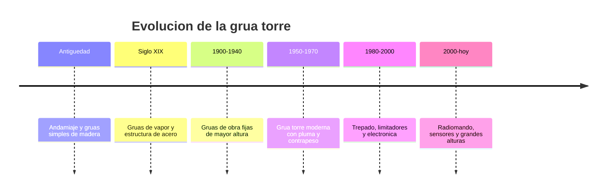

# 📜 Historia de la grua torre

[🏠 Inicio](../../../README.md) · [🗼 Curso: Grua torre](../README.md) · 📜 Historia

## Origen

La grua torre desciende de los sistemas de izaje mas antiguos: el andamiaje y las
gruas simples de madera con las que se levantaban bloques en la construccion. Con
el acero y la maquina de vapor aparecieron gruas fijas mas altas y potentes. La
grua torre moderna, tal como se conoce hoy, se consolida a mediados del siglo XX
para dar servicio a la construccion en altura de edificios y estructuras.

## Linea de tiempo

| Periodo | Hito | Importancia |
| --- | --- | --- |
| Antiguedad | Andamiaje y gruas simples de madera | Primer izaje asistido en obra. |
| Siglo XIX | Gruas de vapor y estructura de acero | Mas altura y capacidad. |
| 1900-1940 | Gruas de obra fijas mas altas | Construccion vertical incipiente. |
| 1950-1970 | Grua torre moderna con contrapeso | Estandar de la obra en altura. |
| 1980-2000 | Trepado, limitadores, electronica | Mas seguridad y alturas mayores. |
| 2000-presente | Radiomando y sensores | Operacion remota y monitoreo. |

## Evolucion tecnologica

- **Materiales**: de la madera y el acero remachado a estructuras reticuladas soldadas.
- **Estructura**: mastiles cada vez mas altos gracias al arriostramiento al edificio.
- **Montaje**: del ensamblaje manual al trepado (telescopado) por jaula.
- **Mandos**: de la cabina en altura al mando a distancia por radio.
- **Seguridad**: limitadores de carga y de momento, anemometros, finales de carrera.
- **Monitoreo**: sensores de viento, carga y radio con registro de la operacion.

## Tipos representativos

| Tipo | Uso tipico | Caracteristica destacada |
| --- | --- | --- |
| Pluma horizontal | Edificios y obra general | Carro que corre por la pluma. |
| Pluma abatible | Ciudad densa y espacios estrechos | La pluma sube para no invadir vecinos. |
| Auto-montante | Obras pequenas y rapidas | Se despliega sola sin gran montaje. |
| Arriostrada al edificio | Torres de gran altura | Anclada al edificio para crecer. |
| Autoestable | Alturas moderadas | Se sostiene por su base sin anclajes. |

## Impacto social y economico

La grua torre hizo posible la construccion en altura moderna: sin ella, los
edificios de muchos pisos serian inviables. Es un simbolo del ritmo de la obra
urbana y una pieza critica de la seguridad laboral, porque concentra grandes
cargas sobre la via publica y sobre el personal en tierra.

## Fuentes

- Registrar aqui las fuentes publicas consultadas.
- Enlazar cada fuente tambien en [`manuales/fuentes.md`](../../../manuales/fuentes.md).

---

[🎓 Portada del curso](../README.md) · [➡️ Siguiente: Caracteristicas](../operacion/caracteristicas-grua-torre.md)
