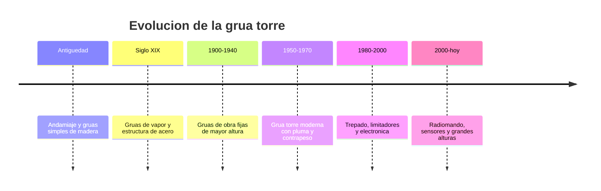

<!-- clase-meta
tipo_documento: clase
clase: 1
codigo: GRUATORRE-01
curso: grua-torre
titulo: "Historia de la grúa torre"
modalidad: "teórica dialogada"
duracion_minutos: 45
nivel: introductorio
prerrequisito: ninguno
competencia: "contexto_historico"
resultados_aprendizaje:
  - "Explicar origen, evolución tecnológica, variantes representativas e impacto con vocabulario propio de Grúa torre."
  - "Aplicar esos conceptos a una decisión segura o a un escenario de simulación de Grúa torre."
evidencia: "Línea de tiempo comentada con cuatro hitos o más."
criterio_aprobacion: "Los hitos están ordenados, son pertinentes y dos relaciones de causa y efecto quedan justificadas."
fuentes: manuales/fuentes.md
ultima_revision: 2026-09-10
-->

# 📜 Historia de la grúa torre

[🏠 Inicio](../../../README.md) · [🗼 Curso: Grúa torre](../README.md) · 📜 Historia

```mermaid
timeline
    title Evolucion de la grua torre
    Antiguedad : Andamiaje y gruas simples de madera
    Siglo XIX : Gruas de vapor y estructura de acero
    1900-1940 : Gruas de obra fijas de mayor altura
    1950-1970 : Grua torre moderna con pluma y contrapeso
    1980-2000 : Trepado, limitadores y electronica
    2000-hoy : Radiomando, sensores y grandes alturas
```

## Origen

La grúa torre desciende de los sistemas de izaje más antiguos: el andamiaje y las
grúas simples de madera con las que se levantaban bloques en la construcción. Con
el acero y la máquina de vapor aparecieron grúas fijas más altas y potentes. La
grúa torre moderna, tal como se conoce hoy, se consolida a mediados del siglo XX
para dar servicio a la construcción en altura de edificios y estructuras.

## Línea de tiempo

| Periodo | Hito | Importancia |
| --- | --- | --- |
| Antiguedad | Andamiaje y grúas simples de madera | Primer izaje asistido en obra. |
| Siglo XIX | Grúas de vapor y estructura de acero | Más altura y capacidad. |
| 1900-1940 | Grúas de obra fijas más altas | Construcción vertical incipiente. |
| 1950-1970 | Grúa torre moderna con contrapeso | Estandar de la obra en altura. |
| 1980-2000 | Trepado, limitadores, electrónica | Más seguridad y alturas mayores. |
| 2000-presente | Radiomando y sensores | Operación remota y monitoreo. |

## Evolución tecnológica

- **Materiales**: de la madera y el acero remachado a estructuras reticuladas soldadas.
- **Estructura**: mástiles cada vez más altos gracias al arriostramiento al edificio.
- **Montaje**: del ensamblaje manual al trepado (telescopado) por jaula.
- **Mandos**: de la cabina en altura al mando a distancia por radio.
- **Seguridad**: limitadores de carga y de momento, anemómetros, finales de carrera.
- **Monitoreo**: sensores de viento, carga y radio con registro de la operación.

## Tipos representativos

| Tipo | Uso típico | Característica destacada |
| --- | --- | --- |
| Pluma horizontal | Edificios y obra general | Carro que corre por la pluma. |
| Pluma abatible | Ciudad densa y espacios estrechos | La pluma sube para no invadir vecinos. |
| Auto-montante | Obras pequeñas y rápidas | Se despliega sola sin gran montaje. |
| Arriostrada al edificio | Torres de gran altura | Anclada al edificio para crecer. |
| Autoestable | Alturas moderadas | Se sostiene por su base sin anclajes. |

## Impacto social y económico

La grúa torre hizo posible la construcción en altura moderna: sin ella, los
edificios de muchos pisos serían inviables. Es un símbolo del ritmo de la obra
urbana y una pieza crítica de la seguridad laboral, porque concentra grandes
cargas sobre la vía pública y sobre el personal en tierra.

## 🧭 Guía de estudio aplicada

### Pregunta guía

¿Cómo ayuda **Origen, Línea de tiempo, Evolución tecnológica y Tipos representativos** a **explicar cómo la evolución hizo posibles alternativas como grúa de pluma horizontal frente a pluma abatible**?

### Explicación razonada

La evolución de Grúa torre se comprende mejor como una sucesión de respuestas a problemas, no como una lista de fechas. Los cambios en alimentación, cabrestante, carro y pluma y gancho y carga alteraron qué podía hacer la máquina, quién podía usarla y qué riesgos debían controlarse. El contraste «grúa de pluma horizontal frente a pluma abatible» permite observar qué decisiones de diseño permanecieron y cuáles cambiaron con la tecnología y el propósito.

Esta clase se conecta con el resto del curso mediante **equilibrio de momentos: el efecto de la carga crece cuando aumenta su radio**. El hilo de
seguridad consiste en reconocer a tiempo **sobrepasar capacidad, inducir péndulo o trabajar sobre una zona no aislada** y poder justificar la decisión
**consultar tabla de carga y viento antes de autorizar cada trayectoria**; en clases posteriores cambiará el ángulo de análisis, no esa relación causal.
La lectura funcional común sigue **alimentación → cabrestante → carro y pluma → gancho y carga**, de modo que cada concepto pueda
ubicarse dentro del funcionamiento completo y no quede como un dato aislado.

**Apoyo documental:** [Crane, Derrick and Hoist Safety](https://www.osha.gov/cranes-derricks) aporta izaje, riesgos y controles;
[1926.1435 Tower Cranes](https://www.osha.gov/laws-regs/regulations/standardnumber/1926/1926.1435) se usa para requisitos específicos de grúas torre. Estas fuentes
se contrastan con el alcance de la clase y no sustituyen un manual de equipo concreto.

### Caso resuelto: de la observación a la decisión

1. **Situar:** ordena los hitos que explican cómo se llegó a **grúa de pluma horizontal frente a pluma abatible** y describe la necesidad que impulsó cada cambio.
2. **Relacionar:** explica qué se modificó en **alimentación**, **cabrestante**, **carro y pluma** o **gancho y carga**; una fecha sin mecanismo no basta.
3. **Interpretar:** vincula el cambio con una capacidad nueva y también con el riesgo **sobrepasar capacidad, inducir péndulo o trabajar sobre una zona no aislada**.
4. **Transferir:** usa la evolución para justificar por qué hoy conviene **consultar tabla de carga y viento antes de autorizar cada trayectoria**.

### Comprueba tu comprensión

1. ¿Qué necesidad histórica impulsó un cambio en **alimentación** o **cabrestante**?
2. ¿Qué hito modificó la relación entre capacidad y **sobrepasar capacidad, inducir péndulo o trabajar sobre una zona no aislada**?
3. ¿Por qué **grúa de pluma horizontal frente a pluma abatible** no puede explicarse como una simple diferencia estética?

Orientación para revisar tus respuestas

- La primera respuesta debe relacionar el eslabón elegido con un efecto posterior, no solo nombrarlo.
- La segunda debe proponer una señal medible u observable y explicar qué tendencia sería preocupante.
- La tercera debe cambiar al menos una variable de capacidad, mando, entorno o margen de seguridad.

## 🎓 Cierre de clase

- **Actividad:** Construye una línea de tiempo de Grúa torre y explica cómo dos cambios históricos transformaron su función o su puesto de mando.
- **Evidencia:** Línea de tiempo comentada con cuatro hitos o más.
- **Criterio de aprobación:** Los hitos están ordenados, son pertinentes y dos relaciones de causa y efecto quedan justificadas.
- **Transferencia:** explica qué cambiaría al pasar a otra variante de esta máquina.

### Fuentes de esta clase

- [OSHA-CRANES](https://www.osha.gov/cranes-derricks): Crane, Derrick and Hoist Safety, OSHA. Uso: izaje, riesgos y controles.
- [OSHA-TOWER](https://www.osha.gov/laws-regs/regulations/standardnumber/1926/1926.1435): 1926.1435 Tower Cranes, OSHA. Uso: requisitos específicos de grúas torre.

> Las fuentes sostienen el marco conceptual y normativo; esta clase no reemplaza el manual
> del fabricante, la formación certificada ni la habilitación exigida para operar equipos reales.

---

[🎓 Portada del curso](../README.md) · [➡️ Siguiente: Características](../operacion/caracteristicas-grua-torre.md)
