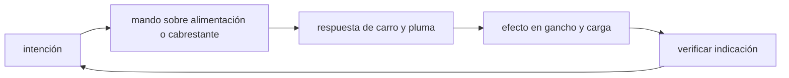

<!-- clase-meta
tipo_documento: clase
clase: 5
codigo: GRUATORRE-05
curso: grua-torre
titulo: "Mandos e instrumentos de la grúa torre"
modalidad: "taller de simulación"
duracion_minutos: 60
nivel: introductorio
prerrequisito: GRUATORRE-04
competencia: "lectura_y_mando"
resultados_aprendizaje:
  - "Explicar controles, instrumentos, entradas y estados del sistema con vocabulario propio de Grúa torre."
  - "Aplicar esos conceptos a una decisión segura o a un escenario de simulación de Grúa torre."
evidencia: "Mapa de mandos y resolución de dos estados del tablero."
criterio_aprobacion: "Reconoce los controles críticos y responde a los estados sin introducir acciones inseguras."
fuentes: manuales/fuentes.md
ultima_revision: 2026-09-10
-->

# 🎛️ Mandos e instrumentos de la grúa torre

[🏠 Inicio](../../../README.md) · [🗼 Curso: Grúa torre](../README.md) · 🎛️ Mandos

## Vista general

El puesto de mando de una grúa torre puede ser una cabina en lo alto del mástil,
junto a la corona de giro, o un mando a distancia por radio operado desde tierra.
El operador controla el izaje, la traslación del carro y el giro con palancas
proporcionales, y vigila una consola donde el limitador de momento y el
anemómetro ocupan el lugar central. La prioridad no es la velocidad sino la
precisión y el control del momento de carga. En tierra un señalero (rigger)
coordina por radio o con gestos.

## Mapa de controles

| Zona | Control | Tipo | Función | Prioridad | Comentarios |
| --- | --- | --- | --- | --- | --- |
| Palanca izquierda | Izaje | Palanca proporcional | Subir y bajar el gancho | Alta | Izaje lento para controlar el péndulo. |
| Palanca izquierda | Giro / orientación | Palanca proporcional | Rotar la superestructura | Alta | Movimiento suave para no balancear la carga. |
| Palanca derecha | Traslación del carro | Palanca proporcional | Mover el carro por la pluma | Alta | Alejar el carro baja la capacidad. |
| Consola | Limitador de momento | Sistema | Cortar movimientos que superan el momento | Alta | Corazón de la seguridad. |
| Consola | Anemómetro | Indicador | Mostrar la velocidad del viento | Alta | Fija el límite de servicio. |
| Consola | Parada de emergencia | Botón hongo | Cortar todos los movimientos | Alta | Detiene la operación de inmediato. |
| Consola | Freno de giro | Palanca | Fijar o liberar la orientación | Media | Se libera en veleta fuera de servicio. |
| Consola | Bocina y señales | Botón | Advertir al personal en tierra | Media | Coordinación con el señalero. |
| Cabina o radio | Instrumentos | Pantalla | Mostrar estado de izaje | Alta | Ver sección de instrumentos. |

## Instrumentos principales

| Instrumento | Mide o muestra | Unidad | Importancia | Notas |
| --- | --- | --- | --- | --- |
| Limitador de momento | Momento actual vs máximo | % y t·m | Alta | Avisa y corta antes del vuelco. |
| Indicador de carga | Peso izado | t | Alta | Peso real en el gancho. |
| Radio de trabajo | Distancia del eje al gancho | m | Alta | Parámetro clave de la tabla de carga. |
| Altura de gancho | Posición vertical del gancho | m | Media | Evita el fin de carrera y el contacto. |
| Anemómetro | Velocidad del viento | km/h o m/s | Alta | El viento reduce o detiene el izaje. |
| Ángulo de giro | Orientación de la pluma | grados | Media | Ubica la carga sobre la obra. |
| Nivel de la base | Nivelación del mástil | grados | Alta | Confirma base estabilizada. |

## Entradas de simulación

| Acción | Teclado | Controlador | Pantalla táctil | Comentarios |
| --- | --- | --- | --- | --- |
| Subir/bajar gancho | Teclas W/S | Stick izquierdo vertical | Zona izaje | Proporcional, izaje lento. |
| Girar superestructura | Flechas izq/der | Stick izquierdo horizontal | Zona giro | Movimiento suave para no balancear. |
| Trasladar carro | Teclas R/F | Stick derecho vertical | Zona carro | Alejar baja la capacidad. |
| Freno de giro | Tecla G | Botón lateral | Panel giro | Liberar para veleta. |
| Parada de emergencia | Barra espaciadora | Botón dedicado | Botón rojo | Corta todos los movimientos. |
| Consultar viento | Tecla V | Botón info | Panel anemómetro | Decide si se puede izar. |

## Estados del sistema

| Estado | Descripción | Indicadores | Acciones disponibles |
| --- | --- | --- | --- |
| Fuera de servicio | Detenida, giro en veleta | Freno de giro liberado | Poner en servicio si el viento baja. |
| Preparada | Encendida y nivelada | Nivel en verde | Habilitar izaje. |
| Izando | Levantando o moviendo carga | Limitador activo | Izar, girar, trasladar carro. |
| Viento alto | Viento sobre el límite | Alarma de anemómetro | Bajar carga, pasar a veleta. |
| Emergencia | Limitador en tope o falla | Alarma y luz roja | Parar, reducir radio, bajar carga. |

## Observaciones ergonomicas y de seguridad

- El limitador de momento debe estar siempre visible y ser el primer instrumento del campo de visión.
- Las palancas proporcionales evitan movimientos bruscos que balancean la carga.
- El sistema debe impedir el izaje si la grúa no está nivelada o si el viento supera el límite.
- La parada de emergencia debe ser grande, roja y accesible sin mirar.
- En simulación conviene mostrar el radio y el porcentaje de capacidad de forma
  continua, para que el usuario relacione cada movimiento con la estabilidad.

## 🧭 Guía de estudio aplicada

### Pregunta guía

¿Cómo ayuda **Vista general, Mapa de controles, Instrumentos principales y Entradas de simulación** a **interpretar mandos e indicaciones durante traslado de una carga desde radio corto hacia el extremo de pluma**?

### Explicación razonada

Un mando no se aprende memorizando su nombre, sino recorriendo el ciclo intención → acción → indicación → verificación. En Grúa torre, el operador actúa sobre alimentación o cabrestante, observa la respuesta en carro y pluma y confirma el efecto en gancho y carga. Una indicación inesperada exige detener la secuencia mental, identificar el modo activo y evitar una segunda orden que agrave el estado.

Esta clase se conecta con el resto del curso mediante **equilibrio de momentos: el efecto de la carga crece cuando aumenta su radio**. El hilo de
seguridad consiste en reconocer a tiempo **sobrepasar capacidad, inducir péndulo o trabajar sobre una zona no aislada** y poder justificar la decisión
**consultar tabla de carga y viento antes de autorizar cada trayectoria**; en clases posteriores cambiará el ángulo de análisis, no esa relación causal.
La lectura funcional común sigue **alimentación → cabrestante → carro y pluma → gancho y carga**, de modo que cada concepto pueda
ubicarse dentro del funcionamiento completo y no quede como un dato aislado.

**Apoyo documental:** [Crane, Derrick and Hoist Safety](https://www.osha.gov/cranes-derricks) aporta izaje, riesgos y controles;
[1926.1435 Tower Cranes](https://www.osha.gov/laws-regs/regulations/standardnumber/1926/1926.1435) se usa para requisitos específicos de grúas torre. Estas fuentes
se contrastan con el alcance de la clase y no sustituyen un manual de equipo concreto.

### Caso resuelto: de la observación a la decisión

1. **Intención:** formula qué cambio se necesita durante **traslado de una carga desde radio corto hacia el extremo de pluma**.
2. **Mando:** identifica el control que actúa sobre **alimentación** o **cabrestante** y el modo que debe estar activo.
3. **Lectura:** localiza la indicación que confirma la respuesta de **carro y pluma** y el efecto en **gancho y carga**.
4. **Verificación:** si la lectura no coincide, no acumules órdenes; estabiliza e investiga el estado.

### Comprueba tu comprensión

1. ¿Qué mando inicia la respuesta y qué instrumento confirma que el modo correcto está activo?
2. ¿Qué indicación temprana advertiría **sobrepasar capacidad, inducir péndulo o trabajar sobre una zona no aislada**?
3. ¿Qué secuencia usarías si la respuesta de **gancho y carga** no coincide con la orden?

Orientación para revisar tus respuestas

- La primera respuesta debe relacionar el eslabón elegido con un efecto posterior, no solo nombrarlo.
- La segunda debe proponer una señal medible u observable y explicar qué tendencia sería preocupante.
- La tercera debe cambiar al menos una variable de capacidad, mando, entorno o margen de seguridad.

## 🎓 Cierre de clase

- **Actividad:** Recorre el puesto de mando simulado de Grúa torre: localiza los controles de controles, instrumentos, entradas y estados del sistema y asocia cada indicación con una decisión.
- **Evidencia:** Mapa de mandos y resolución de dos estados del tablero.
- **Criterio de aprobación:** Reconoce los controles críticos y responde a los estados sin introducir acciones inseguras.
- **Transferencia:** explica qué cambiaría al pasar a otra variante de esta máquina.

### Fuentes de esta clase

- [OSHA-CRANES](https://www.osha.gov/cranes-derricks): Crane, Derrick and Hoist Safety, OSHA. Uso: izaje, riesgos y controles.
- [OSHA-TOWER](https://www.osha.gov/laws-regs/regulations/standardnumber/1926/1926.1435): 1926.1435 Tower Cranes, OSHA. Uso: requisitos específicos de grúas torre.

> Las fuentes sostienen el marco conceptual y normativo; esta clase no reemplaza el manual
> del fabricante, la formación certificada ni la habilitación exigida para operar equipos reales.

---

[⬅️ Anterior: Sistemas mecánicos](../operacion/sistemas-mecanicos-grua-torre.md) · [➡️ Siguiente: Principios y operación](../operacion/principios-grua-torre.md)
