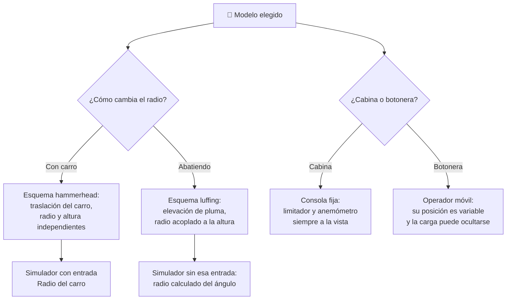

# 🧩 Modelos y variantes de la grúa torre

[🏠 Inicio](../../../README.md) · [🗼 Curso: Grúa torre](../README.md) · 🧩 Modelos

El [Módulo 2](../operacion/caracteristicas-grua-torre.md) ya dijo qué tipos de
grúa torre existen y para qué sirve cada uno. Este módulo responde a lo
siguiente: **no todas se manejan igual**, y esa diferencia no es de matiz.
Cambia qué mandos tiene la máquina y, por tanto, qué debe modelar el simulador.

> 🎯 **La idea que sostiene el módulo.** "Una grúa torre" no es una sola máquina
> desde el punto de vista del mando. Una grúa de pluma abatible no tiene carro:
> no es que lo tenga más lento, es que **no existe**, y el radio se cambia
> moviendo toda la pluma. Un simulador que presente un solo esquema de control
> está representando una grúa concreta aunque diga representarlas todas.

---

## 🧭 Por qué el modelo decide el simulador

El [Módulo 5](../mandos/manual-mandos-grua-torre.md) describe un puesto de mando
con una palanca derecha dedicada a la **traslación del carro** por la pluma, y
una entrada de simulación asociada (teclas `R`/`F`, stick derecho vertical). El
[Módulo 9](../simulacion/diseno-simulador-grua-torre.md) expone una variable
`Radio del carro` con rango `3-50 m`. Ambos describen una grúa **de pluma
horizontal** (hammerhead).

En una grúa de pluma abatible (luffing jib) esa palanca derecha no traslada un
carro: eleva o baja la pluma entera. El radio sigue existiendo, pero deja de ser
una posición que el operador fija directamente y pasa a ser el **resultado** del
ángulo de la pluma. Si el simulador se construye sobre el esquema del carro y
luego se le "añade" la pluma abatible, el resultado es una grúa abatible con
trolley, que no existe.

La segunda bisagra es el puesto: el Módulo 5 admite **cabina en lo alto o mando
a distancia por radio desde tierra**. Son dos máquinas distintas para el
operador, aunque la estructura sea idéntica.

---

## 🗂️ Qué cambia en el manejo

| Modelo | Qué cambia al operarla |
| --- | --- |
| Pluma horizontal (hammerhead) | La referencia del curso: el carro corre por una pluma fija y el radio se ajusta sin mover la carga en altura. |
| Pluma abatible (luffing jib) | Cambiar el radio significa abatir la pluma, así que la carga sube o baja al acercarla. Radio y altura dejan de ser independientes. |
| Auto-montante | Se despliega sola y trabaja en obra pequeña: los recorridos son cortos y el margen de maniobra alrededor es escaso. |
| De trepado | La altura de trabajo cambia durante la obra: la misma grúa opera hoy a una cota y mañana a otra tras intercalar un tramo. |
| Autoestable | Base propia sin anclajes: la altura tiene tope y la nivelación de la base manda sobre todo lo demás. |
| Arriostrada al edificio | Los anclajes fijan el mástil, pero el edificio en crecimiento se vuelve un obstáculo alrededor de la pluma. |
| Mando desde cabina | El operador ve la carga desde arriba y no se mueve del puesto durante la jornada. |
| Mando a distancia (botonera) | El operador camina por la obra: la perspectiva cambia con cada paso y a veces la carga queda fuera de vista. |

---

## 🎛️ Qué cambia en el mando

| Modelo | Qué mando aparece o desaparece | Consecuencia |
| --- | --- | --- |
| Pluma horizontal, Auto-montante, Autoestable, Arriostrada | Ninguno: el mapa de controles del Módulo 5 aplica tal cual. | Cambian los rangos y los límites, no los controles. |
| Pluma abatible | **Desaparece** la traslación del carro. **Aparece** el mando de elevación de la pluma en su lugar (misma palanca derecha, otra función). | El operador ya no fija el radio: lo obtiene como consecuencia del ángulo, y cada corrección de radio mueve la carga en vertical. |
| De trepado | **Aparece** el mando de la jaula de trepado, fuera del ciclo normal de izaje. | Es un modo aparte: durante el trepado los mandos de izaje y giro no son la operación. |
| Mando a distancia (botonera) | **Desaparecen** las palancas proporcionales de la cabina y la consola fija. El limitador, el anemómetro y el nivel **se mudan** a una pantalla pequeña o a avisos sonoros. | Se pierde el campo de visión único que el Módulo 5 exige para el limitador, y **aparece** la posición del propio operador como variable. |
| Todos | **Permanece** la parada de emergencia. | Es el único control que no cambia de sitio ni de función entre variantes. |

---

## 🎮 Qué cambia en el simulador

Contrastado con las variables del
[Módulo 9](../simulacion/diseno-simulador-grua-torre.md):

| Modelo | Variables que cambian | Esquema de control |
| --- | --- | --- |
| Pluma horizontal | Ninguna: es el caso base. | El del Módulo 5. |
| Pluma abatible | `Radio del carro` **se elimina** como entrada y pasa a calcularse desde el ángulo de la pluma. `Altura del gancho` se acopla a ese ángulo: deja de ser independiente. | Sin entrada de traslación del carro; entrada de elevación de pluma. |
| Auto-montante | `Radio del carro` y `Altura del gancho` **reducen** su rango útil. | El mismo. |
| De trepado | `Altura del gancho` deja de tener un techo fijo: el máximo crece durante la partida. | El mismo, más un modo de trepado sin izaje. |
| Autoestable | `Altura del gancho` queda con techo cerrado y el nivel de la base pesa más en la validación previa. | El mismo. |
| Arriostrada al edificio | `Ángulo de giro` deja de ser un rango libre de `0-360`: aparecen sectores vetados por el edificio. | El mismo, con giro restringido. |
| Mando desde cabina | Ninguna: es el caso base del puesto. | El del Módulo 5. |
| Mando a distancia | `Péndulo de la carga` deja de leerse desde arriba y depende de dónde está el operador. `Viento` y `Momento de carga` dejan de estar siempre a la vista. | El mismo cálculo, otra presentación: sin consola fija y con la vista del operador como parte del problema. |

---

## 🗺️ Del modelo al esquema de control

---

## ⚠️ Qué modelos no comparten simulador

Dos familias no se resuelven con un ajuste de parámetros, porque su esquema de
control es otro:

- **La pluma abatible** frente al resto: falta una entrada y dos variables que
  eran independientes quedan acopladas. Es un modo de control distinto, no una
  dificultad distinta.
- **El mando a distancia desde tierra** frente a la cabina: obliga a que la
  posición del operador sea una variable viva durante la partida, no un punto
  fijo desde el que se observa todo.

El resto de modelos sí caben en un mismo simulador ajustando rangos y límites,
tal como plantean los
[niveles de realismo](../../../docs/03-niveles-de-realismo.md): en el nivel 1
casi todos se comportan igual, y las diferencias emergen a medida que el nivel
sube.

> ⚖️ **El principio detrás de todo esto.** Cuánto pesa la carga y dónde va no cambia
> solo los números: cambia qué puede hacer el operador. La física común a todas las
> máquinas del catálogo —sostener, girar, equilibrar y la masa que cambia en
> marcha— está en [⚖️ carga y manejo](../../../docs/09-carga-y-manejo.md).

---

[⬅️ Anterior: Características](../operacion/caracteristicas-grua-torre.md) · [➡️ Siguiente: Sistemas mecánicos](../operacion/sistemas-mecanicos-grua-torre.md)
