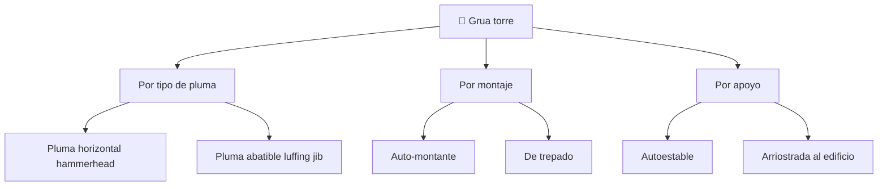

# 📋 Caracteristicas funcionales de la grua torre

[🏠 Inicio](../../../README.md) · [🗼 Curso: Grua torre](../README.md) · 📋 Caracteristicas

Que es una grua torre, que tipos existen y para que sirve cada uno. Este modulo
da el contexto antes de abrir la mecanica del izaje (Modulo 3).

---

## 🧭 Definicion

Una grua torre es una grua fija de gran altura usada para la construccion de
edificios. Se compone de un mastil vertical anclado a una base y de una parte
superior giratoria con una pluma horizontal que proyecta la carga sobre la obra.
A diferencia de una grua movil, no se desplaza: se monta en un punto, crece con
la obra y se desmonta al final.

---

## 🧬 Caracteristicas clave

| Caracteristica | Descripcion |
| --- | --- |
| Grua fija | Se ancla a una base; no circula por via publica. |
| Gran altura | Alcanza decenas de metros; crece con el edificio. |
| Giro superior | La parte alta rota sobre una corona de giro. |
| Momento de carga | La capacidad depende del peso por el radio del carro. |
| Trepado | Puede crecer en altura durante el montaje. |
| Limite de viento | Fuera de servicio gira libre en veleta. |

---

## 🗂️ Tipos de grua torre

| Tipo | Uso tipico | Rasgo destacado |
| --- | --- | --- |
| Pluma horizontal | Edificios y obra general | Carro que corre variando el radio. |
| Pluma abatible | Ciudad densa, espacios estrechos | La pluma se eleva para no invadir vecinos. |
| Auto-montante | Obras pequenas y rapidas | Se despliega sola, poco montaje. |
| De trepado | Torres altas | Crece con jaula de trepado. |
| Autoestable | Alturas moderadas | Base propia sin anclajes. |
| Arriostrada al edificio | Gran altura | Anclajes que fijan el mastil al edificio. |

---

## 🎯 Para que se usa

- Construccion de edificios en altura y torres.
- Izaje de hormigon, encofrados, acero y prefabricados.
- Distribucion de materiales por toda la planta de la obra.
- Montaje de estructuras pesadas en puntos de dificil acceso.
- Obra urbana donde una grua movil no cabe o no alcanza.

---

[⬅️ Anterior: Historia](../historia/historia-grua-torre.md) · [➡️ Siguiente: Sistemas mecanicos](sistemas-mecanicos-grua-torre.md)
