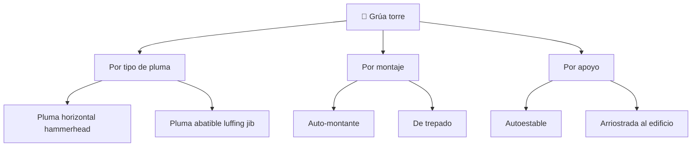

<!-- clase-meta
tipo_documento: clase
clase: 2
codigo: GRUATORRE-02
curso: grua-torre
titulo: "Características funcionales de la grúa torre"
modalidad: "teórica aplicada"
duracion_minutos: 45
nivel: introductorio
prerrequisito: GRUATORRE-01
competencia: "identificacion_funcional"
resultados_aprendizaje:
  - "Explicar definición, rasgos funcionales, tipos y usos con vocabulario propio de Grúa torre."
  - "Aplicar esos conceptos a una decisión segura o a un escenario de simulación de Grúa torre."
evidencia: "Matriz comparativa y decisión justificada."
criterio_aprobacion: "La elección considera función, límites, mando y efecto en la simulación; no se apoya solo en preferencias."
fuentes: manuales/fuentes.md
ultima_revision: 2026-09-10
-->

# 📋 Características funcionales de la grúa torre

[🏠 Inicio](../../../README.md) · [🗼 Curso: Grúa torre](../README.md) · 📋 Características

Que es una grúa torre, que tipos existen y para que sirve cada uno. Esta clase
da el contexto antes de abrir la mecánica del izaje (Clase 4).

---

## 🧭 Definición

Una grúa torre es una grúa fija de gran altura usada para la construcción de
edificios. Se compone de un mástil vertical anclado a una base y de una parte
superior giratoria con una pluma horizontal que proyecta la carga sobre la obra.
A diferencia de una grúa móvil, no se desplaza: se monta en un punto, crece con
la obra y se desmonta al final.

---

## 🧬 Características clave

| Característica | Descripción |
| --- | --- |
| Grúa fija | Se ancla a una base; no circula por vía pública. |
| Gran altura | Alcanza decenas de metros; crece con el edificio. |
| Giro superior | La parte alta rota sobre una corona de giro. |
| Momento de carga | La capacidad depende del peso por el radio del carro. |
| Trepado | Puede crecer en altura durante el montaje. |
| Límite de viento | Fuera de servicio gira libre en veleta. |

---

## 🗂️ Tipos de grúa torre

```mermaid
flowchart TD
    Grua[🗼 Grúa torre] --> Pluma[Por tipo de pluma]
    Grua --> Montaje[Por montaje]
    Grua --> Apoyo[Por apoyo]
    Pluma --> Horizontal[Pluma horizontal hammerhead]
    Pluma --> Abatible[Pluma abatible luffing jib]
    Montaje --> Auto[Auto-montante]
    Montaje --> Trepado[De trepado]
    Apoyo --> Autoestable[Autoestable]
    Apoyo --> Arriostrada[Arriostrada al edificio]
```

| Tipo | Uso típico | Rasgo destacado |
| --- | --- | --- |
| Pluma horizontal | Edificios y obra general | Carro que corre variando el radio. |
| Pluma abatible | Ciudad densa, espacios estrechos | La pluma se eleva para no invadir vecinos. |
| Auto-montante | Obras pequeñas y rápidas | Se despliega sola, poco montaje. |
| De trepado | Torres altas | Crece con jaula de trepado. |
| Autoestable | Alturas moderadas | Base propia sin anclajes. |
| Arriostrada al edificio | Gran altura | Anclajes que fijan el mástil al edificio. |

---

## 🎯 Para qué se usa

- Construcción de edificios en altura y torres.
- Izaje de hormigón, encofrados, acero y prefabricados.
- Distribución de materiales por toda la planta de la obra.
- Montaje de estructuras pesadas en puntos de difícil acceso.
- Obra urbana donde una grúa móvil no cabe o no alcanza.

## 🧭 Guía de estudio aplicada

### Pregunta guía

¿Cómo ayuda **Definición, Características clave, Tipos de grúa torre y Para qué se usa** a **elegir una configuración adecuada para traslado de una carga desde radio corto hacia el extremo de pluma**?

### Explicación razonada

Una característica solo es útil cuando permite anticipar comportamiento. En Grúa torre, la relación entre alimentación, cabrestante, carro y pluma y gancho y carga determina capacidad, respuesta y límites. Por eso «grúa de pluma horizontal frente a pluma abatible» no se compara por apariencia: se compara por misión, entorno, carga de trabajo y exposición al riesgo «sobrepasar capacidad, inducir péndulo o trabajar sobre una zona no aislada».

Esta clase se conecta con el resto del curso mediante **equilibrio de momentos: el efecto de la carga crece cuando aumenta su radio**. El hilo de
seguridad consiste en reconocer a tiempo **sobrepasar capacidad, inducir péndulo o trabajar sobre una zona no aislada** y poder justificar la decisión
**consultar tabla de carga y viento antes de autorizar cada trayectoria**; en clases posteriores cambiará el ángulo de análisis, no esa relación causal.
La lectura funcional común sigue **alimentación → cabrestante → carro y pluma → gancho y carga**, de modo que cada concepto pueda
ubicarse dentro del funcionamiento completo y no quede como un dato aislado.

**Apoyo documental:** [Crane, Derrick and Hoist Safety](https://www.osha.gov/cranes-derricks) aporta izaje, riesgos y controles;
[1926.1435 Tower Cranes](https://www.osha.gov/laws-regs/regulations/standardnumber/1926/1926.1435) se usa para requisitos específicos de grúas torre. Estas fuentes
se contrastan con el alcance de la clase y no sustituyen un manual de equipo concreto.

### Caso resuelto: de la observación a la decisión

1. **Definir la necesidad:** convierte «traslado de una carga desde radio corto hacia el extremo de pluma» en requisitos de capacidad, entorno y respuesta.
2. **Comparar:** contrasta **grúa de pluma horizontal frente a pluma abatible** usando esos requisitos y la cadena **alimentación → cabrestante → carro y pluma → gancho y carga**.
3. **Descartar:** elimina la alternativa que deja menos margen frente a **sobrepasar capacidad, inducir péndulo o trabajar sobre una zona no aislada**.
4. **Elegir:** declara la variante escogida, la evidencia usada y una limitación que todavía debe respetarse.

### Comprueba tu comprensión

1. ¿Qué característica de **gancho y carga** condiciona primero el caso «traslado de una carga desde radio corto hacia el extremo de pluma»?
2. ¿Qué requisito descartaría una de las alternativas **grúa de pluma horizontal frente a pluma abatible**?
3. ¿Qué límite debe declararse junto con la variante elegida?

Orientación para revisar tus respuestas

- La primera respuesta debe relacionar el eslabón elegido con un efecto posterior, no solo nombrarlo.
- La segunda debe proponer una señal medible u observable y explicar qué tendencia sería preocupante.
- La tercera debe cambiar al menos una variable de capacidad, mando, entorno o margen de seguridad.

## 🎓 Cierre de clase

- **Actividad:** Compara variantes de Grúa torre mediante los ejes «definición, rasgos funcionales, tipos y usos» y elige una para un caso de uso razonado.
- **Evidencia:** Matriz comparativa y decisión justificada.
- **Criterio de aprobación:** La elección considera función, límites, mando y efecto en la simulación; no se apoya solo en preferencias.
- **Transferencia:** explica qué cambiaría al pasar a otra variante de esta máquina.

### Fuentes de esta clase

- [OSHA-CRANES](https://www.osha.gov/cranes-derricks): Crane, Derrick and Hoist Safety, OSHA. Uso: izaje, riesgos y controles.
- [OSHA-TOWER](https://www.osha.gov/laws-regs/regulations/standardnumber/1926/1926.1435): 1926.1435 Tower Cranes, OSHA. Uso: requisitos específicos de grúas torre.

> Las fuentes sostienen el marco conceptual y normativo; esta clase no reemplaza el manual
> del fabricante, la formación certificada ni la habilitación exigida para operar equipos reales.

---

[⬅️ Anterior: Historia](../historia/historia-grua-torre.md) · [➡️ Siguiente: Modelos y variantes](../modelos/modelos-grua-torre.md)
