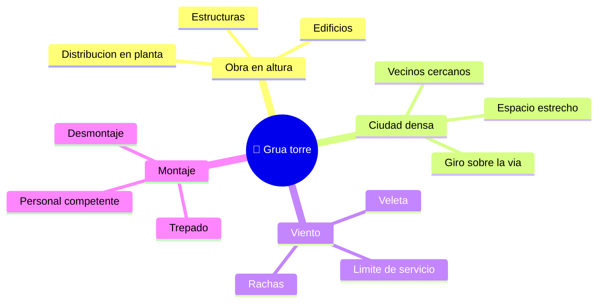

# 🌍 Entornos de trabajo de la grúa torre

[🏠 Inicio](../../../README.md) · [🗼 Curso: Grúa torre](../README.md) · 🌍 Entornos

Dónde opera una grúa torre y cómo cambia la operación según el entorno. Cada
entorno implica reglas, riesgos y ajustes distintos, y en simulación se traduce
en escenarios diferentes.

---

## 🗺️ Entornos principales

| Entorno | Características | Riesgos típicos | Ajuste de operación |
| --- | --- | --- | --- |
| Obra en altura | Edificios y estructuras verticales. | Caída de carga, personal debajo. | Área de exclusión, izaje lento. |
| Ciudad densa | Giro sobre vía pública y vecinos. | Invadir predios, personas abajo. | Pluma abatible, giro controlado. |
| Viento | Rachas que empujan carga y pluma. | Balanceo, empuje sobre la estructura. | Vigilar anemómetro, pasar a veleta. |
| Montaje y desmontaje | Trepado y armado del mástil. | Maniobra crítica, estructura abierta. | Personal competente, plan de izaje. |
| Nocturno / baja visibilidad | Poca luz en la obra. | Errores de señalización. | Iluminación, señalero, radio clara. |

---

## 🌦️ Factores del entorno

- **Viento**: es el límite operacional principal; empuja carga y estructura y
  obliga a detener el servicio por encima de un umbral.
- **Espacio**: en ciudad densa la pluma gira sobre la vía pública y sobre
  vecinos; la pluma abatible reduce esa invasión.
- **Personal en tierra**: bajo la zona de giro no debe haber personas; el área de
  exclusión es clave.
- **Montaje**: el trepado y el desmontaje son operaciones críticas que exigen
  personal competente y condiciones controladas.

---

## 🎮 Traducción a simulación

Cada entorno es un escenario con su viento, su espacio y su personal en tierra.
Ver cómo se modela en el
[Módulo 8: Diseño de simulación](../simulacion/diseno-simulador-grua-torre.md).

---

[⬅️ Anterior: Principios y operación](principios-grua-torre.md) · [➡️ Siguiente: Reglamentos](../reglamentos/reglamentos-grua-torre.md)
