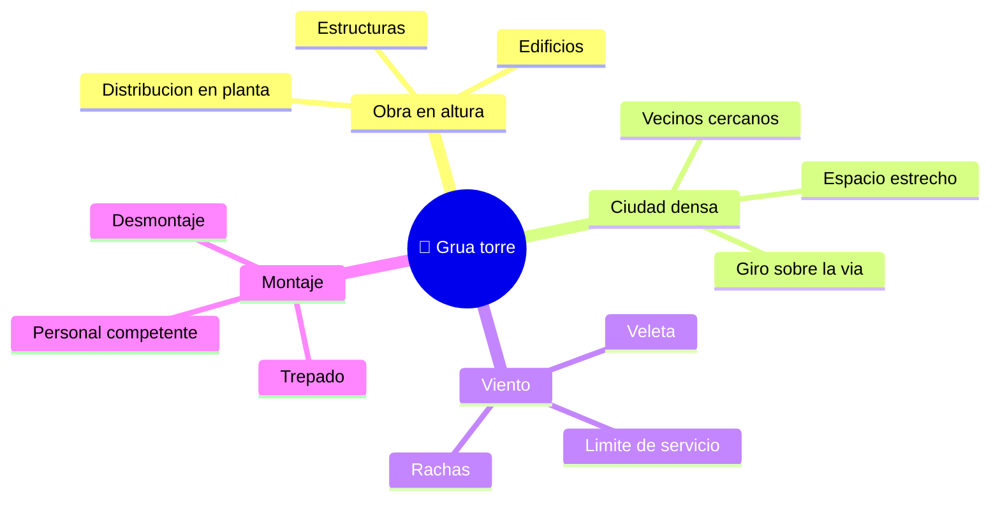

# 🌍 Entornos de trabajo de la grua torre

[🏠 Inicio](../../../README.md) · [🗼 Curso: Grua torre](../README.md) · 🌍 Entornos

Donde opera una grua torre y como cambia la operacion segun el entorno. Cada
entorno implica reglas, riesgos y ajustes distintos, y en simulacion se traduce
en escenarios diferentes.

---

## 🗺️ Entornos principales

| Entorno | Caracteristicas | Riesgos tipicos | Ajuste de operacion |
| --- | --- | --- | --- |
| Obra en altura | Edificios y estructuras verticales. | Caida de carga, personal debajo. | Area de exclusion, izaje lento. |
| Ciudad densa | Giro sobre via publica y vecinos. | Invadir predios, personas abajo. | Pluma abatible, giro controlado. |
| Viento | Rachas que empujan carga y pluma. | Balanceo, empuje sobre la estructura. | Vigilar anemometro, pasar a veleta. |
| Montaje y desmontaje | Trepado y armado del mastil. | Maniobra critica, estructura abierta. | Personal competente, plan de izaje. |
| Nocturno / baja visibilidad | Poca luz en la obra. | Errores de senalizacion. | Iluminacion, senalero, radio clara. |

---

## 🌦️ Factores del entorno

- **Viento**: es el limite operacional principal; empuja carga y estructura y
  obliga a detener el servicio por encima de un umbral.
- **Espacio**: en ciudad densa la pluma gira sobre la via publica y sobre
  vecinos; la pluma abatible reduce esa invasion.
- **Personal en tierra**: bajo la zona de giro no debe haber personas; el area de
  exclusion es clave.
- **Montaje**: el trepado y el desmontaje son operaciones criticas que exigen
  personal competente y condiciones controladas.

---

## 🎮 Traduccion a simulacion

Cada entorno es un escenario con su viento, su espacio y su personal en tierra.
Ver como se modela en el
[Modulo 8: Diseno de simulacion](../simulacion/diseno-simulador-grua-torre.md).

---

[⬅️ Anterior: Principios y operacion](principios-grua-torre.md) · [➡️ Siguiente: Reglamentos](../reglamentos/reglamentos-grua-torre.md)
