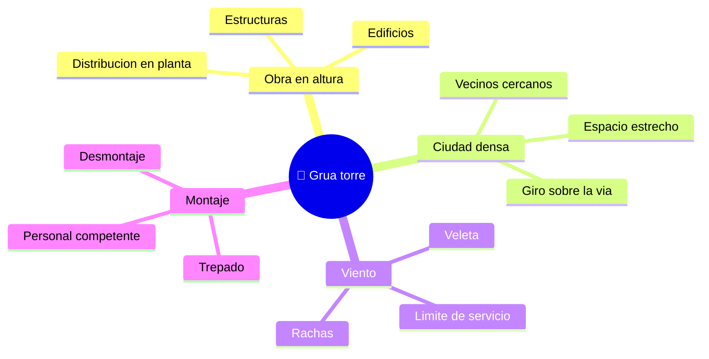

<!-- clase-meta
tipo_documento: clase
clase: 7
codigo: GRUATORRE-07
curso: grua-torre
titulo: "Entornos de trabajo de la grúa torre"
modalidad: "análisis de escenarios"
duracion_minutos: 60
nivel: introductorio
prerrequisito: GRUATORRE-06
competencia: "adaptacion_al_entorno"
resultados_aprendizaje:
  - "Explicar entornos, factores ambientales, riesgos y respuesta de simulación con vocabulario propio de Grúa torre."
  - "Aplicar esos conceptos a una decisión segura o a un escenario de simulación de Grúa torre."
evidencia: "Matriz entorno–cambio–riesgo–respuesta."
criterio_aprobacion: "Cada respuesta se adapta al entorno y distingue riesgos que no son intercambiables entre escenarios."
fuentes: manuales/fuentes.md
ultima_revision: 2026-09-10
-->

# 🌍 Entornos de trabajo de la grúa torre

[🏠 Inicio](../../../README.md) · [🗼 Curso: Grúa torre](../README.md) · 🌍 Entornos

Dónde opera una grúa torre y cómo cambia la operación según el entorno. Cada
entorno implica reglas, riesgos y ajustes distintos, y en simulación se traduce
en escenarios diferentes.

---

## 🗺️ Entornos principales

```mermaid
mindmap
  root((🗼 Grua torre))
    Obra en altura
      Edificios
      Estructuras
      Distribucion en planta
    Ciudad densa
      Giro sobre la via
      Vecinos cercanos
      Espacio estrecho
    Viento
      Limite de servicio
      Veleta
      Rachas
    Montaje
      Trepado
      Desmontaje
      Personal competente
```

| Entorno | Características | Riesgos típicos | Ajuste de operación |
| --- | --- | --- | --- |
| Obra en altura | Edificios y estructuras verticales. | Caída de carga, personal debajo. | Área de exclusión, izaje lento. |
| Ciudad densa | Giro sobre vía pública y vecinos. | Invadir predios, personas abajo. | Pluma abatible, giro controlado. |
| Viento | Rachas que empujan carga y pluma. | Balanceo, empuje sobre la estructura. | Vigilar anemómetro, pasar a veleta. |
| Montaje y desmontaje | Trepado y armado del mástil. | Maniobra crítica, estructura abierta. | Personal competente, plan de izaje. |
| Nocturno / baja visibilidad | Poca luz en la obra. | Errores de señalización. | Iluminación, señalero, radio clara. |

---

## 🌦️ Factores del entorno

- **Viento**: es el límite operacional principal; empuja carga y estructura y
  obliga a detener el servicio por encima de un umbral.
- **Espacio**: en ciudad densa la pluma gira sobre la vía pública y sobre
  vecinos; la pluma abatible reduce esa invasión.
- **Personal en tierra**: bajo la zona de giro no debe haber personas; el área de
  exclusión es clave.
- **Montaje**: el trepado y el desmontaje son operaciones críticas que exigen
  personal competente y condiciones controladas.

---

## 🎮 Traducción a simulación

Cada entorno es un escenario con su viento, su espacio y su personal en tierra.
Ver cómo se modela en el
[Clase 9: Diseño de simulación](../simulacion/diseno-simulador-grua-torre.md).

## 🧭 Guía de estudio aplicada

### Pregunta guía

¿Cómo ayuda **Entornos principales, Factores del entorno, Traducción a simulación y Guía de estudio aplicada** a **adaptar traslado de una carga desde radio corto hacia el extremo de pluma a tres condiciones ambientales distintas**?

### Explicación razonada

El entorno no es decoración: modifica las fuerzas, la percepción y el tiempo disponible. En el caso «traslado de una carga desde radio corto hacia el extremo de pluma», cambia el comportamiento de gancho y carga y aumenta la probabilidad de sobrepasar capacidad, inducir péndulo o trabajar sobre una zona no aislada. La respuesta correcta empieza por reconocer qué variable cambió y después adaptar límites, ruta o misión.

Esta clase se conecta con el resto del curso mediante **equilibrio de momentos: el efecto de la carga crece cuando aumenta su radio**. El hilo de
seguridad consiste en reconocer a tiempo **sobrepasar capacidad, inducir péndulo o trabajar sobre una zona no aislada** y poder justificar la decisión
**consultar tabla de carga y viento antes de autorizar cada trayectoria**; en clases posteriores cambiará el ángulo de análisis, no esa relación causal.
La lectura funcional común sigue **alimentación → cabrestante → carro y pluma → gancho y carga**, de modo que cada concepto pueda
ubicarse dentro del funcionamiento completo y no quede como un dato aislado.

**Apoyo documental:** [Crane, Derrick and Hoist Safety](https://www.osha.gov/cranes-derricks) aporta izaje, riesgos y controles;
[1926.1435 Tower Cranes](https://www.osha.gov/laws-regs/regulations/standardnumber/1926/1926.1435) se usa para requisitos específicos de grúas torre. Estas fuentes
se contrastan con el alcance de la clase y no sustituyen un manual de equipo concreto.

### Caso resuelto: de la observación a la decisión

1. **Escenario base:** conserva la misión «traslado de una carga desde radio corto hacia el extremo de pluma» para poder comparar.
2. **Cambiar una condición:** modifica sucesivamente superficie o medio, visibilidad y perturbación externa.
3. **Recalcular margen:** explica cómo cada cambio afecta **gancho y carga** y acerca o aleja **sobrepasar capacidad, inducir péndulo o trabajar sobre una zona no aislada**.
4. **Adaptar:** cambia límite, ruta, configuración o incluso cancela; no mantengas la misma respuesta por hábito.

### Comprueba tu comprensión

1. ¿Cómo cambiaría **gancho y carga** si empeora la perturbación externa?
2. ¿Qué condición ambiental acerca más el escenario a **sobrepasar capacidad, inducir péndulo o trabajar sobre una zona no aislada**?
3. ¿Cuándo adaptarías la maniobra y cuándo la cancelarías?

Orientación para revisar tus respuestas

- La primera respuesta debe relacionar el eslabón elegido con un efecto posterior, no solo nombrarlo.
- La segunda debe proponer una señal medible u observable y explicar qué tendencia sería preocupante.
- La tercera debe cambiar al menos una variable de capacidad, mando, entorno o margen de seguridad.

## 🎓 Cierre de clase

- **Actividad:** Contrasta tres entornos de Grúa torre a partir de entornos, factores ambientales, riesgos y respuesta de simulación y determina cómo cambian variables, percepción, riesgos y respuesta.
- **Evidencia:** Matriz entorno–cambio–riesgo–respuesta.
- **Criterio de aprobación:** Cada respuesta se adapta al entorno y distingue riesgos que no son intercambiables entre escenarios.
- **Transferencia:** explica qué cambiaría al pasar a otra variante de esta máquina.

### Fuentes de esta clase

- [OSHA-CRANES](https://www.osha.gov/cranes-derricks): Crane, Derrick and Hoist Safety, OSHA. Uso: izaje, riesgos y controles.
- [OSHA-TOWER](https://www.osha.gov/laws-regs/regulations/standardnumber/1926/1926.1435): 1926.1435 Tower Cranes, OSHA. Uso: requisitos específicos de grúas torre.

> Las fuentes sostienen el marco conceptual y normativo; esta clase no reemplaza el manual
> del fabricante, la formación certificada ni la habilitación exigida para operar equipos reales.

---

[⬅️ Anterior: Principios y operación](principios-grua-torre.md) · [➡️ Siguiente: Reglamentos](../reglamentos/reglamentos-grua-torre.md)
