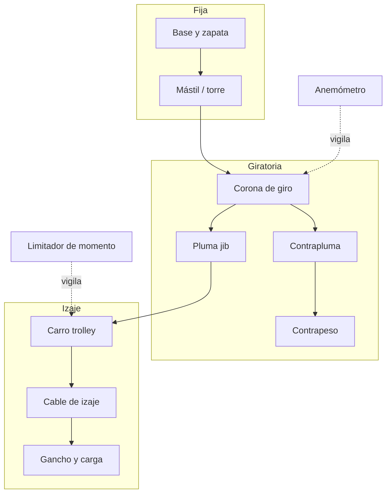
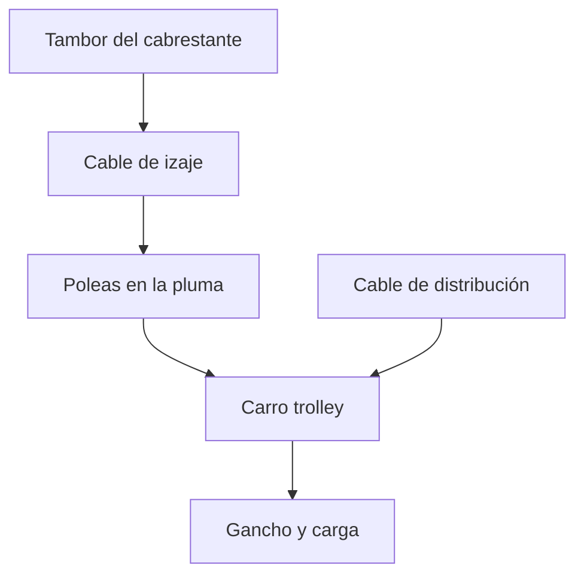
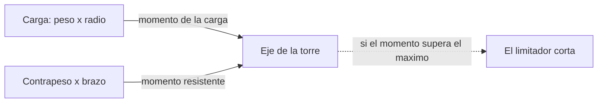

# 🔧 Sistemas mecánicos de la grúa torre

[🏠 Inicio](../../../README.md) · [🗼 Curso: Grúa torre](../README.md) · 🔧 Sistemas mecánicos

Este módulo abre la grúa torre por dentro y es el corazón del curso. Explica la
mecánica del izaje en altura: cómo se sostiene el mástil, como se reparte el
momento entre carga y contrapeso, y por qué existe un límite de peso para cada
posición del carro. Es la base técnica para entender los mandos (Módulo 5) y la
física de la operación (Módulo 6).

---

## 1. 🗼 Mástil y base

El mástil o torre es la estructura vertical reticulada que sostiene todo el
conjunto. Se ancla a una base o zapata de hormigón que transmite las cargas al
terreno. La base es el punto de vuelco de referencia: toda la estabilidad se mide
respecto a ella.

| Elemento | Función |
| --- | --- |
| Zapata / base | Ancla el mástil y reparte la carga al terreno. |
| Tramos de mástil | Módulos reticulados que se apilan para dar altura. |
| Arriostramiento | Anclajes o lazos que fijan el mástil al edificio. |
| Jaula de trepado | Permite crecer en altura intercalando tramos. |

Reglas básicas:

- El mástil **autoestable** se sostiene solo hasta una altura máxima según su base.
- Por encima de esa altura se necesita **arriostramiento** al edificio para no volcar.
- La base debe estar nivelada; una inclinación pequeña desplaza el centro de gravedad.

---

## 2. 🏗️ Pluma, contrapluma y contrapeso

La parte superior giratoria tiene dos brazos opuestos. La **pluma** (jib) proyecta
la carga hacia la obra; la **contrapluma** (counter-jib) lleva el **contrapeso**
que equilibra el conjunto.

| Elemento | Función |
| --- | --- |
| Pluma jib | Brazo horizontal por el que corre el carro. |
| Contrapluma | Brazo opuesto que aloja el contrapeso y la maquinaria. |
| Contrapeso | Masa fija que equilibra el momento de la carga. |
| Tirantes | Cables o barras que sostienen la pluma desde la torre superior. |

La pluma horizontal (hammerhead) usa un carro que se mueve por ella. La pluma
abatible (luffing jib) cambia el radio subiendo o bajando toda la pluma, útil en
ciudad densa para no invadir el espacio de los vecinos.

---

## 3. 🛒 Carro (trolley) y sistema de izaje

El **carro** o trolley corre por la pluma horizontal variando el **radio** (la
distancia del gancho al eje de la torre). El **cable de izaje** sube y baja el
gancho mediante un cabrestante.

- **Carro / trolley**: define el radio; alejarlo del eje reduce la capacidad.
- **Cabrestante de izaje**: enrolla el cable que sube o baja el gancho.
- **Cable de distribución**: mueve el carro a lo largo de la pluma.
- **Gancho**: sostiene la carga; puede llevar varias partes de línea.

La relación clave: **acercar el carro al eje sube la capacidad**, porque reduce el
radio y con el el momento de carga.

---

## 4. 🔄 Corona de giro (slewing)

La corona de giro es el rodamiento que permite rotar toda la parte superior
(pluma, contrapluma y contrapeso) sobre el mástil fijo. Un motor de giro la hace
rotar despacio para no balancear la carga.

| Elemento | Función |
| --- | --- |
| Rodamiento de giro | Une la parte fija con la giratoria. |
| Motor de giro | Rota la superestructura despacio y con control. |
| Freno de giro | Fija la orientación cuando se necesita. |
| Veleta / weathervane | Fuera de servicio deja girar libre con el viento. |

Fuera de servicio se libera el freno para que la pluma gire en **veleta**
(weathervane), orientandose sola con el viento y reduciendo el empuje lateral
sobre la estructura.

---

## 5. ⚖️ Momento de carga y estabilidad

La estabilidad de la grúa torre se explica con momentos, es decir, fuerza por
distancia respecto al eje de la torre.

Las magnitudes clave:

| Magnitud | Fórmula | Significado |
| --- | --- | --- |
| Momento de la carga | Peso de carga x radio | Tiende a volcar la grúa hacia la pluma. |
| Momento del contrapeso | Contrapeso x brazo | Equilibra el lado de la contrapluma. |
| Momento máximo | Valor de diseño de la grúa | Límite que no se puede superar. |
| Porcentaje de capacidad | Momento actual / momento máximo | Lo que muestra el limitador. |

### Por qué al alejar el carro baja la capacidad

El momento de la carga es **peso por radio**. La grúa tiene un momento máximo de
diseño que puede resistir. Si el radio aumenta, para no superar ese momento el
peso debe disminuir en proporción inversa:

- A radio 10 m un momento máximo de 100 t·m permite izar 10 t (10 x 10 = 100).
- A radio 40 m ese mismo momento de 100 t·m solo permite izar 2.5 t (2.5 x 40 = 100).

Por eso, al mover el carro hacia la punta de la pluma, la carga admisible siempre
baja. La tabla de carga de la grúa indica cuanto se puede izar en cada radio:

| Radio (m) | Capacidad (t) | % del máximo |
| --- | --- | --- |
| 10 | 10.0 | 100 |
| 16 | 6.3 | 63 |
| 24 | 4.2 | 42 |
| 32 | 3.1 | 31 |
| 40 | 2.5 | 25 |
| 50 | 2.0 | 20 |

Se lee así: a 10 metros de radio la grúa iza su carga nominal, pero a 50 metros
solo admite 2 toneladas. El **contrapeso** de la contrapluma equilibra el lado de
la carga sin necesidad de una base enorme.

---

## 6. 🧗 Arriostramiento y trepado

Para grandes alturas el mástil no se sostiene solo. Dos técnicas lo permiten:

| Técnica | Como funciona |
| --- | --- |
| Arriostramiento | Lazos o anclajes fijan el mástil al edificio a intervalos. |
| Trepado exterior | Una jaula de trepado externa sube la grúa y se intercala un tramo. |
| Trepado interior | La grúa crece por el interior del edificio apoyandose en las losas. |

El **trepado** (telescopado) es la operación de crecer en altura. Con una jaula
de trepado se abre el mástil, se introduce un tramo nuevo y se vuelve a cerrar.
Es una maniobra crítica que se hace durante el montaje y el desmontaje, con la
grúa en condición controlada.

### Limitadores

- **Limitador de carga**: impide izar más peso del admisible por el sistema de cable.
- **Limitador de momento**: impide superar el momento máximo (peso por radio).
- **Finales de carrera**: detienen el carro y el gancho en sus posiciones límite.

---

## 🔁 Cómo se conecta todo

1. La **base** ancla el **mástil** al terreno y fija el punto de referencia.
2. La **corona de giro** deja rotar la **pluma**, la **contrapluma** y el **contrapeso**.
3. El **carro** define el **radio** y el **cabrestante** sube o baja el gancho.
4. El **contrapeso** equilibra el momento de la carga sobre el eje de la torre.
5. La **tabla de carga** define el límite de peso para cada radio.
6. Los **limitadores** vigilan la carga y el momento y cortan antes del vuelco.

Con esto entendido, el [Módulo 5: Mandos](../mandos/manual-mandos-grua-torre.md)
muestra como el operador acciona cada uno de estos sistemas.

---

[⬅️ Anterior: Modelos y variantes](../modelos/modelos-grua-torre.md) · [➡️ Siguiente: Mandos e instrumentos](../mandos/manual-mandos-grua-torre.md)
