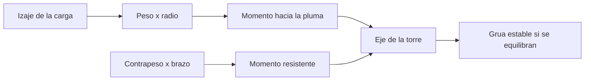

# 🧰 Recursos de la grua torre

[🏠 Inicio](../../../README.md) · [🗼 Curso: Grua torre](../README.md) · 🧰 Recursos

Glosario especifico, enlaces y diagramas de apoyo del curso de grua torre. Amplia
el [glosario general](../../../docs/05-glosario-general.md).

---

## 📖 Glosario especifico

| Termino | Definicion |
| --- | --- |
| Mastil | Estructura vertical reticulada que sostiene la grua torre. |
| Pluma jib | Brazo horizontal por el que corre el carro y del que cuelga la carga. |
| Contrapluma | Brazo opuesto que aloja el contrapeso y la maquinaria. |
| Contrapeso | Masa fija que equilibra el momento de la carga. |
| Carro trolley | Elemento que corre por la pluma y varia el radio. |
| Corona de giro | Rodamiento que permite rotar la parte superior. |
| Momento de carga | Producto del peso por el radio; mide la tendencia al vuelco. |
| Trepado | Maniobra de crecer en altura intercalando tramos de mastil. |
| Veleta | Giro libre de la pluma con el viento fuera de servicio. |

---

## 🗺️ Diagrama de reparto de momentos

---

## 🔗 Enlaces y fuentes

- Marco legal: [⚖️ docs/07-marco-legal-chile.md](../../../docs/07-marco-legal-chile.md)
- Registro de fuentes: [📚 manuales/fuentes.md](../../../manuales/fuentes.md)
- Normativa de seguridad laboral (Ley 16.744, D.S. 594): ver el registro de fuentes.

Registrar cada recurso nuevo con su origen y licencia, siguiendo
[`recursos/README.md`](../../../recursos/README.md).

---

[🎓 Portada del curso](../README.md) · [⬅️ Anterior: Diseno de simulacion](../simulacion/diseno-simulador-grua-torre.md)
