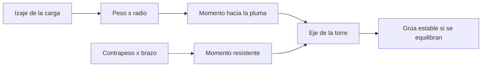

# 🧰 Recursos de la grúa torre

[🏠 Inicio](../../../README.md) · [🗼 Curso: Grúa torre](../README.md) · 🧰 Recursos

Glosario específico, enlaces y diagramas de apoyo del curso de grúa torre. Amplia
el [glosario general](../../../docs/05-glosario-general.md).

---

## 📖 Glosario específico

| Término | Definición |
| --- | --- |
| Mástil | Estructura vertical reticulada que sostiene la grúa torre. |
| Pluma jib | Brazo horizontal por el que corre el carro y del que cuelga la carga. |
| Contrapluma | Brazo opuesto que aloja el contrapeso y la maquinaria. |
| Contrapeso | Masa fija que equilibra el momento de la carga. |
| Carro trolley | Elemento que corre por la pluma y varia el radio. |
| Corona de giro | Rodamiento que permite rotar la parte superior. |
| Momento de carga | Producto del peso por el radio; mide la tendencia al vuelco. |
| Trepado | Maniobra de crecer en altura intercalando tramos de mástil. |
| Veleta | Giro libre de la pluma con el viento fuera de servicio. |

---

## 🗺️ Diagrama de reparto de momentos

```mermaid
flowchart LR
    Izaje[Izaje de la carga] --> Momento[Peso x radio]
    Momento --> Pluma[Momento hacia la pluma]
    Contrapeso[Contrapeso x brazo] --> Resistente[Momento resistente]
    Pluma --> Eje[Eje de la torre]
    Resistente --> Eje
    Eje --> Estable[Grúa estable si se equilibran]
```

---

## 🔗 Enlaces y fuentes

- Marco legal: [⚖️ docs/07-marco-legal-chile.md](../../../docs/07-marco-legal-chile.md)
- Registro de fuentes: [📚 manuales/fuentes.md](../../../manuales/fuentes.md)
- Normativa de seguridad laboral (Ley 16.744, D.S. 594): ver el registro de fuentes.

Registrar cada recurso nuevo con su origen y licencia, siguiendo
[`recursos/README.md`](../../../recursos/README.md).

## 🎓 Cierre de clase

- **Actividad:** Selecciona términos de glosario, esquemas y trazabilidad de fuentes, explícalos en contexto de Grúa torre y verifica la procedencia de las fuentes utilizadas.
- **Evidencia:** Glosario aplicado y ficha breve de trazabilidad.
- **Criterio de aprobación:** Los términos permiten interpretar el curso y las fuentes se distinguen por autoridad, alcance y vigencia.
- **Transferencia:** explica qué cambiaría al pasar a otra variante de esta máquina.

### Fuentes de esta clase

- [OSHA-CRANES](https://www.osha.gov/cranes-derricks): Crane, Derrick and Hoist Safety, OSHA. Uso: izaje, riesgos y controles.
- [OSHA-TOWER](https://www.osha.gov/laws-regs/regulations/standardnumber/1926/1926.1435): 1926.1435 Tower Cranes, OSHA. Uso: requisitos específicos de grúas torre.

> Las fuentes sostienen el marco conceptual y normativo; esta clase no reemplaza el manual
> del fabricante, la formación certificada ni la habilitación exigida para operar equipos reales.

---

[🎓 Portada del curso](../README.md) · [⬅️ Anterior: Diseño de simulación](../simulacion/diseno-simulador-grua-torre.md) · [➡️ Siguiente: Ejercicios](../ejercicios/ejercicios-grua-torre.md)
