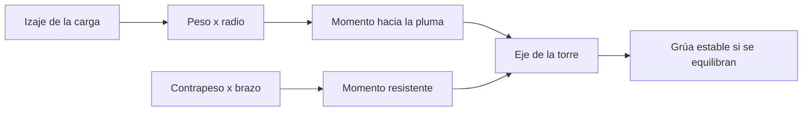

<!-- clase-meta
tipo_documento: clase
clase: 10
codigo: GRUATORRE-10
curso: grua-torre
titulo: "Recursos de la grúa torre"
modalidad: "taller documental"
duracion_minutos: 45
nivel: introductorio
prerrequisito: GRUATORRE-09
competencia: "alfabetizacion_tecnica"
resultados_aprendizaje:
  - "Explicar glosario, esquemas y trazabilidad de fuentes con vocabulario propio de Grúa torre."
  - "Aplicar esos conceptos a una decisión segura o a un escenario de simulación de Grúa torre."
evidencia: "Glosario aplicado y ficha breve de trazabilidad."
criterio_aprobacion: "Los términos permiten interpretar el curso y las fuentes se distinguen por autoridad, alcance y vigencia."
fuentes: manuales/fuentes.md
ultima_revision: 2026-09-10
-->

# 🧰 Recursos de la grúa torre

[🏠 Inicio](../../../README.md) · [🗼 Curso: Grúa torre](../README.md) · 🧰 Recursos

Glosario específico, enlaces y diagramas de apoyo del curso de grúa torre. Amplia
el [glosario general](../../../docs/05-glosario-general.md).

---

## 📖 Glosario específico

| Término | Definición |
| --- | --- |
| Mástil | Estructura vertical reticulada que sostiene la grúa torre. |
| Pluma jib | Brazo horizontal por el que corre el carro y del que cuelga la carga. |
| Contrapluma | Brazo opuesto que aloja el contrapeso y la maquinaria. |
| Contrapeso | Masa fija que equilibra el momento de la carga. |
| Carro trolley | Elemento que corre por la pluma y varia el radio. |
| Corona de giro | Rodamiento que permite rotar la parte superior. |
| Momento de carga | Producto del peso por el radio; mide la tendencia al vuelco. |
| Trepado | Maniobra de crecer en altura intercalando tramos de mástil. |
| Veleta | Giro libre de la pluma con el viento fuera de servicio. |

---

## 🗺️ Diagrama de reparto de momentos

```mermaid
flowchart LR
    Izaje[Izaje de la carga] --> Momento[Peso x radio]
    Momento --> Pluma[Momento hacia la pluma]
    Contrapeso[Contrapeso x brazo] --> Resistente[Momento resistente]
    Pluma --> Eje[Eje de la torre]
    Resistente --> Eje
    Eje --> Estable[Grúa estable si se equilibran]
```

---

## 🔗 Enlaces y fuentes

- Marco legal: [⚖️ docs/07-marco-legal-chile.md](../../../docs/07-marco-legal-chile.md)
- Registro de fuentes: [📚 manuales/fuentes.md](../../../manuales/fuentes.md)
- Normativa de seguridad laboral (Ley 16.744, D.S. 594): ver el registro de fuentes.

Registrar cada recurso nuevo con su origen y licencia, siguiendo
[`recursos/README.md`](../../../recursos/README.md).

## 🧭 Guía de estudio aplicada

### Pregunta guía

¿Cómo ayuda **Glosario específico, Diagrama de reparto de momentos, Enlaces y fuentes y Guía de estudio aplicada** a **explicar con fuentes los términos alimentación, cabrestante, carro y pluma y gancho y carga**?

### Explicación razonada

El vocabulario técnico organiza relaciones: alimentación, cabrestante, carro y pluma y gancho y carga nombran partes distintas de una misma cadena funcional. Una fuente se usa para sostener una afirmación concreta —principio, límite, procedimiento o contexto— y debe distinguirse del manual particular de un fabricante o de una regla narrativa.

Esta clase se conecta con el resto del curso mediante **equilibrio de momentos: el efecto de la carga crece cuando aumenta su radio**. El hilo de
seguridad consiste en reconocer a tiempo **sobrepasar capacidad, inducir péndulo o trabajar sobre una zona no aislada** y poder justificar la decisión
**consultar tabla de carga y viento antes de autorizar cada trayectoria**; en clases posteriores cambiará el ángulo de análisis, no esa relación causal.
La lectura funcional común sigue **alimentación → cabrestante → carro y pluma → gancho y carga**, de modo que cada concepto pueda
ubicarse dentro del funcionamiento completo y no quede como un dato aislado.

**Apoyo documental:** [Crane, Derrick and Hoist Safety](https://www.osha.gov/cranes-derricks) aporta izaje, riesgos y controles;
[1926.1435 Tower Cranes](https://www.osha.gov/laws-regs/regulations/standardnumber/1926/1926.1435) se usa para requisitos específicos de grúas torre. Estas fuentes
se contrastan con el alcance de la clase y no sustituyen un manual de equipo concreto.

### Caso resuelto: de la observación a la decisión

1. **Definir en contexto:** explica **alimentación**, **cabrestante**, **carro y pluma** y **gancho y carga** por su función y relación.
2. **Respaldar:** enlaza cada afirmación importante con una fuente identificable y declara su alcance.
3. **Contrastar:** separa principios generales, requisitos locales, manual de fabricante y —si aplica— canon ficticio.
4. **Reformular:** convierte una definición copiada en una explicación propia con un ejemplo de **Grúa torre**.

### Comprueba tu comprensión

1. Explica la diferencia funcional entre **cabrestante** y **carro y pluma** sin copiar una definición.
2. ¿Qué fuente respalda el principio «equilibrio de momentos: el efecto de la carga crece cuando aumenta su radio» y cuál es su alcance?
3. ¿Qué dato exigiría un manual de fabricante en vez de una fuente general?

Orientación para revisar tus respuestas

- La primera respuesta debe relacionar el eslabón elegido con un efecto posterior, no solo nombrarlo.
- La segunda debe proponer una señal medible u observable y explicar qué tendencia sería preocupante.
- La tercera debe cambiar al menos una variable de capacidad, mando, entorno o margen de seguridad.

## 🎓 Cierre de clase

- **Actividad:** Selecciona términos de glosario, esquemas y trazabilidad de fuentes, explícalos en contexto de Grúa torre y verifica la procedencia de las fuentes utilizadas.
- **Evidencia:** Glosario aplicado y ficha breve de trazabilidad.
- **Criterio de aprobación:** Los términos permiten interpretar el curso y las fuentes se distinguen por autoridad, alcance y vigencia.
- **Transferencia:** explica qué cambiaría al pasar a otra variante de esta máquina.

### Fuentes de esta clase

- [OSHA-CRANES](https://www.osha.gov/cranes-derricks): Crane, Derrick and Hoist Safety, OSHA. Uso: izaje, riesgos y controles.
- [OSHA-TOWER](https://www.osha.gov/laws-regs/regulations/standardnumber/1926/1926.1435): 1926.1435 Tower Cranes, OSHA. Uso: requisitos específicos de grúas torre.

> Las fuentes sostienen el marco conceptual y normativo; esta clase no reemplaza el manual
> del fabricante, la formación certificada ni la habilitación exigida para operar equipos reales.

---

[🎓 Portada del curso](../README.md) · [⬅️ Anterior: Diseño de simulación](../simulacion/diseno-simulador-grua-torre.md) · [➡️ Siguiente: Ejercicios](../ejercicios/ejercicios-grua-torre.md)
