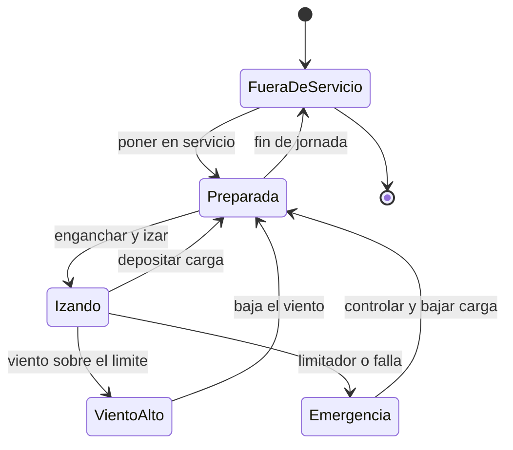

# 🎮 Diseño de simulación de la grúa torre

[🏠 Inicio](../../../README.md) · [🗼 Curso: Grúa torre](../README.md) · 🎮 Simulación

## Objetivo de la simulación

Que el usuario aprenda a izar, girar y trasladar el carro respetando el momento
de carga, el radio y el límite de viento, controlando el péndulo de la carga de
forma segura y progresiva.

## Nivel de realismo

- Nivel elegido: se ofrece del 1 al 3 (ver `docs/03-niveles-de-realismo.md`).
- Justificación: la grúa torre permite enseñar el equilibrio de momentos y el
  límite de viento con una estructura fija, sin la complejidad de la circulación
  por vía pública.

## Variables principales

| Variable | Tipo | Rango | Afecta a | Comentarios |
| --- | --- | --- | --- | --- |
| Peso de la carga | numérica | 0-10 t | Momento de carga | Central para el limitador. |
| Radio del carro | numérica | 3-50 m | Capacidad admisible | Alejar baja la capacidad. |
| Altura del gancho | numérica | 0-80 m | Posición vertical | Limitada por finales de carrera. |
| Ángulo de giro | numérica | 0-360 grados | Orientación de la pluma | Ubica la carga en la obra. |
| Viento | numérica | 0-100 km/h | Límite de servicio | Sobre el umbral detiene el izaje. |
| Momento de carga | numérica | 0-100% | Estabilidad | Peso por radio vs máximo. |
| Péndulo de la carga | numérica | 0-30 grados | Control y seguridad | Aumenta con movimientos bruscos. |

## Ciclo básico

1. Leer entrada del usuario (izaje, giro, traslación del carro, freno).
2. Actualizar posición del carro, altura del gancho y ángulo de giro.
3. Calcular el momento de carga (peso por radio) y compararlo con el máximo.
4. Aplicar restricciones del entorno (viento, área de exclusión, nivel de base).
5. Actualizar el péndulo de la carga según la suavidad de los movimientos.
6. Refrescar instrumentos y retroalimentación (limitador, anemómetro, alarmas).

## Modos de juego futuros

- Tutorial guiado de mandos e izaje.
- Práctica libre de izaje y giro en obra cerrada.
- Misiones de distribución de material por la planta.
- Desafíos de precisión al depositar la carga.
- Situaciones de viento creciente que obligan a pasar a veleta.

## Elementos fuera de alcance

- Maniobras temerarias presentadas como recomendables.
- Superar el limitador de momento como objetivo del juego.
- Datos técnicos que permitan alterar sistemas reales de una grúa.

## Pendientes

- [ ] Definir valores por defecto de cada variable por tipo de grúa torre.
- [ ] Prototipar el ciclo básico en un motor simple.
- [ ] Ajustar el modelo de péndulo y de viento.
- [ ] Agregar fuentes técnicas públicas a [`manuales/fuentes.md`](../../../manuales/fuentes.md).

---

[⬅️ Anterior: Reglamentos](../reglamentos/reglamentos-grua-torre.md) · [➡️ Siguiente: Recursos](../recursos/recursos-grua-torre.md)
