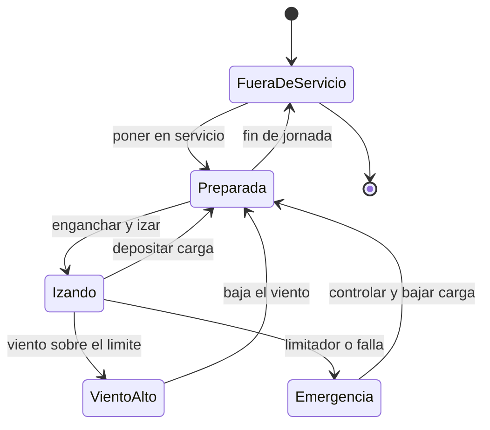

# 🎮 Diseno de simulacion de la grua torre

[🏠 Inicio](../../../README.md) · [🗼 Curso: Grua torre](../README.md) · 🎮 Simulacion

## Objetivo de la simulacion

Que el usuario aprenda a izar, girar y trasladar el carro respetando el momento
de carga, el radio y el limite de viento, controlando el pendulo de la carga de
forma segura y progresiva.

## Nivel de realismo

- Nivel elegido: se ofrece del 1 al 3 (ver `docs/03-niveles-de-realismo.md`).
- Justificacion: la grua torre permite ensenar el equilibrio de momentos y el
  limite de viento con una estructura fija, sin la complejidad de la circulacion
  por via publica.

## Variables principales

| Variable | Tipo | Rango | Afecta a | Comentarios |
| --- | --- | --- | --- | --- |
| Peso de la carga | numerica | 0-10 t | Momento de carga | Central para el limitador. |
| Radio del carro | numerica | 3-50 m | Capacidad admisible | Alejar baja la capacidad. |
| Altura del gancho | numerica | 0-80 m | Posicion vertical | Limitada por finales de carrera. |
| Angulo de giro | numerica | 0-360 grados | Orientacion de la pluma | Ubica la carga en la obra. |
| Viento | numerica | 0-100 km/h | Limite de servicio | Sobre el umbral detiene el izaje. |
| Momento de carga | numerica | 0-100% | Estabilidad | Peso por radio vs maximo. |
| Pendulo de la carga | numerica | 0-30 grados | Control y seguridad | Aumenta con movimientos bruscos. |

## Ciclo basico

1. Leer entrada del usuario (izaje, giro, traslacion del carro, freno).
2. Actualizar posicion del carro, altura del gancho y angulo de giro.
3. Calcular el momento de carga (peso por radio) y compararlo con el maximo.
4. Aplicar restricciones del entorno (viento, area de exclusion, nivel de base).
5. Actualizar el pendulo de la carga segun la suavidad de los movimientos.
6. Refrescar instrumentos y retroalimentacion (limitador, anemometro, alarmas).

## Modos de juego futuros

- Tutorial guiado de mandos e izaje.
- Practica libre de izaje y giro en obra cerrada.
- Misiones de distribucion de material por la planta.
- Desafios de precision al depositar la carga.
- Situaciones de viento creciente que obligan a pasar a veleta.

## Elementos fuera de alcance

- Maniobras temerarias presentadas como recomendables.
- Superar el limitador de momento como objetivo del juego.
- Datos tecnicos que permitan alterar sistemas reales de una grua.

## Pendientes

- [ ] Definir valores por defecto de cada variable por tipo de grua torre.
- [ ] Prototipar el ciclo basico en un motor simple.
- [ ] Ajustar el modelo de pendulo y de viento.
- [ ] Agregar fuentes tecnicas publicas a [`manuales/fuentes.md`](../../../manuales/fuentes.md).

---

[⬅️ Anterior: Reglamentos](../reglamentos/reglamentos-grua-torre.md) · [➡️ Siguiente: Recursos](../recursos/recursos-grua-torre.md)
