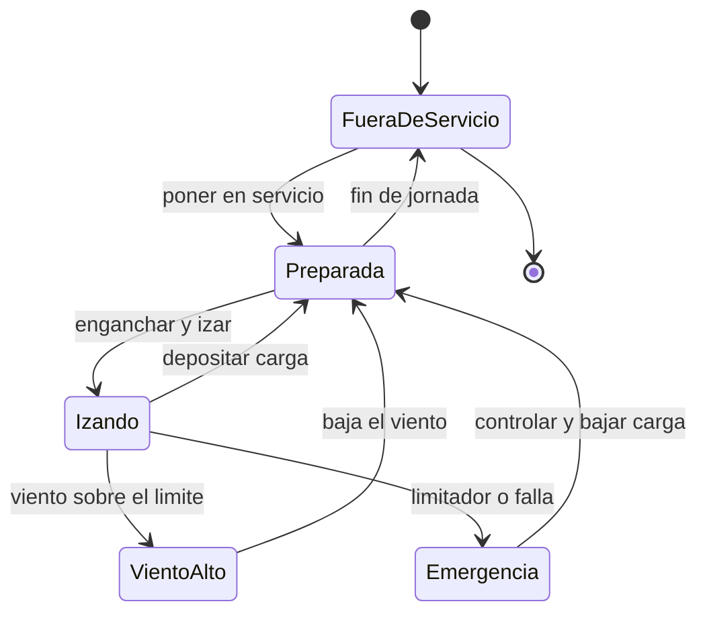
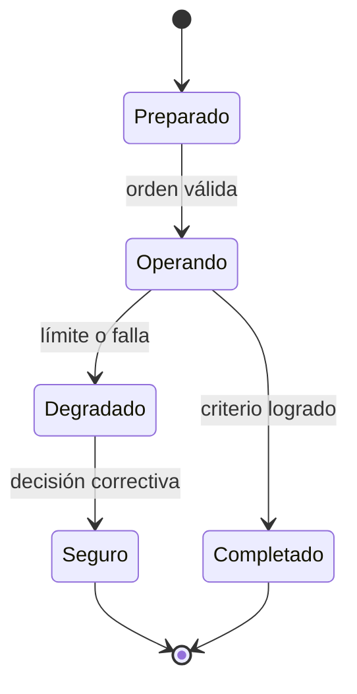

<!-- clase-meta
tipo_documento: clase
clase: 9
codigo: GRUATORRE-09
curso: grua-torre
titulo: "Diseño de simulación de la grúa torre"
modalidad: "laboratorio de diseño"
duracion_minutos: 90
nivel: introductorio
prerrequisito: GRUATORRE-08
competencia: "modelado_de_simulacion"
resultados_aprendizaje:
  - "Explicar objetivo, variables, estados, ciclo y escenarios de simulación con vocabulario propio de Grúa torre."
  - "Aplicar esos conceptos a una decisión segura o a un escenario de simulación de Grúa torre."
evidencia: "Ficha de escenario y diagrama de estados."
criterio_aprobacion: "El modelo es específico de la máquina, medible, seguro y trazable a clases anteriores."
fuentes: manuales/fuentes.md
ultima_revision: 2026-09-10
-->

# 🎮 Diseño de simulación de la grúa torre

[🏠 Inicio](../../../README.md) · [🗼 Curso: Grúa torre](../README.md) · 🎮 Simulación

```mermaid
stateDiagram-v2
    [*] --> FueraDeServicio
    FueraDeServicio --> Preparada: poner en servicio
    Preparada --> Izando: enganchar y izar
    Izando --> Preparada: depositar carga
    Izando --> VientoAlto: viento sobre el limite
    VientoAlto --> Preparada: baja el viento
    Izando --> Emergencia: limitador o falla
    Emergencia --> Preparada: controlar y bajar carga
    Preparada --> FueraDeServicio: fin de jornada
    FueraDeServicio --> [*]
```

## Objetivo de la simulación

Que el usuario aprenda a izar, girar y trasladar el carro respetando el momento
de carga, el radio y el límite de viento, controlando el péndulo de la carga de
forma segura y progresiva.

## Nivel de realismo

- Nivel elegido: se ofrece del 1 al 3 (ver `docs/03-niveles-de-realismo.md`).
- Justificación: la grúa torre permite enseñar el equilibrio de momentos y el
  límite de viento con una estructura fija, sin la complejidad de la circulación
  por vía pública.

## Variables principales

| Variable | Tipo | Rango | Afecta a | Comentarios |
| --- | --- | --- | --- | --- |
| Peso de la carga | numérica | 0-10 t | Momento de carga | Central para el limitador. |
| Radio del carro | numérica | 3-50 m | Capacidad admisible | Alejar baja la capacidad. |
| Altura del gancho | numérica | 0-80 m | Posición vertical | Limitada por finales de carrera. |
| Ángulo de giro | numérica | 0-360 grados | Orientación de la pluma | Ubica la carga en la obra. |
| Viento | numérica | 0-100 km/h | Límite de servicio | Sobre el umbral detiene el izaje. |
| Momento de carga | numérica | 0-100% | Estabilidad | Peso por radio vs máximo. |
| Péndulo de la carga | numérica | 0-30 grados | Control y seguridad | Aumenta con movimientos bruscos. |

## Ciclo básico

1. Leer entrada del usuario (izaje, giro, traslación del carro, freno).
2. Actualizar posición del carro, altura del gancho y ángulo de giro.
3. Calcular el momento de carga (peso por radio) y compararlo con el máximo.
4. Aplicar restricciones del entorno (viento, área de exclusión, nivel de base).
5. Actualizar el péndulo de la carga según la suavidad de los movimientos.
6. Refrescar instrumentos y retroalimentación (limitador, anemómetro, alarmas).

## Modos de juego futuros

- Tutorial guiado de mandos e izaje.
- Práctica libre de izaje y giro en obra cerrada.
- Misiones de distribución de material por la planta.
- Desafíos de precisión al depositar la carga.
- Situaciones de viento creciente que obligan a pasar a veleta.

## Elementos fuera de alcance

- Maniobras temerarias presentadas como recomendables.
- Superar el limitador de momento como objetivo del juego.
- Datos técnicos que permitan alterar sistemas reales de una grúa.

## Pendientes

- [ ] Definir valores por defecto de cada variable por tipo de grúa torre.
- [ ] Prototipar el ciclo básico en un motor simple.
- [ ] Ajustar el modelo de péndulo y de viento.
- [ ] Agregar fuentes técnicas públicas a [`manuales/fuentes.md`](../../../manuales/fuentes.md).

## 🧭 Guía de estudio aplicada

### Pregunta guía

¿Cómo ayuda **Objetivo de la simulación, Nivel de realismo, Variables principales y Ciclo básico** a **modelar traslado de una carga desde radio corto hacia el extremo de pluma como estados, variables y decisiones observables**?

### Explicación razonada

Una simulación de Grúa torre es educativa si representa decisiones y consecuencias. Como mínimo debe modelar el estado de alimentación, la respuesta de cabrestante, la transición en carro y pluma y el resultado en gancho y carga. El escenario «traslado de una carga desde radio corto hacia el extremo de pluma» es valioso porque obliga a observar, formular una hipótesis, actuar y comprobar.

```mermaid
stateDiagram-v2
    [*] --> Preparado
    Preparado --> Operando: orden válida
    Operando --> Degradado: límite o falla
    Degradado --> Seguro: decisión correctiva
    Operando --> Completado: criterio logrado
    Seguro --> [*]
    Completado --> [*]
```

Esta clase se conecta con el resto del curso mediante **equilibrio de momentos: el efecto de la carga crece cuando aumenta su radio**. El hilo de
seguridad consiste en reconocer a tiempo **sobrepasar capacidad, inducir péndulo o trabajar sobre una zona no aislada** y poder justificar la decisión
**consultar tabla de carga y viento antes de autorizar cada trayectoria**; en clases posteriores cambiará el ángulo de análisis, no esa relación causal.
La lectura funcional común sigue **alimentación → cabrestante → carro y pluma → gancho y carga**, de modo que cada concepto pueda
ubicarse dentro del funcionamiento completo y no quede como un dato aislado.

**Apoyo documental:** [Crane, Derrick and Hoist Safety](https://www.osha.gov/cranes-derricks) aporta izaje, riesgos y controles;
[1926.1435 Tower Cranes](https://www.osha.gov/laws-regs/regulations/standardnumber/1926/1926.1435) se usa para requisitos específicos de grúas torre. Estas fuentes
se contrastan con el alcance de la clase y no sustituyen un manual de equipo concreto.

### Caso resuelto: de la observación a la decisión

1. **Estado inicial:** representa traslado de una carga desde radio corto hacia el extremo de pluma con valores observables para **alimentación**, **cabrestante**, **carro y pluma** y **gancho y carga**.
2. **Decisión del estudiante:** ofrece una elección que cambie el estado, no una animación automática.
3. **Consecuencia:** modela la tendencia hacia **sobrepasar capacidad, inducir péndulo o trabajar sobre una zona no aislada** y una señal previa que permita corregir.
4. **Cierre:** evalúa la explicación de la decisión, además de si el estudiante “ganó” el escenario.

### Comprueba tu comprensión

1. ¿Qué cuatro estados mínimos necesita el escenario «traslado de una carga desde radio corto hacia el extremo de pluma»?
2. ¿Qué variable anticipa **sobrepasar capacidad, inducir péndulo o trabajar sobre una zona no aislada** antes de llegar al estado de falla?
3. ¿Cómo evaluarías la explicación del estudiante y no solo el resultado final?

Orientación para revisar tus respuestas

- La primera respuesta debe relacionar el eslabón elegido con un efecto posterior, no solo nombrarlo.
- La segunda debe proponer una señal medible u observable y explicar qué tendencia sería preocupante.
- La tercera debe cambiar al menos una variable de capacidad, mando, entorno o margen de seguridad.

## 🎓 Cierre de clase

- **Actividad:** Diseña un escenario educativo de Grúa torre basado en objetivo, variables, estados, ciclo y escenarios de simulación, con entradas, estados, variables y criterio de cierre.
- **Evidencia:** Ficha de escenario y diagrama de estados.
- **Criterio de aprobación:** El modelo es específico de la máquina, medible, seguro y trazable a clases anteriores.
- **Transferencia:** explica qué cambiaría al pasar a otra variante de esta máquina.

### Fuentes de esta clase

- [OSHA-CRANES](https://www.osha.gov/cranes-derricks): Crane, Derrick and Hoist Safety, OSHA. Uso: izaje, riesgos y controles.
- [OSHA-TOWER](https://www.osha.gov/laws-regs/regulations/standardnumber/1926/1926.1435): 1926.1435 Tower Cranes, OSHA. Uso: requisitos específicos de grúas torre.

> Las fuentes sostienen el marco conceptual y normativo; esta clase no reemplaza el manual
> del fabricante, la formación certificada ni la habilitación exigida para operar equipos reales.

---

[⬅️ Anterior: Reglamentos](../reglamentos/reglamentos-grua-torre.md) · [➡️ Siguiente: Recursos](../recursos/recursos-grua-torre.md)
