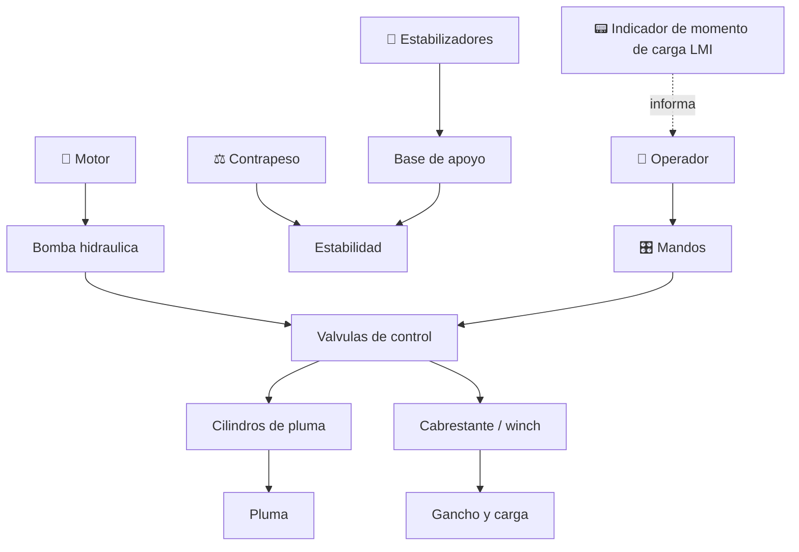

# 🏗️ Curso: Gruas

[🏠 Inicio](../../README.md) · [🚙 Catalogo de vehiculos](../README.md) · [🎓 Guia de curso](../../docs/08-guia-de-estilo-y-curso.md)

> **Curso de operacion de gruas.** Documenta la grua de principio a fin:
> historia, caracteristicas, mecanica e izaje en profundidad, mandos, fisica de
> la estabilidad, entornos, reglamentos chilenos y diseno de simulacion. El
> nucleo del curso es la estabilidad: momento de carga, radio y contrapeso.

---

## 🎯 Objetivos de aprendizaje

Al terminar este curso deberias poder:

- Explicar como una grua iza, gira y traslada una carga sin volcar.
- Identificar sus sistemas mecanicos e hidraulicos y como se conectan.
- Leer una tabla de carga y relacionar radio, angulo y capacidad.
- Comprender el momento de vuelco, el contrapeso y el rol del LMI.
- Reconocer todos los mandos e instrumentos y su funcion.
- Conocer los reglamentos chilenos aplicables (licencia clase D, seguridad).
- Traducir todo lo anterior en variables de un simulador educativo.

---

## 🗺️ Mapa del vehiculo

---

## 📚 Modulos del curso

| # | Modulo | Contenido | Enlace |
| :-: | --- | --- | --- |
| 1 | 📜 Historia | Origen y evolucion de la grua, linea de tiempo. | [Abrir](historia/historia-grua.md) |
| 2 | 📋 Caracteristicas | Que es, tipos de grua y para que sirve cada uno. | [Abrir](operacion/caracteristicas-grua.md) |
| 3 | 🔧 Sistemas mecanicos | Pluma, cabrestante, estabilizadores, tablas de carga, hidraulica. | [Abrir](operacion/sistemas-mecanicos-grua.md) |
| 4 | 🎛️ Mandos e instrumentos | Cabina, controles, joysticks, LMI y tablero. | [Abrir](mandos/manual-mandos-grua.md) |
| 5 | 🧪 Principios y operacion | Momento de carga, estabilidad y fases de izaje. | [Abrir](operacion/principios-grua.md) |
| 6 | 🌍 Entornos de trabajo | Obra, puerto, industria, rescate y terreno irregular. | [Abrir](operacion/entornos-grua.md) |
| 7 | ⚖️ Reglamentos | Ley chilena: licencia clase D, seguridad de izaje. | [Abrir](reglamentos/reglamentos-grua.md) |
| 8 | 🎮 Diseno de simulacion | Variables, ciclo y modos de juego. | [Abrir](simulacion/diseno-simulador-grua.md) |
| 9 | 🧰 Recursos | Glosario, enlaces y diagramas. | [Abrir](recursos/recursos-grua.md) |

---

## 🧩 Requisitos previos

Se recomienda haber revisado antes el curso de [motos](../motos/README.md) como
introduccion a la mecanica y a los mandos. La grua es un vehiculo avanzado: su
dificultad no esta en desplazarse, sino en izar cargas sin superar el momento de
vuelco. Marco legal comun en
[⚖️ docs/07-marco-legal-chile.md](../../docs/07-marco-legal-chile.md).

---

[➡️ Empezar por el Modulo 1: Historia](historia/historia-grua.md)
