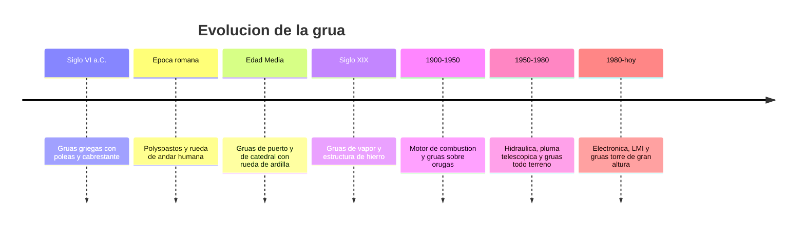

# 📜 Historia de la grua

[🏠 Inicio](../../../README.md) · [🏗️ Curso: Gruas](../README.md) · 📜 Historia

## Origen

La grua nace de la necesidad de elevar cargas mas pesadas que las que una
persona puede levantar. Los primeros dispositivos combinaron la palanca, la
polea y el cabrestante para multiplicar la fuerza humana. Los griegos ya usaban
gruas simples hacia el siglo VI a.C. para construir templos, y los romanos las
perfeccionaron con el polyspastos, un aparejo de varias poleas movido por una
rueda de andar donde caminaban operarios.

## Linea de tiempo

| Periodo | Hito | Importancia |
| --- | --- | --- |
| Siglo VI a.C. | Gruas griegas con polea y cabrestante | Nace el izaje mecanico. |
| Epoca romana | Polyspastos y rueda de andar | Multiplica la fuerza con poleas. |
| Edad Media | Gruas de puerto y de catedral | Izaje a gran altura con rueda de ardilla. |
| Siglo XIX | Gruas de vapor y hierro | Potencia y estructuras mas resistentes. |
| 1900-1950 | Combustion y orugas | Movilidad y autonomia en obra. |
| 1950-1980 | Hidraulica y pluma telescopica | Extension rapida y control fino. |
| 1980-presente | Electronica, LMI y gruas torre | Seguridad de izaje y gran altura. |

## Evolucion tecnologica

- **Fuerza**: de la fuerza humana y animal al vapor, la combustion y la hidraulica.
- **Estructura**: de la madera al hierro forjado y luego al acero de alta resistencia.
- **Pluma**: de la pluma fija de celosia a la pluma telescopica hidraulica.
- **Movilidad**: de gruas fijas a gruas sobre camion, orugas y todo terreno.
- **Control**: de palancas mecanicas a joysticks electrohidraulicos proporcionales.
- **Seguridad**: aparicion del indicador de momento de carga (LMI) y cortes automaticos.

## Tipos representativos

| Tipo | Uso tipico | Caracteristica destacada |
| --- | --- | --- |
| Grua movil sobre camion | Obra y montaje itinerante | Se desplaza por carretera y opera con estabilizadores. |
| Grua todo terreno (RT) | Terreno irregular de obra | Traccion en todas las ruedas, pluma telescopica. |
| Grua sobre orugas | Grandes obras y larga permanencia | Iza sin estabilizadores y puede desplazarse con carga. |
| Grua torre | Edificacion en altura | Fija, gran alcance y altura, pluma horizontal. |
| Grua articulada | Carga y descarga de camiones | Pluma plegable montada sobre vehiculo. |
| Puente grua | Naves industriales | Recorre un carril elevado, izaje vertical. |

## Impacto en la construccion e industria

La grua es la maquina que hizo posible la construccion moderna en altura, los
puertos de contenedores y el montaje industrial pesado. Sin ella no existirian
los rascacielos, los puentes de gran luz ni la logistica portuaria actual. Su
evolucion esta ligada a la seguridad: cada avance busca izar mas carga a mayor
alcance sin aumentar el riesgo de vuelco, hoy controlado por sistemas
electronicos que vigilan el momento de carga en tiempo real.

## Fuentes

- Registrar aqui las fuentes publicas consultadas.
- Enlazar cada fuente tambien en [`manuales/fuentes.md`](../../../manuales/fuentes.md).

---

[🎓 Portada del curso](../README.md) · [➡️ Siguiente: Caracteristicas](../operacion/caracteristicas-grua.md)
