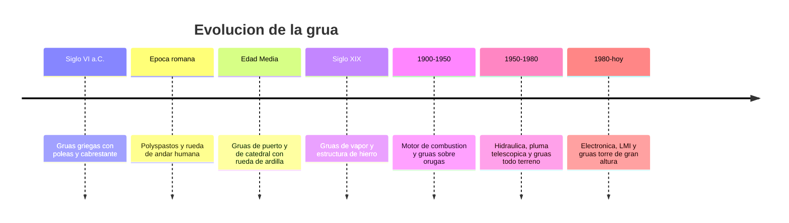

<!-- clase-meta
tipo_documento: clase
clase: 1
codigo: GRUAS-01
curso: gruas
titulo: "Historia de la grúa"
modalidad: "teórica dialogada"
duracion_minutos: 45
nivel: introductorio
prerrequisito: ninguno
competencia: "contexto_historico"
resultados_aprendizaje:
  - "Explicar origen, evolución tecnológica, variantes representativas e impacto con vocabulario propio de Grúas."
  - "Aplicar esos conceptos a una decisión segura o a un escenario de simulación de Grúas."
evidencia: "Línea de tiempo comentada con cuatro hitos o más."
criterio_aprobacion: "Los hitos están ordenados, son pertinentes y dos relaciones de causa y efecto quedan justificadas."
fuentes: manuales/fuentes.md
ultima_revision: 2026-09-10
-->

# 📜 Historia de la grúa

[🏠 Inicio](../../../README.md) · [🏗️ Curso: Grúas](../README.md) · 📜 Historia

```mermaid
timeline
    title Evolucion de la grua
    Siglo VI a.C. : Gruas griegas con poleas y cabrestante
    Epoca romana : Polyspastos y rueda de andar humana
    Edad Media : Gruas de puerto y de catedral con rueda de ardilla
    Siglo XIX : Gruas de vapor y estructura de hierro
    1900-1950 : Motor de combustion y gruas sobre orugas
    1950-1980 : Hidraulica, pluma telescopica y gruas todo terreno
    1980-hoy : Electronica, LMI y gruas torre de gran altura
```

## Origen

La grúa nace de la necesidad de elevar cargas más pesadas que las que una
persona puede levantar. Los primeros dispositivos combinaron la palanca, la
polea y el cabrestante para multiplicar la fuerza humana. Los griegos ya usaban
grúas simples hacia el siglo VI a.C. para construir templos, y los romanos las
perfeccionaron con el polyspastos, un aparejo de varias poleas movido por una
rueda de andar donde caminaban operarios.

## Línea de tiempo

| Periodo | Hito | Importancia |
| --- | --- | --- |
| Siglo VI a.C. | Grúas griegas con polea y cabrestante | Nace el izaje mecánico. |
| Época romana | Polyspastos y rueda de andar | Multiplica la fuerza con poleas. |
| Edad Media | Grúas de puerto y de catedral | Izaje a gran altura con rueda de ardilla. |
| Siglo XIX | Grúas de vapor y hierro | Potencia y estructuras más resistentes. |
| 1900-1950 | Combustión y orugas | Movilidad y autonomía en obra. |
| 1950-1980 | Hidráulica y pluma telescópica | Extensión rápida y control fino. |
| 1980-presente | Electrónica, LMI y grúas torre | Seguridad de izaje y gran altura. |

## Evolución tecnológica

- **Fuerza**: de la fuerza humana y animal al vapor, la combustión y la hidráulica.
- **Estructura**: de la madera al hierro forjado y luego al acero de alta resistencia.
- **Pluma**: de la pluma fija de celosía a la pluma telescópica hidráulica.
- **Movilidad**: de grúas fijas a grúas sobre camión, orugas y todo terreno.
- **Control**: de palancas mecánicas a joysticks electrohidraulicos proporcionales.
- **Seguridad**: aparición del indicador de momento de carga (LMI) y cortes automáticos.

## Tipos representativos

| Tipo | Uso típico | Característica destacada |
| --- | --- | --- |
| Grúa móvil sobre camión | Obra y montaje itinerante | Se desplaza por carretera y opera con estabilizadores. |
| Grúa todo terreno (RT) | Terreno irregular de obra | Tracción en todas las ruedas, pluma telescópica. |
| Grúa sobre orugas | Grandes obras y larga permanencia | Iza sin estabilizadores y puede desplazarse con carga. |
| Grúa torre | Edificación en altura | Fija, gran alcance y altura, pluma horizontal. |
| Grúa articulada | Carga y descarga de camiones | Pluma plegable montada sobre vehículo. |
| Puente grúa | Naves industriales | Recorre un carril elevado, izaje vertical. |

## Impacto en la construcción e industria

La grúa es la máquina que hizo posible la construcción moderna en altura, los
puertos de contenedores y el montaje industrial pesado. Sin ella no existirían
los rascacielos, los puentes de gran luz ni la logística portuaria actual. Su
evolución está ligada a la seguridad: cada avance busca izar más carga a mayor
alcance sin aumentar el riesgo de vuelco, hoy controlado por sistemas
electrónicos que vigilan el momento de carga en tiempo real.

## 🧭 Guía de estudio aplicada

### Pregunta guía

¿Cómo ayuda **Origen, Línea de tiempo, Evolución tecnológica y Tipos representativos** a **explicar cómo la evolución hizo posibles alternativas como grúa móvil telescópica frente a grúa de celosía**?

### Explicación razonada

La evolución de Grúas se comprende mejor como una sucesión de respuestas a problemas, no como una lista de fechas. Los cambios en motor, bombas hidráulicas, cabrestante y pluma y gancho y carga alteraron qué podía hacer la máquina, quién podía usarla y qué riesgos debían controlarse. El contraste «grúa móvil telescópica frente a grúa de celosía» permite observar qué decisiones de diseño permanecieron y cuáles cambiaron con la tecnología y el propósito.

Esta clase se conecta con el resto del curso mediante **momento de vuelco igual a carga por radio, condicionado por apoyos y configuración**. El hilo de
seguridad consiste en reconocer a tiempo **exceder la tabla de carga o perder estabilidad del apoyo** y poder justificar la decisión
**confirmar peso, radio, configuración y suelo antes de levantar**; en clases posteriores cambiará el ángulo de análisis, no esa relación causal.
La lectura funcional común sigue **motor → bombas hidráulicas → cabrestante y pluma → gancho y carga**, de modo que cada concepto pueda
ubicarse dentro del funcionamiento completo y no quede como un dato aislado.

**Apoyo documental:** [Crane, Derrick and Hoist Safety](https://www.osha.gov/cranes-derricks) aporta izaje, riesgos y controles;
[Ley de Tránsito 18.290](https://www.bcn.cl/leychile/navegar?idNorma=29708) se usa para marco legal chileno. Estas fuentes
se contrastan con el alcance de la clase y no sustituyen un manual de equipo concreto.

### Caso resuelto: de la observación a la decisión

1. **Situar:** ordena los hitos que explican cómo se llegó a **grúa móvil telescópica frente a grúa de celosía** y describe la necesidad que impulsó cada cambio.
2. **Relacionar:** explica qué se modificó en **motor**, **bombas hidráulicas**, **cabrestante y pluma** o **gancho y carga**; una fecha sin mecanismo no basta.
3. **Interpretar:** vincula el cambio con una capacidad nueva y también con el riesgo **exceder la tabla de carga o perder estabilidad del apoyo**.
4. **Transferir:** usa la evolución para justificar por qué hoy conviene **confirmar peso, radio, configuración y suelo antes de levantar**.

### Comprueba tu comprensión

1. ¿Qué necesidad histórica impulsó un cambio en **motor** o **bombas hidráulicas**?
2. ¿Qué hito modificó la relación entre capacidad y **exceder la tabla de carga o perder estabilidad del apoyo**?
3. ¿Por qué **grúa móvil telescópica frente a grúa de celosía** no puede explicarse como una simple diferencia estética?

Orientación para revisar tus respuestas

- La primera respuesta debe relacionar el eslabón elegido con un efecto posterior, no solo nombrarlo.
- La segunda debe proponer una señal medible u observable y explicar qué tendencia sería preocupante.
- La tercera debe cambiar al menos una variable de capacidad, mando, entorno o margen de seguridad.

## 🎓 Cierre de clase

- **Actividad:** Construye una línea de tiempo de Grúas y explica cómo dos cambios históricos transformaron su función o su puesto de mando.
- **Evidencia:** Línea de tiempo comentada con cuatro hitos o más.
- **Criterio de aprobación:** Los hitos están ordenados, son pertinentes y dos relaciones de causa y efecto quedan justificadas.
- **Transferencia:** explica qué cambiaría al pasar a otra variante de esta máquina.

### Fuentes de esta clase

- [OSHA-CRANES](https://www.osha.gov/cranes-derricks): Crane, Derrick and Hoist Safety, OSHA. Uso: izaje, riesgos y controles.
- [CL-LEY-18290](https://www.bcn.cl/leychile/navegar?idNorma=29708): Ley de Tránsito 18.290, BCN Chile. Uso: marco legal chileno.

> Las fuentes sostienen el marco conceptual y normativo; esta clase no reemplaza el manual
> del fabricante, la formación certificada ni la habilitación exigida para operar equipos reales.

---

[🎓 Portada del curso](../README.md) · [➡️ Siguiente: Características](../operacion/caracteristicas-grua.md)
