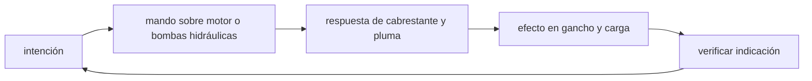

<!-- clase-meta
tipo_documento: clase
clase: 5
codigo: GRUAS-05
curso: gruas
titulo: "Mandos e instrumentos de la grúa"
modalidad: "taller de simulación"
duracion_minutos: 60
nivel: introductorio
prerrequisito: GRUAS-04
competencia: "lectura_y_mando"
resultados_aprendizaje:
  - "Explicar controles, instrumentos, entradas y estados del sistema con vocabulario propio de Grúas."
  - "Aplicar esos conceptos a una decisión segura o a un escenario de simulación de Grúas."
evidencia: "Mapa de mandos y resolución de dos estados del tablero."
criterio_aprobacion: "Reconoce los controles críticos y responde a los estados sin introducir acciones inseguras."
fuentes: manuales/fuentes.md
ultima_revision: 2026-09-10
-->

# 🎛️ Mandos e instrumentos de la grúa

[🏠 Inicio](../../../README.md) · [🏗️ Curso: Grúas](../README.md) · 🎛️ Mandos

## Vista general

El puesto de mando de una grúa es una cabina giratoria montada sobre la
superestructura. El operador controla casi todo con dos joysticks
electrohidraulicos proporcionales, palancas para los estabilizadores y una
consola de instrumentos donde el LMI ocupa el lugar central. A diferencia de un
vehículo de calle, aquí la prioridad no es la velocidad sino la precisión y el
control del momento de carga.

## Mapa de controles

| Zona | Control | Tipo | Función | Prioridad | Comentarios |
| --- | --- | --- | --- | --- | --- |
| Joystick izquierdo | Elevación de pluma | Joystick proporcional | Subir y bajar el ángulo de la pluma | Alta | Subir el ángulo reduce el radio. |
| Joystick izquierdo | Giro / swing | Joystick proporcional | Rotar la superestructura | Alta | Movimiento suave para no balancear la carga. |
| Joystick derecho | Telescópico | Joystick proporcional | Extender o recoger la pluma | Alta | Extender aumenta el radio y baja la capacidad. |
| Joystick derecho | Cabrestante | Joystick proporcional | Subir o bajar el gancho | Alta | Controla el izaje vertical de la carga. |
| Consola lateral | Estabilizadores | Palancas | Extender y apoyar outriggers | Alta | Se opera con la grúa detenida antes de izar. |
| Consola | Parada de emergencia | Botón hongo | Cortar todos los movimientos | Alta | Detiene la operación de inmediato. |
| Consola | Bloqueo de giro | Palanca | Fijar la superestructura | Media | Se usa al desplazar o transportar. |
| Consola | Bocina y señales | Botón | Advertir a personal en tierra | Media | Coordinación con el señalero. |
| Cabina | Instrumentos y LMI | Pantalla | Mostrar estado de izaje | Alta | Ver sección de instrumentos. |

## Instrumentos principales

| Instrumento | Mide o muestra | Unidad | Importancia | Notas |
| --- | --- | --- | --- | --- |
| LMI (momento de carga) | Momento actual vs máximo | % y t·m | Alta | Corazón de la seguridad; avisa y corta. |
| Indicador de carga | Peso izado | t | Alta | Peso real en el gancho. |
| Ángulo de pluma | Inclinación de la pluma | grados | Alta | Relacionado con el radio. |
| Radio de trabajo | Distancia del eje al gancho | m | Alta | Parámetro clave de la tabla de carga. |
| Longitud de pluma | Extensión telescópica | m | Alta | Define la tabla aplicable. |
| Anemómetro | Velocidad del viento | km/h o m/s | Alta | El viento reduce el límite de izaje. |
| Nivel de burbuja | Nivelación de la máquina | grados | Alta | Confirma base estabilizada. |
| Altura de gancho | Posición vertical del gancho | m | Media | Evita el contacto y el fin de carrera. |

## Entradas de simulación

| Acción | Teclado | Controlador | Pantalla táctil | Comentarios |
| --- | --- | --- | --- | --- |
| Elevar pluma | Flechas arriba/abajo | Stick izquierdo vertical | Zona pluma | Proporcional, no on/off. |
| Girar superestructura | Flechas izq/der | Stick izquierdo horizontal | Zona giro | Movimiento suave para no balancear. |
| Telescopiar | Teclas R/F | Stick derecho vertical | Zona telescópico | Extender baja la capacidad. |
| Subir/bajar gancho | Teclas W/S | Stick derecho horizontal | Zona winch | Controla el izaje vertical. |
| Estabilizadores | Tecla O | Botones laterales | Panel outriggers | Solo con grúa detenida. |
| Parada de emergencia | Barra espaciadora | Botón dedicado | Botón rojo | Corta todos los movimientos. |

## Estados del sistema

| Estado | Descripción | Indicadores | Acciones disponibles |
| --- | --- | --- | --- |
| Apagado | Motor detenido | Consola off | Encender, planificar. |
| No estabilizado | Encendida, sin outriggers | Alerta de nivel | Extender estabilizadores. |
| Estabilizado | Base apoyada y nivelada | Nivel en verde | Habilitar izaje. |
| Izando | Levantando o moviendo carga | LMI activo | Elevar, girar, telescopiar, gancho. |
| Emergencia | LMI en límite o falla | Alarma y luz roja | Parar, reducir radio, bajar carga. |

## Observaciones ergonomicas y de seguridad

- El LMI debe estar siempre visible y ser el primer instrumento en el campo de visión.
- Los joysticks proporcionales evitan movimientos bruscos que balancean la carga.
- El sistema debe impedir el izaje si la grúa no está estabilizada y nivelada.
- La parada de emergencia debe ser grande, roja y accesible sin mirar.
- En simulación conviene mostrar el radio y el porcentaje de capacidad de forma
  continua, para que el usuario relacione cada movimiento con la estabilidad.

## 🧭 Guía de estudio aplicada

### Pregunta guía

¿Cómo ayuda **Vista general, Mapa de controles, Instrumentos principales y Entradas de simulación** a **interpretar mandos e indicaciones durante izaje de una carga conocida cuyo destino exige aumentar el radio**?

### Explicación razonada

Un mando no se aprende memorizando su nombre, sino recorriendo el ciclo intención → acción → indicación → verificación. En Grúas, el operador actúa sobre motor o bombas hidráulicas, observa la respuesta en cabrestante y pluma y confirma el efecto en gancho y carga. Una indicación inesperada exige detener la secuencia mental, identificar el modo activo y evitar una segunda orden que agrave el estado.

Esta clase se conecta con el resto del curso mediante **momento de vuelco igual a carga por radio, condicionado por apoyos y configuración**. El hilo de
seguridad consiste en reconocer a tiempo **exceder la tabla de carga o perder estabilidad del apoyo** y poder justificar la decisión
**confirmar peso, radio, configuración y suelo antes de levantar**; en clases posteriores cambiará el ángulo de análisis, no esa relación causal.
La lectura funcional común sigue **motor → bombas hidráulicas → cabrestante y pluma → gancho y carga**, de modo que cada concepto pueda
ubicarse dentro del funcionamiento completo y no quede como un dato aislado.

**Apoyo documental:** [Crane, Derrick and Hoist Safety](https://www.osha.gov/cranes-derricks) aporta izaje, riesgos y controles;
[Ley de Tránsito 18.290](https://www.bcn.cl/leychile/navegar?idNorma=29708) se usa para marco legal chileno. Estas fuentes
se contrastan con el alcance de la clase y no sustituyen un manual de equipo concreto.

### Caso resuelto: de la observación a la decisión

1. **Intención:** formula qué cambio se necesita durante **izaje de una carga conocida cuyo destino exige aumentar el radio**.
2. **Mando:** identifica el control que actúa sobre **motor** o **bombas hidráulicas** y el modo que debe estar activo.
3. **Lectura:** localiza la indicación que confirma la respuesta de **cabrestante y pluma** y el efecto en **gancho y carga**.
4. **Verificación:** si la lectura no coincide, no acumules órdenes; estabiliza e investiga el estado.

### Comprueba tu comprensión

1. ¿Qué mando inicia la respuesta y qué instrumento confirma que el modo correcto está activo?
2. ¿Qué indicación temprana advertiría **exceder la tabla de carga o perder estabilidad del apoyo**?
3. ¿Qué secuencia usarías si la respuesta de **gancho y carga** no coincide con la orden?

Orientación para revisar tus respuestas

- La primera respuesta debe relacionar el eslabón elegido con un efecto posterior, no solo nombrarlo.
- La segunda debe proponer una señal medible u observable y explicar qué tendencia sería preocupante.
- La tercera debe cambiar al menos una variable de capacidad, mando, entorno o margen de seguridad.

## 🎓 Cierre de clase

- **Actividad:** Recorre el puesto de mando simulado de Grúas: localiza los controles de controles, instrumentos, entradas y estados del sistema y asocia cada indicación con una decisión.
- **Evidencia:** Mapa de mandos y resolución de dos estados del tablero.
- **Criterio de aprobación:** Reconoce los controles críticos y responde a los estados sin introducir acciones inseguras.
- **Transferencia:** explica qué cambiaría al pasar a otra variante de esta máquina.

### Fuentes de esta clase

- [OSHA-CRANES](https://www.osha.gov/cranes-derricks): Crane, Derrick and Hoist Safety, OSHA. Uso: izaje, riesgos y controles.
- [CL-LEY-18290](https://www.bcn.cl/leychile/navegar?idNorma=29708): Ley de Tránsito 18.290, BCN Chile. Uso: marco legal chileno.

> Las fuentes sostienen el marco conceptual y normativo; esta clase no reemplaza el manual
> del fabricante, la formación certificada ni la habilitación exigida para operar equipos reales.

---

[⬅️ Anterior: Sistemas mecánicos](../operacion/sistemas-mecanicos-grua.md) · [➡️ Siguiente: Principios y operación](../operacion/principios-grua.md)
