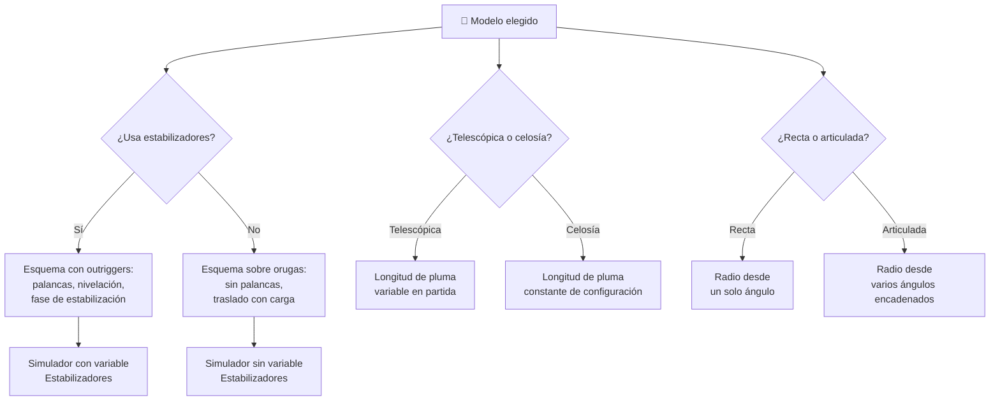

# 🧩 Modelos y variantes de la grúa

[🏠 Inicio](../../../README.md) · [🏗️ Curso: Grúas](../README.md) · 🧩 Modelos

El [Módulo 2](../operacion/caracteristicas-grua.md) ya dijo qué tipos de grúa
existen y para qué sirve cada uno. Este módulo responde a lo siguiente: **no
todas se operan igual**, y esa diferencia no es de matiz. Cambia qué mandos
tiene la máquina y, por tanto, qué debe modelar el simulador.

> 🎯 **La idea que sostiene el módulo.** "Una grúa móvil" no es una sola máquina
> desde el punto de vista del mando. Una grúa sobre orugas no tiene
> estabilizadores: no es que los tenga más rápidos de extender, es que **no
> existen**, y con ellos desaparece la fase entera de estabilización. Un
> simulador que presente un solo esquema de control está representando una grúa
> concreta aunque diga representarlas todas.

---

## 🧭 Por qué el modelo decide el simulador

El [Módulo 5](../mandos/manual-mandos-grua.md) describe un puesto de mando con
**estabilizadores en palancas de la consola lateral**, operables solo con la
grúa detenida, y con el **telescópico en el stick derecho vertical**. El
[Módulo 9](../simulacion/diseno-simulador-grua.md) expone una variable
`Estabilizadores` discreta con valores `nulo/medio/completo` y una
`Longitud de pluma` numérica de `10-40 m`. Ambos describen una grúa **móvil
sobre camión con pluma telescópica**.

En una grúa sobre orugas esas palancas no existen: la máquina iza sin
estabilizadores y se desplaza con la carga colgada. La variable
`Estabilizadores` sencillamente no tiene valores que tomar, y el estado "No
estabilizado" del Módulo 5 deja de ser un error a corregir. Si el simulador se
construye sobre el esquema del camión y luego se le "añade" una grúa de orugas,
el resultado es una grúa de orugas con outriggers, que no existe.

Lo mismo ocurre con la pluma de celosía del
[Módulo 4](../operacion/sistemas-mecanicos-grua.md): no telescopia. La entrada
del stick derecho vertical no tiene destino, y `Longitud de pluma` deja de ser
una variable que el operador mueve en partida para pasar a ser una constante que
se fija antes de empezar.

---

## 🗂️ Qué cambia en el manejo

| Modelo | Qué cambia al operarla |
| --- | --- |
| Móvil sobre camión, pluma telescópica | La referencia del curso: llega por carretera, se estabiliza, iza desde una posición fija y se repliega. La maniobra tiene principio y fin en un mismo punto. |
| Todo terreno (RT) | Mismo esquema de izaje, pero se posiciona sobre terreno irregular y compacto de obra. La nivelación deja de ser un trámite: el terreno la condiciona. |
| Sobre orugas, pluma de celosía | Iza sin estabilizadores y se traslada con la carga suspendida. La estabilidad no se resuelve una vez al principio, se gestiona en movimiento durante toda la maniobra. |
| Articulada / pluma articulada | Carga y descarga sobre el propio camión. Los brazos se pliegan: la geometría no es una recta con un ángulo, son tramos encadenados. |
| Variante con pluma de celosía | La longitud se decide al montar, no en cabina. Para cambiar el alcance hay que desarmar, no accionar un mando. |

---

## 🎛️ Qué cambia en el mando

| Modelo | Qué mando aparece o desaparece | Consecuencia |
| --- | --- | --- |
| Móvil sobre camión, Todo terreno (RT) | Ninguno: el mapa de controles del Módulo 5 aplica tal cual. | Cambian los rangos y el entorno, no los controles. |
| Sobre orugas | **Desaparecen** las palancas de estabilizadores de la consola lateral y el estado "No estabilizado". **Aparece** el desplazamiento con carga como movimiento a mandar. | El operador ya no habilita el izaje estabilizando: iza y traslada en el mismo gesto. |
| Pluma de celosía | **Desaparece** el telescópico del joystick derecho (stick derecho vertical / teclas R/F). | Ese eje del mando queda libre; el alcance solo se cambia con el ángulo de pluma. |
| Articulada / pluma articulada | **Aparece** un mando de articulación de brazos, que no está en el mapa del Módulo 5. | El radio deja de deducirse de un solo ángulo: hay más de una forma de llegar al mismo punto. |
| Todo terreno (RT) | **Ninguno desaparece**, pero el nivel de burbuja pasa de confirmación a mando de trabajo continuo. | No es un control nuevo; es un instrumento que empieza a exigir atención. |

---

## 🎮 Qué cambia en el simulador

Contrastado con las variables del
[Módulo 9](../simulacion/diseno-simulador-grua.md):

| Modelo | Variables que cambian | Esquema de control |
| --- | --- | --- |
| Móvil sobre camión | Ninguna: es el caso base. | El del Módulo 5. |
| Todo terreno (RT) | `Estabilizadores` mantiene sus valores, pero la capacidad del terreno deja de ser un supuesto y entra en el paso 4 del ciclo básico. | El mismo. |
| Sobre orugas | `Estabilizadores` **se elimina**. `Momento` y `Capacidad / LMI` pasan a recalcularse mientras la máquina se desplaza, no solo mientras se mueve la pluma. | Sin entrada de estabilizadores; el estado "Listo" no depende de nivelar. |
| Pluma de celosía | `Longitud de pluma` deja de ser una variable de partida y se convierte en una constante de configuración. `Radio` pasa a depender solo de `Ángulo de pluma`. | Sin entrada de telescópico. |
| Articulada / pluma articulada | `Ángulo de pluma` **deja de ser un único valor**: la geometría necesita más de un ángulo para resolver el `Radio`. | El mismo, más una entrada de articulación. |
| Cualquier modelo al aire libre | `Viento` gana peso: sobre el umbral suspende el izaje, tal como fija el Módulo 9. | El mismo. |

---

## 🗺️ Del modelo al esquema de control

---

## ⚠️ Qué modelos no comparten simulador

Tres variantes no se resuelven con un ajuste de parámetros, porque su esquema de
control es otro:

- **La grúa sobre orugas** frente al resto: falta una entrada entera y con ella
  una fase de la operación. Es un modo de control distinto, no una dificultad
  distinta.
- **La pluma de celosía** frente a la telescópica: falta la entrada de
  telescopiado, y una variable que el operador movía pasa a decidirse antes de
  empezar.
- **La pluma articulada** frente a la recta: obliga a resolver el radio con
  varios ángulos encadenados, no con uno solo. El cálculo del momento no cambia,
  pero la geometría que lo alimenta sí.

El resto de variantes sí caben en un mismo simulador ajustando rangos, tal como
plantean los [niveles de realismo](../../../docs/03-niveles-de-realismo.md): en
el nivel 1 casi todas se comportan igual, y las diferencias emergen a medida que
el nivel sube. La grúa de torre y el puente grúa quedan fuera de este módulo
porque no son variantes de la grúa móvil: tienen curso propio.

---

[⬅️ Anterior: Características](../operacion/caracteristicas-grua.md) · [➡️ Siguiente: Sistemas mecánicos](../operacion/sistemas-mecanicos-grua.md)
