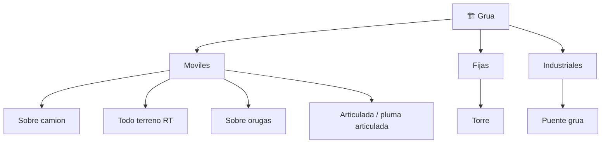

# 📋 Caracteristicas funcionales de la grua

[🏠 Inicio](../../../README.md) · [🏗️ Curso: Gruas](../README.md) · 📋 Caracteristicas

Que es una grua, que tipos existen y para que sirve cada uno. Este modulo da el
contexto antes de abrir la mecanica y el izaje (Modulo 3).

---

## 🧭 Definicion

Una grua es una maquina de izaje que eleva, gira y traslada cargas mediante una
pluma y un cabrestante. A diferencia de otros vehiculos, su desafio no es
desplazarse, sino levantar pesos elevados manteniendo la estabilidad: toda la
operacion gira en torno a no superar el momento de vuelco.

---

## 🧬 Caracteristicas clave

| Caracteristica | Descripcion |
| --- | --- |
| Capacidad de izaje | Peso maximo que puede levantar, siempre segun radio y angulo. |
| Radio de trabajo | Distancia horizontal del eje de giro al gancho; a mayor radio, menor capacidad. |
| Momento de carga | Producto de peso por radio; es el parametro critico de estabilidad. |
| Estabilizadores | Amplian la base de apoyo para resistir el vuelco. |
| Contrapeso | Masa que equilibra el momento de la carga. |
| Alcance y altura | Longitud de pluma que define hasta donde y cuan alto se iza. |
| Giro (swing) | Rotacion de la superestructura para posicionar la carga. |

---

## 🗂️ Tipos de grua

| Tipo | Uso tipico | Rasgo destacado |
| --- | --- | --- |
| Movil sobre camion | Montaje itinerante en ciudad y obra | Circula por carretera, opera con estabilizadores. |
| Todo terreno (RT) | Terreno irregular y compacto de obra | Traccion total, chasis unico, muy maniobrable. |
| Sobre orugas | Grandes obras de larga duracion | Iza sin estabilizadores, se mueve con carga. |
| Torre | Edificacion en altura | Fija, gran altura y alcance, pluma horizontal. |
| Articulada / pluma articulada | Carga y descarga sobre camion | Pluma plegable de brazos, compacta al replegar. |
| Puente grua | Naves y talleres industriales | Recorre un carril elevado, izaje vertical preciso. |

---

## 🎯 Para que se usa

- Montaje de estructuras y prefabricados en construccion.
- Carga y descarga de contenedores en puertos.
- Instalacion de equipos pesados en industria y energia.
- Rescate y remocion de vehiculos o escombros.
- Movimiento de materiales dentro de naves industriales.

---

[⬅️ Anterior: Historia](../historia/historia-grua.md) · [➡️ Siguiente: Sistemas mecanicos](sistemas-mecanicos-grua.md)
