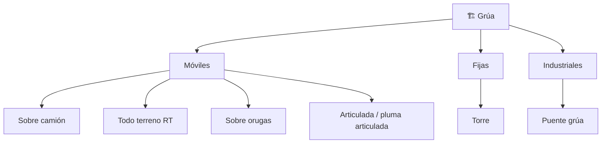

# 📋 Características funcionales de la grúa

[🏠 Inicio](../../../README.md) · [🏗️ Curso: Grúas](../README.md) · 📋 Características

Que es una grúa, que tipos existen y para que sirve cada uno. Este módulo da el
contexto antes de abrir la mecánica y el izaje (Módulo 4).

---

## 🧭 Definición

Una grúa es una máquina de izaje que eleva, gira y traslada cargas mediante una
pluma y un cabrestante. A diferencia de otros vehículos, su desafío no es
desplazarse, sino levantar pesos elevados manteniendo la estabilidad: toda la
operación gira en torno a no superar el momento de vuelco.

---

## 🧬 Características clave

| Característica | Descripción |
| --- | --- |
| Capacidad de izaje | Peso máximo que puede levantar, siempre según radio y ángulo. |
| Radio de trabajo | Distancia horizontal del eje de giro al gancho; a mayor radio, menor capacidad. |
| Momento de carga | Producto de peso por radio; es el parámetro crítico de estabilidad. |
| Estabilizadores | Amplian la base de apoyo para resistir el vuelco. |
| Contrapeso | Masa que equilibra el momento de la carga. |
| Alcance y altura | Longitud de pluma que define hasta dónde y cuán alto se iza. |
| Giro (swing) | Rotación de la superestructura para posicionar la carga. |

---

## 🗂️ Tipos de grúa

```mermaid
flowchart TD
    Grua[🏗️ Grúa] --> Movil[Móviles]
    Grua --> Fija[Fijas]
    Grua --> Industrial[Industriales]
    Movil --> Camion[Sobre camión]
    Movil --> RT[Todo terreno RT]
    Movil --> Orugas[Sobre orugas]
    Movil --> Articulada[Articulada / pluma articulada]
    Fija --> Torre[Torre]
    Industrial --> Puente[Puente grúa]
```

| Tipo | Uso típico | Rasgo destacado |
| --- | --- | --- |
| Móvil sobre camión | Montaje itinerante en ciudad y obra | Circula por carretera, opera con estabilizadores. |
| Todo terreno (RT) | Terreno irregular y compacto de obra | Tracción total, chasis único, muy maniobrable. |
| Sobre orugas | Grandes obras de larga duración | Iza sin estabilizadores, se mueve con carga. |
| Torre | Edificación en altura | Fija, gran altura y alcance, pluma horizontal. |
| Articulada / pluma articulada | Carga y descarga sobre camión | Pluma plegable de brazos, compacta al replegar. |
| Puente grúa | Naves y talleres industriales | Recorre un carril elevado, izaje vertical preciso. |

---

## 🎯 Para qué se usa

- Montaje de estructuras y prefabricados en construcción.
- Carga y descarga de contenedores en puertos.
- Instalación de equipos pesados en industria y energía.
- Rescate y remoción de vehículos o escombros.
- Movimiento de materiales dentro de naves industriales.

## 🎓 Cierre de clase

- **Actividad:** Compara variantes de Grúas mediante los ejes «definición, rasgos funcionales, tipos y usos» y elige una para un caso de uso razonado.
- **Evidencia:** Matriz comparativa y decisión justificada.
- **Criterio de aprobación:** La elección considera función, límites, mando y efecto en la simulación; no se apoya solo en preferencias.
- **Transferencia:** explica qué cambiaría al pasar a otra variante de esta máquina.

### Fuentes de esta clase

- [OSHA-CRANES](https://www.osha.gov/cranes-derricks): Crane, Derrick and Hoist Safety, OSHA. Uso: izaje, riesgos y controles.
- [CL-LEY-18290](https://www.bcn.cl/leychile/navegar?idNorma=29708): Ley de Tránsito 18.290, BCN Chile. Uso: marco legal chileno.

> Las fuentes sostienen el marco conceptual y normativo; esta clase no reemplaza el manual
> del fabricante, la formación certificada ni la habilitación exigida para operar equipos reales.

---

[⬅️ Anterior: Historia](../historia/historia-grua.md) · [➡️ Siguiente: Modelos y variantes](../modelos/modelos-grua.md)
