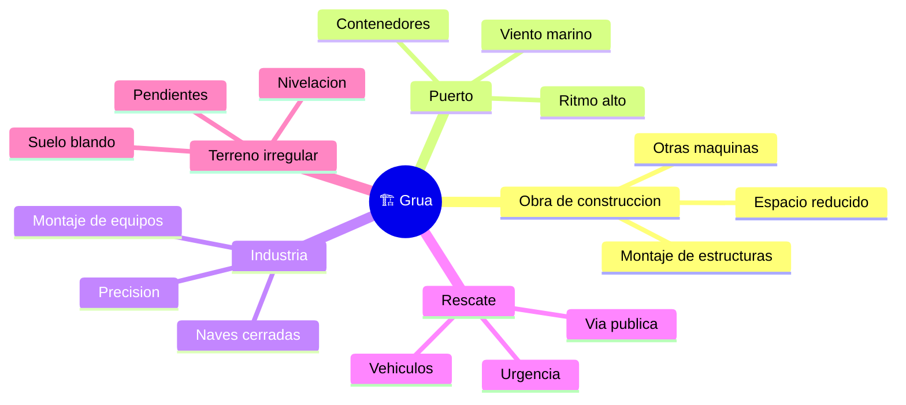

# 🌍 Entornos de trabajo de la grúa

[🏠 Inicio](../../../README.md) · [🏗️ Curso: Grúas](../README.md) · 🌍 Entornos

Dónde opera una grúa y cómo cambia el izaje según el entorno. Cada entorno
implica reglas, riesgos y ajustes distintos, y en simulación se traduce en
escenarios diferentes. El factor común es siempre la estabilidad.

---

## 🗺️ Entornos principales

| Entorno | Características | Riesgos típicos | Ajuste de operación |
| --- | --- | --- | --- |
| Obra de construcción | Montaje, espacio reducido, varias máquinas. | Colisiones, personal en tierra, obstáculos. | Área de exclusión, señalero, radios controlados. |
| Puerto | Contenedores, ritmo alto, cerca del agua. | Viento marino, cargas repetidas. | Vigilar anemómetro, ciclos precisos. |
| Industria / montaje | Equipos pesados, alta precisión. | Espacio cerrado, izaje milimetrico. | Movimientos lentos, planificación detallada. |
| Rescate / vía pública | Vehículos, escombros, urgencia. | Tráfico, terreno improvisado. | Estabilizar bien, delimitar la vía. |
| Terreno irregular | Suelo blando, pendientes. | Hundimiento de zapatas, desnivel. | Tacos de apoyo, nivelación cuidadosa. |

---

## 🌦️ Factores del entorno

- **Viento**: empuja carga y pluma, aumenta el balanceo y reduce el límite de
  izaje; sobre cierto umbral la operación se suspende.
- **Suelo y capacidad portante**: el terreno debe resistir la presión de las
  zapatas; un suelo blando puede ceder y perder la base.
- **Obstáculos aéreos y líneas eléctricas**: exigen distancias de seguridad; el
  contacto con una línea de alta tensión es un riesgo grave.
- **Espacio de giro**: edificios, otras grúas y estructuras limitan el arco de la
  pluma y de la carga.

---

## 🎮 Traducción a simulación

Cada entorno es un escenario con su terreno, viento, obstáculos y límites de
espacio. Ver cómo se modela en el
[Módulo 8: Diseño de simulación](../simulacion/diseno-simulador-grua.md).

---

[⬅️ Anterior: Principios y operación](principios-grua.md) · [➡️ Siguiente: Reglamentos](../reglamentos/reglamentos-grua.md)
