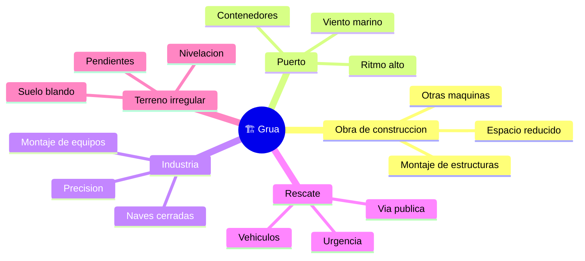

# 🌍 Entornos de trabajo de la grua

[🏠 Inicio](../../../README.md) · [🏗️ Curso: Gruas](../README.md) · 🌍 Entornos

Donde opera una grua y como cambia el izaje segun el entorno. Cada entorno
implica reglas, riesgos y ajustes distintos, y en simulacion se traduce en
escenarios diferentes. El factor comun es siempre la estabilidad.

---

## 🗺️ Entornos principales

| Entorno | Caracteristicas | Riesgos tipicos | Ajuste de operacion |
| --- | --- | --- | --- |
| Obra de construccion | Montaje, espacio reducido, varias maquinas. | Colisiones, personal en tierra, obstaculos. | Area de exclusion, senalero, radios controlados. |
| Puerto | Contenedores, ritmo alto, cerca del agua. | Viento marino, cargas repetidas. | Vigilar anemometro, ciclos precisos. |
| Industria / montaje | Equipos pesados, alta precision. | Espacio cerrado, izaje milimetrico. | Movimientos lentos, planificacion detallada. |
| Rescate / via publica | Vehiculos, escombros, urgencia. | Trafico, terreno improvisado. | Estabilizar bien, delimitar la via. |
| Terreno irregular | Suelo blando, pendientes. | Hundimiento de zapatas, desnivel. | Tacos de apoyo, nivelacion cuidadosa. |

---

## 🌦️ Factores del entorno

- **Viento**: empuja carga y pluma, aumenta el balanceo y reduce el limite de
  izaje; sobre cierto umbral la operacion se suspende.
- **Suelo y capacidad portante**: el terreno debe resistir la presion de las
  zapatas; un suelo blando puede ceder y perder la base.
- **Obstaculos aereos y lineas electricas**: exigen distancias de seguridad; el
  contacto con una linea de alta tension es un riesgo grave.
- **Espacio de giro**: edificios, otras gruas y estructuras limitan el arco de la
  pluma y de la carga.

---

## 🎮 Traduccion a simulacion

Cada entorno es un escenario con su terreno, viento, obstaculos y limites de
espacio. Ver como se modela en el
[Modulo 8: Diseno de simulacion](../simulacion/diseno-simulador-grua.md).

---

[⬅️ Anterior: Principios y operacion](principios-grua.md) · [➡️ Siguiente: Reglamentos](../reglamentos/reglamentos-grua.md)
