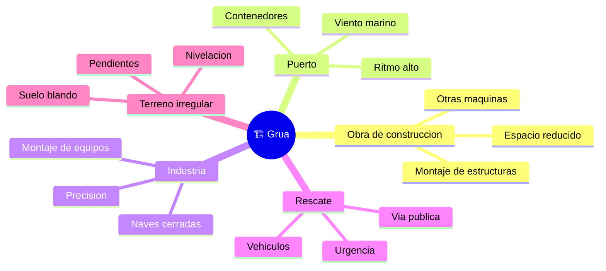

<!-- clase-meta
tipo_documento: clase
clase: 7
codigo: GRUAS-07
curso: gruas
titulo: "Entornos de trabajo de la grúa"
modalidad: "análisis de escenarios"
duracion_minutos: 60
nivel: introductorio
prerrequisito: GRUAS-06
competencia: "adaptacion_al_entorno"
resultados_aprendizaje:
  - "Explicar entornos, factores ambientales, riesgos y respuesta de simulación con vocabulario propio de Grúas."
  - "Aplicar esos conceptos a una decisión segura o a un escenario de simulación de Grúas."
evidencia: "Matriz entorno–cambio–riesgo–respuesta."
criterio_aprobacion: "Cada respuesta se adapta al entorno y distingue riesgos que no son intercambiables entre escenarios."
fuentes: manuales/fuentes.md
ultima_revision: 2026-09-10
-->

# 🌍 Entornos de trabajo de la grúa

[🏠 Inicio](../../../README.md) · [🏗️ Curso: Grúas](../README.md) · 🌍 Entornos

Dónde opera una grúa y cómo cambia el izaje según el entorno. Cada entorno
implica reglas, riesgos y ajustes distintos, y en simulación se traduce en
escenarios diferentes. El factor común es siempre la estabilidad.

---

## 🗺️ Entornos principales

```mermaid
mindmap
  root((🏗️ Grua))
    Obra de construccion
      Montaje de estructuras
      Espacio reducido
      Otras maquinas
    Puerto
      Contenedores
      Viento marino
      Ritmo alto
    Industria
      Montaje de equipos
      Precision
      Naves cerradas
    Rescate
      Via publica
      Vehiculos
      Urgencia
    Terreno irregular
      Suelo blando
      Pendientes
      Nivelacion
```

| Entorno | Características | Riesgos típicos | Ajuste de operación |
| --- | --- | --- | --- |
| Obra de construcción | Montaje, espacio reducido, varias máquinas. | Colisiones, personal en tierra, obstáculos. | Área de exclusión, señalero, radios controlados. |
| Puerto | Contenedores, ritmo alto, cerca del agua. | Viento marino, cargas repetidas. | Vigilar anemómetro, ciclos precisos. |
| Industria / montaje | Equipos pesados, alta precisión. | Espacio cerrado, izaje milimetrico. | Movimientos lentos, planificación detallada. |
| Rescate / vía pública | Vehículos, escombros, urgencia. | Tráfico, terreno improvisado. | Estabilizar bien, delimitar la vía. |
| Terreno irregular | Suelo blando, pendientes. | Hundimiento de zapatas, desnivel. | Tacos de apoyo, nivelación cuidadosa. |

---

## 🌦️ Factores del entorno

- **Viento**: empuja carga y pluma, aumenta el balanceo y reduce el límite de
  izaje; sobre cierto umbral la operación se suspende.
- **Suelo y capacidad portante**: el terreno debe resistir la presión de las
  zapatas; un suelo blando puede ceder y perder la base.
- **Obstáculos aéreos y líneas eléctricas**: exigen distancias de seguridad; el
  contacto con una línea de alta tensión es un riesgo grave.
- **Espacio de giro**: edificios, otras grúas y estructuras limitan el arco de la
  pluma y de la carga.

---

## 🎮 Traducción a simulación

Cada entorno es un escenario con su terreno, viento, obstáculos y límites de
espacio. Ver cómo se modela en el
[Clase 9: Diseño de simulación](../simulacion/diseno-simulador-grua.md).

## 🧭 Guía de estudio aplicada

### Pregunta guía

¿Cómo ayuda **Entornos principales, Factores del entorno, Traducción a simulación y Guía de estudio aplicada** a **adaptar izaje de una carga conocida cuyo destino exige aumentar el radio a tres condiciones ambientales distintas**?

### Explicación razonada

El entorno no es decoración: modifica las fuerzas, la percepción y el tiempo disponible. En el caso «izaje de una carga conocida cuyo destino exige aumentar el radio», cambia el comportamiento de gancho y carga y aumenta la probabilidad de exceder la tabla de carga o perder estabilidad del apoyo. La respuesta correcta empieza por reconocer qué variable cambió y después adaptar límites, ruta o misión.

Esta clase se conecta con el resto del curso mediante **momento de vuelco igual a carga por radio, condicionado por apoyos y configuración**. El hilo de
seguridad consiste en reconocer a tiempo **exceder la tabla de carga o perder estabilidad del apoyo** y poder justificar la decisión
**confirmar peso, radio, configuración y suelo antes de levantar**; en clases posteriores cambiará el ángulo de análisis, no esa relación causal.
La lectura funcional común sigue **motor → bombas hidráulicas → cabrestante y pluma → gancho y carga**, de modo que cada concepto pueda
ubicarse dentro del funcionamiento completo y no quede como un dato aislado.

**Apoyo documental:** [Crane, Derrick and Hoist Safety](https://www.osha.gov/cranes-derricks) aporta izaje, riesgos y controles;
[Ley de Tránsito 18.290](https://www.bcn.cl/leychile/navegar?idNorma=29708) se usa para marco legal chileno. Estas fuentes
se contrastan con el alcance de la clase y no sustituyen un manual de equipo concreto.

### Caso resuelto: de la observación a la decisión

1. **Escenario base:** conserva la misión «izaje de una carga conocida cuyo destino exige aumentar el radio» para poder comparar.
2. **Cambiar una condición:** modifica sucesivamente superficie o medio, visibilidad y perturbación externa.
3. **Recalcular margen:** explica cómo cada cambio afecta **gancho y carga** y acerca o aleja **exceder la tabla de carga o perder estabilidad del apoyo**.
4. **Adaptar:** cambia límite, ruta, configuración o incluso cancela; no mantengas la misma respuesta por hábito.

### Comprueba tu comprensión

1. ¿Cómo cambiaría **gancho y carga** si empeora la perturbación externa?
2. ¿Qué condición ambiental acerca más el escenario a **exceder la tabla de carga o perder estabilidad del apoyo**?
3. ¿Cuándo adaptarías la maniobra y cuándo la cancelarías?

Orientación para revisar tus respuestas

- La primera respuesta debe relacionar el eslabón elegido con un efecto posterior, no solo nombrarlo.
- La segunda debe proponer una señal medible u observable y explicar qué tendencia sería preocupante.
- La tercera debe cambiar al menos una variable de capacidad, mando, entorno o margen de seguridad.

## 🎓 Cierre de clase

- **Actividad:** Contrasta tres entornos de Grúas a partir de entornos, factores ambientales, riesgos y respuesta de simulación y determina cómo cambian variables, percepción, riesgos y respuesta.
- **Evidencia:** Matriz entorno–cambio–riesgo–respuesta.
- **Criterio de aprobación:** Cada respuesta se adapta al entorno y distingue riesgos que no son intercambiables entre escenarios.
- **Transferencia:** explica qué cambiaría al pasar a otra variante de esta máquina.

### Fuentes de esta clase

- [OSHA-CRANES](https://www.osha.gov/cranes-derricks): Crane, Derrick and Hoist Safety, OSHA. Uso: izaje, riesgos y controles.
- [CL-LEY-18290](https://www.bcn.cl/leychile/navegar?idNorma=29708): Ley de Tránsito 18.290, BCN Chile. Uso: marco legal chileno.

> Las fuentes sostienen el marco conceptual y normativo; esta clase no reemplaza el manual
> del fabricante, la formación certificada ni la habilitación exigida para operar equipos reales.

---

[⬅️ Anterior: Principios y operación](principios-grua.md) · [➡️ Siguiente: Reglamentos](../reglamentos/reglamentos-grua.md)
