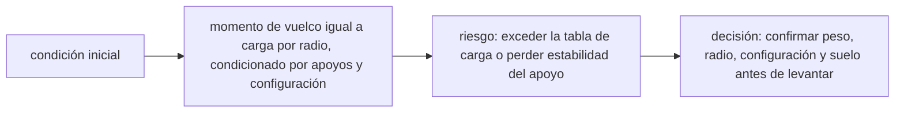

<!-- clase-meta
tipo_documento: clase
clase: 6
codigo: GRUAS-06
curso: gruas
titulo: "Principios y operación de la grúa"
modalidad: "resolución de problemas"
duracion_minutos: 90
nivel: introductorio
prerrequisito: GRUAS-05
competencia: "razonamiento_operacional"
resultados_aprendizaje:
  - "Explicar principios físicos, fases de operación, decisiones y errores frecuentes con vocabulario propio de Grúas."
  - "Aplicar esos conceptos a una decisión segura o a un escenario de simulación de Grúas."
evidencia: "Resolución argumentada de un escenario operacional."
criterio_aprobacion: "Aplica los principios correctos, anticipa consecuencias y respeta los límites del curso."
fuentes: manuales/fuentes.md
ultima_revision: 2026-09-10
-->

# 🧪 Principios y operación de la grúa

[🏠 Inicio](../../../README.md) · [🏗️ Curso: Grúas](../README.md) · 🧪 Principios

Documento general y educativo. No sustituye un curso de operador certificado ni
el manual del fabricante. Describe cómo se opera una grúa en simulación y que
principios físicos conviene representar. El núcleo es siempre la estabilidad.

## Principios de funcionamiento

- **Momento de carga y palanca**: la carga actua como una palanca sobre el eje de
  giro. El momento es peso por radio; cuanto más lejos está la carga, mayor es el
  efecto de vuelco para un mismo peso.
- **Centro de gravedad**: es el punto donde se concentra el peso del conjunto grúa
  más carga. Debe mantenerse siempre dentro de la base de apoyo.
- **Estabilidad y contrapeso**: la grúa resiste el vuelco con su propio peso y el
  contrapeso. La estabilidad existe mientras el momento resistente supera al de
  vuelco.
- **Efecto del radio y el ángulo**: subir la pluma acerca la carga al eje (menor
  radio, más capacidad); bajarla o telescopiarla la aleja (mayor radio, menos
  capacidad).
- **Efecto del viento**: el viento empuja la carga y la pluma, aumenta el radio
  efectivo y el balanceo; por eso reduce el límite de izaje.
- **Izaje seguro**: se iza vertical, sin arrastrar la carga, con movimientos
  suaves y coordinados con el personal en tierra.

## Fases de operación

| Fase | Que ocurre | Puntos clave |
| --- | --- | --- |
| Planificación | Estudio del izaje | Peso de la carga, radio, tabla de carga, obstáculos. |
| Posicionamiento | Ubicar la grúa | Terreno firme, distancia a la carga y al montaje. |
| Estabilización | Extender outriggers | Nivelar la máquina y apoyar zapatas. |
| Izaje | Levantar la carga | Verificar LMI, izar vertical, sin tirones. |
| Traslado de carga | Girar y mover | Movimiento lento, controlar balanceo y radio. |
| Descenso | Depositar la carga | Bajar suave, coordinar con señalero. |
| Repliegue | Cierre de la maniobra | Recoger pluma, estabilizadores y bloquear giro. |

## Izaje seguro: idea general

1. Calcular el **peso real** de la carga y el **radio** de trabajo.
2. Consultar la **tabla de carga** y confirmar que hay margen.
3. **Estabilizar y nivelar** la grúa antes de cargar el gancho.
4. Izar **vertical**, sin arrastrar, vigilando el **LMI**.
5. Girar y trasladar con **movimientos lentos** para no balancear la carga.
6. Descender de forma controlada y **coordinar** con el señalero en tierra.

## Errores comunes que la simulación puede enseñar a evitar

- Izar sin extender o nivelar los estabilizadores.
- Superar el radio máximo de la tabla al bajar o telescopiar la pluma.
- Arrastrar la carga de lado en vez de izar vertical.
- Girar demasiado rápido y provocar balanceo peligroso.
- Ignorar el viento o el aviso del LMI.
- No confirmar el peso real de la carga antes de izar.

## Relación con los niveles de realismo

- **Nivel 1 (educativo)**: estabilizar, izar, girar y depositar respetando el LMI.
- **Nivel 2 (simplificado)**: agregar radio, ángulo, tabla de carga y balanceo.
- **Nivel 3 (técnico)**: sumar viento, capacidad del terreno, reeving y margenes
  de momento de carga.

En todos los niveles el núcleo educativo es la **estabilidad**: entender que cada
movimiento cambia el radio y, con el, cuanto peso se puede sostener. Ver
[`docs/03-niveles-de-realismo.md`](../../../docs/03-niveles-de-realismo.md) para el
detalle de cada nivel.

## 🧭 Guía de estudio aplicada

### Pregunta guía

¿Cómo ayuda **Principios de funcionamiento, Fases de operación, Izaje seguro: idea general y Errores comunes que la simulación puede enseñar a evitar** a **resolver izaje de una carga conocida cuyo destino exige aumentar el radio sin agotar el margen operacional**?

### Explicación razonada

El principio rector puede resumirse así: momento de vuelco igual a carga por radio, condicionado por apoyos y configuración. Esto explica por qué una misma orden produce resultados distintos cuando cambian velocidad, carga, configuración o entorno. Operar bien consiste en leer la tendencia antes de agotar el margen y tomar esta decisión: confirmar peso, radio, configuración y suelo antes de levantar.

Esta clase se conecta con el resto del curso mediante **momento de vuelco igual a carga por radio, condicionado por apoyos y configuración**. El hilo de
seguridad consiste en reconocer a tiempo **exceder la tabla de carga o perder estabilidad del apoyo** y poder justificar la decisión
**confirmar peso, radio, configuración y suelo antes de levantar**; en clases posteriores cambiará el ángulo de análisis, no esa relación causal.
La lectura funcional común sigue **motor → bombas hidráulicas → cabrestante y pluma → gancho y carga**, de modo que cada concepto pueda
ubicarse dentro del funcionamiento completo y no quede como un dato aislado.

**Apoyo documental:** [Crane, Derrick and Hoist Safety](https://www.osha.gov/cranes-derricks) aporta izaje, riesgos y controles;
[Ley de Tránsito 18.290](https://www.bcn.cl/leychile/navegar?idNorma=29708) se usa para marco legal chileno. Estas fuentes
se contrastan con el alcance de la clase y no sustituyen un manual de equipo concreto.

### Caso resuelto: de la observación a la decisión

1. **Datos:** reconoce condiciones, configuración y margen disponibles en **izaje de una carga conocida cuyo destino exige aumentar el radio**.
2. **Modelo:** aplica **momento de vuelco igual a carga por radio, condicionado por apoyos y configuración** para predecir una tendencia antes de actuar.
3. **Riesgo:** explica mediante qué cadena de causas podría ocurrir **exceder la tabla de carga o perder estabilidad del apoyo**.
4. **Decisión:** ejecuta mentalmente **confirmar peso, radio, configuración y suelo antes de levantar** y define qué observación confirmaría que funcionó.

### Comprueba tu comprensión

1. ¿Qué variable del principio «momento de vuelco igual a carga por radio, condicionado por apoyos y configuración» cambia primero en el caso?
2. ¿Cómo se propaga ese cambio hasta **gancho y carga**?
3. ¿Qué evidencia confirmaría que **confirmar peso, radio, configuración y suelo antes de levantar** conservó margen operacional?

Orientación para revisar tus respuestas

- La primera respuesta debe relacionar el eslabón elegido con un efecto posterior, no solo nombrarlo.
- La segunda debe proponer una señal medible u observable y explicar qué tendencia sería preocupante.
- La tercera debe cambiar al menos una variable de capacidad, mando, entorno o margen de seguridad.

## 🎓 Cierre de clase

- **Actividad:** Resuelve un escenario de Grúas explicando, paso a paso, cómo intervienen principios físicos, fases de operación, decisiones y errores frecuentes.
- **Evidencia:** Resolución argumentada de un escenario operacional.
- **Criterio de aprobación:** Aplica los principios correctos, anticipa consecuencias y respeta los límites del curso.
- **Transferencia:** explica qué cambiaría al pasar a otra variante de esta máquina.

### Fuentes de esta clase

- [OSHA-CRANES](https://www.osha.gov/cranes-derricks): Crane, Derrick and Hoist Safety, OSHA. Uso: izaje, riesgos y controles.
- [CL-LEY-18290](https://www.bcn.cl/leychile/navegar?idNorma=29708): Ley de Tránsito 18.290, BCN Chile. Uso: marco legal chileno.

> Las fuentes sostienen el marco conceptual y normativo; esta clase no reemplaza el manual
> del fabricante, la formación certificada ni la habilitación exigida para operar equipos reales.

---

[⬅️ Anterior: Mandos](../mandos/manual-mandos-grua.md) · [➡️ Siguiente: Entornos de trabajo](entornos-grua.md)
