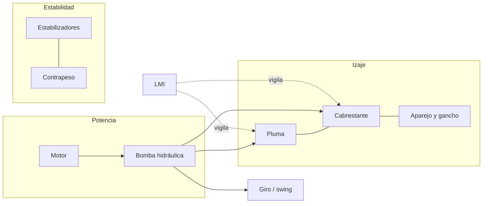
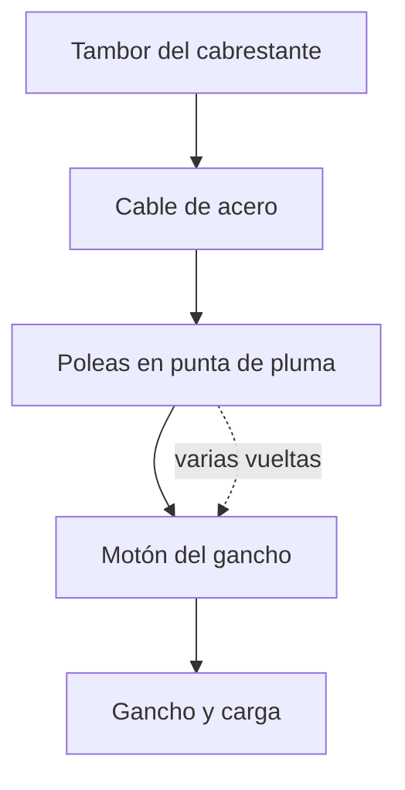
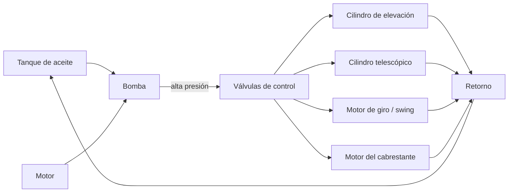

# 🔧 Sistemas mecánicos de la grúa

[🏠 Inicio](../../../README.md) · [🏗️ Curso: Grúas](../README.md) · 🔧 Sistemas mecánicos

Este módulo abre la grúa por dentro y es el corazón del curso. Explica la
mecánica del izaje: cómo se sostiene la carga, como se mantiene la estabilidad y
por  qué existe un límite de peso para cada posición. Es la base técnica para
entender los mandos (Módulo 4) y la física de la operación (Módulo 5).

---

## 1. 🏗️ Pluma

La pluma (boom) es el brazo que proyecta la carga en altura y alcance. Define el
radio de trabajo y, con el, la capacidad disponible.

| Tipo de pluma | Como funciona | Uso típico |
| --- | --- | --- |
| Telescópica | Secciones que se deslizan una dentro de otra por cilindros hidráulicos. | Grúas móviles, RT, sobre camión. |
| De celosía | Estructura reticulada de acero, ligera y muy rígida. | Grúas sobre orugas y de gran capacidad. |
| Articulada (knuckle) | Brazos unidos por articulaciones que se pliegan. | Grúas sobre camión para carga y descarga. |

Parámetros que la describen:

| Parámetro | Que es | Efecto |
| --- | --- | --- |
| Longitud | Extensión total de la pluma. | Más longitud da más alcance y altura, pero menos capacidad. |
| Ángulo | Inclinación respecto a la horizontal. | Más ángulo acerca la carga al eje y reduce el radio. |
| Número de secciones | Tramos telescópicos. | Definen los pasos de extensión disponibles. |
| Extensión | Cuanto se despliegan las secciones. | Aumenta el radio y reduce la capacidad. |

La relación clave: **subir el ángulo de la pluma reduce el radio**, y menor radio
significa mayor capacidad. Por eso el operador prefiere izar con la pluma lo más
empinada que permita la maniobra.

---

## 2. ⚙️ Cabrestante y cable (winch)

El cabrestante enrolla el cable de acero que sostiene el gancho. El cable pasa
por poleas en la punta de la pluma y en el motón del gancho formando el
**reeving** (enhebrado).

- **Tambor**: enrolla y desenrolla el cable; su giro sube o baja el gancho.
- **Cable**: cable de acero trenzado; se define por diámetro y carga de rotura.
- **Poleas**: reparten la carga y cambian la dirección del cable.
- **Reeving (partes de línea)**: el número de tramos de cable que sostienen el
  gancho. Con más partes de línea se levanta más peso, pero más lento.

La capacidad del sistema de cable se calcula con el **factor de seguridad**:

| Concepto | Fórmula / valor | Comentario |
| --- | --- | --- |
| Carga de rotura mínima (MBL) | Según diámetro y tipo de cable | Dato del fabricante. |
| Factor de seguridad | Típico 3.5 a 5 en izaje | Margen sobre la carga de trabajo. |
| Carga de trabajo por línea | MBL / factor de seguridad | Máximo por cada parte de línea. |
| Capacidad del aparejo | Carga por línea x partes de línea | Suma de todas las partes. |

Ejemplo: si cada línea admite 5 toneladas y el reeving usa 4 partes de línea, el
aparejo soporta hasta 20 toneladas, siempre que la grúa también lo permita según
su tabla de carga.

---

## 3. 🦿 Estabilizadores (outriggers)

Los estabilizadores son brazos que se extienden lateralmente y apoyan zapatas en
el suelo, ampliando la base de sustentación. Cuanto mayor es esa base, más lejos
queda el punto de vuelco y más momento resistente aporta la grúa.

| Elemento | Función |
| --- | --- |
| Brazo extensible | Aleja el punto de apoyo del eje de la grúa. |
| Zapata / plato | Reparte la carga sobre el terreno. |
| Tacos de apoyo | Aumentan el área para suelos blandos. |
| Nivel de burbuja / sensor | Confirma que la grúa está nivelada. |

Reglas básicas:

- La grúa debe quedar **nivelada**; una inclinación pequeña desplaza el centro de
  gravedad y reduce la capacidad.
- La extensión de los estabilizadores (completa, media o nula) cambia la tabla de
  carga que se debe usar.
- El terreno debe soportar la presión de la zapata; si cede, la base se pierde.

---

## 4. 📊 Tablas de carga (load chart)

La tabla de carga es el documento que indica cuanto puede izar la grúa para cada
combinación de radio, longitud de pluma y ángulo. Es la ley de la operación: si
la carga supera el valor de la tabla, la maniobra no se hace.

Ejemplo simplificado de tabla de carga (grúa de 50 t, estabilizadores extendidos):

| Radio (m) | Ángulo aprox. (grados) | Capacidad (t) | % del máximo |
| --- | --- | --- | --- |
| 3 | 78 | 50.0 | 100 |
| 5 | 72 | 38.0 | 76 |
| 8 | 64 | 24.0 | 48 |
| 12 | 54 | 14.5 | 29 |
| 16 | 44 | 9.0 | 18 |
| 20 | 32 | 5.5 | 11 |
| 24 | 18 | 3.2 | 6 |

Se lee así: a 3 metros de radio la grúa iza sus 50 toneladas nominales, pero a 20
metros solo admite 5.5 toneladas. La tabla siempre corresponde a una
configuración concreta (contrapeso, extensión de estabilizadores y largo de
pluma); cambiar cualquiera de esos datos obliga a usar otra tabla.

---

## 5. ⚖️ Momento de vuelco y estabilidad

La estabilidad de una grúa se explica con momentos, es decir, fuerza por
distancia respecto al punto de vuelco (el borde de la base de apoyo).

Las magnitudes clave:

| Magnitud | Fórmula | Significado |
| --- | --- | --- |
| Momento de vuelco | Peso de carga x radio | Empuja la grúa a volcar hacia la carga. |
| Momento resistente | (Peso grúa + contrapeso) x brazo al punto de vuelco | Se opone al vuelco. |
| Margen de estabilidad | Momento resistente - momento de vuelco | Debe ser siempre positivo. |
| Porcentaje de capacidad | Momento actual / momento máximo permitido | Lo que muestra el LMI. |

El **punto de vuelco** es la línea que une las zapatas de los estabilizadores del
lado de la carga. Mientras el momento resistente supere al momento de vuelco, la
grúa es estable. El **contrapeso** es la masa colocada en la parte trasera de la
superestructura para aumentar el momento resistente sin necesidad de una base
enorme.

El **LMI (Load Moment Indicator)** o indicador de momento de carga mide en tiempo
real el peso izado y el radio, calcula el momento y lo compara con el máximo de
la tabla. Avisa al acercarse al límite y corta los movimientos que agravan la
condición antes de llegar al vuelco.

### Por  qué al aumentar el radio baja la capacidad

El momento de vuelco es **peso por radio**. La grúa tiene un momento máximo que
puede resistir (fijado por su contrapeso y su base). Si el radio aumenta, para no
superar ese momento máximo el peso debe disminuir en proporción inversa:

- A radio 3 m un momento máximo de 150 t·m permite izar 50 t (50 x 3 = 150).
- A radio 15 m ese mismo momento de 150 t·m solo permite izar 10 t (10 x 15 = 150).

Por eso alejar la carga del eje de giro, ya sea bajando la pluma o
telescopiandola, siempre reduce cuanto peso se puede levantar.

---

## 6. 💧 Sistema hidráulico

La hidráulica es la fuerza de trabajo de la grúa moderna: mueve la pluma, el
cabrestante, los estabilizadores y el giro con control fino y gran potencia.

| Componente | Función |
| --- | --- |
| Bomba | Convierte el giro del motor en caudal de aceite a presión. |
| Válvulas de control | Dirigen el aceite al actuador que el operador acciona. |
| Cilindros | Transforman presión en movimiento lineal (elevar, telescopiar). |
| Motor de giro (swing) | Convierte presión en rotación de la superestructura. |
| Presión | Empuje disponible; a mayor presión, más fuerza de izaje. |
| Tanque y filtros | Almacenan y limpian el aceite en circuito cerrado. |

El movimiento proporcional de los joysticks regula el caudal que llega a cada
actuador, por lo que la velocidad de la pluma o del gancho depende de cuanto se
desplaza el mando.

---

## 🔁 Cómo se conecta todo

1. El **motor** mueve la **bomba** hidráulica.
2. La bomba envia aceite a presión a las **válvulas** de control.
3. Las válvulas alimentan los **cilindros** de la pluma, el **cabrestante** y el
   **motor de giro** según lo que ordena el operador.
4. Los **estabilizadores** y el **contrapeso** fijan la base y el momento resistente.
5. La **tabla de carga** define el límite de peso para cada radio y ángulo.
6. El **LMI** vigila el momento de carga y evita superar el punto de vuelco.

Con esto entendido, el [Módulo 4: Mandos](../mandos/manual-mandos-grua.md) muestra
como el operador acciona cada uno de estos sistemas.

---

[⬅️ Anterior: Características](caracteristicas-grua.md) · [➡️ Siguiente: Mandos e instrumentos](../mandos/manual-mandos-grua.md)
