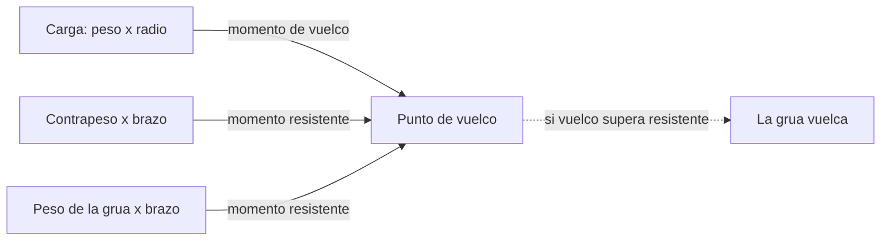
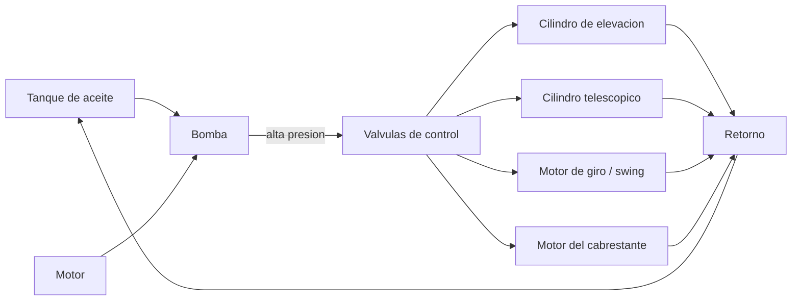

# 🔧 Sistemas mecanicos de la grua

[🏠 Inicio](../../../README.md) · [🏗️ Curso: Gruas](../README.md) · 🔧 Sistemas mecanicos

Este modulo abre la grua por dentro y es el corazon del curso. Explica la
mecanica del izaje: como se sostiene la carga, como se mantiene la estabilidad y
por que existe un limite de peso para cada posicion. Es la base tecnica para
entender los mandos (Modulo 4) y la fisica de la operacion (Modulo 5).

---

## 1. 🏗️ Pluma

La pluma (boom) es el brazo que proyecta la carga en altura y alcance. Define el
radio de trabajo y, con el, la capacidad disponible.

| Tipo de pluma | Como funciona | Uso tipico |
| --- | --- | --- |
| Telescopica | Secciones que se deslizan una dentro de otra por cilindros hidraulicos. | Gruas moviles, RT, sobre camion. |
| De celosia | Estructura reticulada de acero, ligera y muy rigida. | Gruas sobre orugas y de gran capacidad. |
| Articulada (knuckle) | Brazos unidos por articulaciones que se pliegan. | Gruas sobre camion para carga y descarga. |

Parametros que la describen:

| Parametro | Que es | Efecto |
| --- | --- | --- |
| Longitud | Extension total de la pluma. | Mas longitud da mas alcance y altura, pero menos capacidad. |
| Angulo | Inclinacion respecto a la horizontal. | Mas angulo acerca la carga al eje y reduce el radio. |
| Numero de secciones | Tramos telescopicos. | Definen los pasos de extension disponibles. |
| Extension | Cuanto se despliegan las secciones. | Aumenta el radio y reduce la capacidad. |

La relacion clave: **subir el angulo de la pluma reduce el radio**, y menor radio
significa mayor capacidad. Por eso el operador prefiere izar con la pluma lo mas
empinada que permita la maniobra.

---

## 2. ⚙️ Cabrestante y cable (winch)

El cabrestante enrolla el cable de acero que sostiene el gancho. El cable pasa
por poleas en la punta de la pluma y en el moton del gancho formando el
**reeving** (enhebrado).

- **Tambor**: enrolla y desenrolla el cable; su giro sube o baja el gancho.
- **Cable**: cable de acero trenzado; se define por diametro y carga de rotura.
- **Poleas**: reparten la carga y cambian la direccion del cable.
- **Reeving (partes de linea)**: el numero de tramos de cable que sostienen el
  gancho. Con mas partes de linea se levanta mas peso, pero mas lento.

La capacidad del sistema de cable se calcula con el **factor de seguridad**:

| Concepto | Formula / valor | Comentario |
| --- | --- | --- |
| Carga de rotura minima (MBL) | Segun diametro y tipo de cable | Dato del fabricante. |
| Factor de seguridad | Tipico 3.5 a 5 en izaje | Margen sobre la carga de trabajo. |
| Carga de trabajo por linea | MBL / factor de seguridad | Maximo por cada parte de linea. |
| Capacidad del aparejo | Carga por linea x partes de linea | Suma de todas las partes. |

Ejemplo: si cada linea admite 5 toneladas y el reeving usa 4 partes de linea, el
aparejo soporta hasta 20 toneladas, siempre que la grua tambien lo permita segun
su tabla de carga.

---

## 3. 🦿 Estabilizadores (outriggers)

Los estabilizadores son brazos que se extienden lateralmente y apoyan zapatas en
el suelo, ampliando la base de sustentacion. Cuanto mayor es esa base, mas lejos
queda el punto de vuelco y mas momento resistente aporta la grua.

| Elemento | Funcion |
| --- | --- |
| Brazo extensible | Aleja el punto de apoyo del eje de la grua. |
| Zapata / plato | Reparte la carga sobre el terreno. |
| Tacos de apoyo | Aumentan el area para suelos blandos. |
| Nivel de burbuja / sensor | Confirma que la grua esta nivelada. |

Reglas basicas:

- La grua debe quedar **nivelada**; una inclinacion pequena desplaza el centro de
  gravedad y reduce la capacidad.
- La extension de los estabilizadores (completa, media o nula) cambia la tabla de
  carga que se debe usar.
- El terreno debe soportar la presion de la zapata; si cede, la base se pierde.

---

## 4. 📊 Tablas de carga (load chart)

La tabla de carga es el documento que indica cuanto puede izar la grua para cada
combinacion de radio, longitud de pluma y angulo. Es la ley de la operacion: si
la carga supera el valor de la tabla, la maniobra no se hace.

Ejemplo simplificado de tabla de carga (grua de 50 t, estabilizadores extendidos):

| Radio (m) | Angulo aprox. (grados) | Capacidad (t) | % del maximo |
| --- | --- | --- | --- |
| 3 | 78 | 50.0 | 100 |
| 5 | 72 | 38.0 | 76 |
| 8 | 64 | 24.0 | 48 |
| 12 | 54 | 14.5 | 29 |
| 16 | 44 | 9.0 | 18 |
| 20 | 32 | 5.5 | 11 |
| 24 | 18 | 3.2 | 6 |

Se lee asi: a 3 metros de radio la grua iza sus 50 toneladas nominales, pero a 20
metros solo admite 5.5 toneladas. La tabla siempre corresponde a una
configuracion concreta (contrapeso, extension de estabilizadores y largo de
pluma); cambiar cualquiera de esos datos obliga a usar otra tabla.

---

## 5. ⚖️ Momento de vuelco y estabilidad

La estabilidad de una grua se explica con momentos, es decir, fuerza por
distancia respecto al punto de vuelco (el borde de la base de apoyo).

Las magnitudes clave:

| Magnitud | Formula | Significado |
| --- | --- | --- |
| Momento de vuelco | Peso de carga x radio | Empuja la grua a volcar hacia la carga. |
| Momento resistente | (Peso grua + contrapeso) x brazo al punto de vuelco | Se opone al vuelco. |
| Margen de estabilidad | Momento resistente - momento de vuelco | Debe ser siempre positivo. |
| Porcentaje de capacidad | Momento actual / momento maximo permitido | Lo que muestra el LMI. |

El **punto de vuelco** es la linea que une las zapatas de los estabilizadores del
lado de la carga. Mientras el momento resistente supere al momento de vuelco, la
grua es estable. El **contrapeso** es la masa colocada en la parte trasera de la
superestructura para aumentar el momento resistente sin necesidad de una base
enorme.

El **LMI (Load Moment Indicator)** o indicador de momento de carga mide en tiempo
real el peso izado y el radio, calcula el momento y lo compara con el maximo de
la tabla. Avisa al acercarse al limite y corta los movimientos que agravan la
condicion antes de llegar al vuelco.

### Por que al aumentar el radio baja la capacidad

El momento de vuelco es **peso por radio**. La grua tiene un momento maximo que
puede resistir (fijado por su contrapeso y su base). Si el radio aumenta, para no
superar ese momento maximo el peso debe disminuir en proporcion inversa:

- A radio 3 m un momento maximo de 150 t·m permite izar 50 t (50 x 3 = 150).
- A radio 15 m ese mismo momento de 150 t·m solo permite izar 10 t (10 x 15 = 150).

Por eso alejar la carga del eje de giro, ya sea bajando la pluma o
telescopiandola, siempre reduce cuanto peso se puede levantar.

---

## 6. 💧 Sistema hidraulico

La hidraulica es la fuerza de trabajo de la grua moderna: mueve la pluma, el
cabrestante, los estabilizadores y el giro con control fino y gran potencia.

| Componente | Funcion |
| --- | --- |
| Bomba | Convierte el giro del motor en caudal de aceite a presion. |
| Valvulas de control | Dirigen el aceite al actuador que el operador acciona. |
| Cilindros | Transforman presion en movimiento lineal (elevar, telescopiar). |
| Motor de giro (swing) | Convierte presion en rotacion de la superestructura. |
| Presion | Empuje disponible; a mayor presion, mas fuerza de izaje. |
| Tanque y filtros | Almacenan y limpian el aceite en circuito cerrado. |

El movimiento proporcional de los joysticks regula el caudal que llega a cada
actuador, por lo que la velocidad de la pluma o del gancho depende de cuanto se
desplaza el mando.

---

## 🔁 Como se conecta todo

1. El **motor** mueve la **bomba** hidraulica.
2. La bomba envia aceite a presion a las **valvulas** de control.
3. Las valvulas alimentan los **cilindros** de la pluma, el **cabrestante** y el
   **motor de giro** segun lo que ordena el operador.
4. Los **estabilizadores** y el **contrapeso** fijan la base y el momento resistente.
5. La **tabla de carga** define el limite de peso para cada radio y angulo.
6. El **LMI** vigila el momento de carga y evita superar el punto de vuelco.

Con esto entendido, el [Modulo 4: Mandos](../mandos/manual-mandos-grua.md) muestra
como el operador acciona cada uno de estos sistemas.

---

[⬅️ Anterior: Caracteristicas](caracteristicas-grua.md) · [➡️ Siguiente: Mandos e instrumentos](../mandos/manual-mandos-grua.md)
