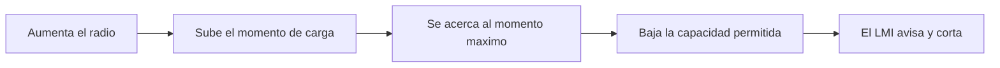

# 🧰 Recursos de la grua

[🏠 Inicio](../../../README.md) · [🏗️ Curso: Gruas](../README.md) · 🧰 Recursos

Glosario especifico, enlaces y diagramas de apoyo del curso de gruas. Amplia el
[glosario general](../../../docs/05-glosario-general.md).

---

## 📖 Glosario especifico

| Termino | Definicion |
| --- | --- |
| Momento de carga | Producto del peso por el radio; mide el efecto de vuelco. |
| Radio de trabajo | Distancia horizontal del eje de giro al gancho. |
| LMI | Indicador de momento de carga; vigila el limite y corta movimientos. |
| Tabla de carga | Documento que define la capacidad segun radio, angulo y longitud. |
| Reeving | Enhebrado del cable por las poleas; sus partes de linea reparten la carga. |
| Outrigger | Estabilizador extensible que amplia la base de apoyo. |
| Contrapeso | Masa trasera que equilibra el momento de la carga. |
| Cuadrante de trabajo | Sector de giro donde la capacidad puede variar. |
| Pluma telescopica | Pluma de secciones que se extienden por cilindros hidraulicos. |
| Swing | Giro de la superestructura sobre el eje de la grua. |
| Momento resistente | Momento que se opone al vuelco, dado por peso y contrapeso. |
| Factor de seguridad | Margen entre la carga de rotura del cable y la de trabajo. |

---

## 🗺️ Diagrama de la relacion radio-capacidad

---

## 🔗 Enlaces y fuentes

- Marco legal: [⚖️ docs/07-marco-legal-chile.md](../../../docs/07-marco-legal-chile.md)
- Registro de fuentes: [📚 manuales/fuentes.md](../../../manuales/fuentes.md)
- Manuales del fabricante y tablas de carga oficiales: ver el registro de fuentes.

Registrar cada recurso nuevo con su origen y licencia, siguiendo
[`recursos/README.md`](../../../recursos/README.md).

---

[🎓 Portada del curso](../README.md) · [⬅️ Anterior: Diseno de simulacion](../simulacion/diseno-simulador-grua.md)
