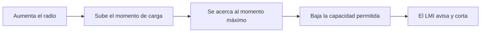

# 🧰 Recursos de la grúa

[🏠 Inicio](../../../README.md) · [🏗️ Curso: Grúas](../README.md) · 🧰 Recursos

Glosario específico, enlaces y diagramas de apoyo del curso de grúas. Amplia el
[glosario general](../../../docs/05-glosario-general.md).

---

## 📖 Glosario específico

| Término | Definición |
| --- | --- |
| Momento de carga | Producto del peso por el radio; mide el efecto de vuelco. |
| Radio de trabajo | Distancia horizontal del eje de giro al gancho. |
| LMI | Indicador de momento de carga; vigila el límite y corta movimientos. |
| Tabla de carga | Documento que define la capacidad según radio, ángulo y longitud. |
| Reeving | Enhebrado del cable por las poleas; sus partes de línea reparten la carga. |
| Outrigger | Estabilizador extensible que amplia la base de apoyo. |
| Contrapeso | Masa trasera que equilibra el momento de la carga. |
| Cuadrante de trabajo | Sector de giro donde la capacidad puede variar. |
| Pluma telescópica | Pluma de secciones que se extienden por cilindros hidráulicos. |
| Swing | Giro de la superestructura sobre el eje de la grúa. |
| Momento resistente | Momento que se opone al vuelco, dado por peso y contrapeso. |
| Factor de seguridad | Margen entre la carga de rotura del cable y la de trabajo. |

---

## 🗺️ Diagrama de la relación radio-capacidad

```mermaid
flowchart LR
    Radio[Aumenta el radio] --> Momento[Sube el momento de carga]
    Momento --> Limite[Se acerca al momento máximo]
    Limite --> Capacidad[Baja la capacidad permitida]
    Capacidad --> LMI[El LMI avisa y corta]
```

---

## 🔗 Enlaces y fuentes

- Marco legal: [⚖️ docs/07-marco-legal-chile.md](../../../docs/07-marco-legal-chile.md)
- Registro de fuentes: [📚 manuales/fuentes.md](../../../manuales/fuentes.md)
- Manuales del fabricante y tablas de carga oficiales: ver el registro de fuentes.

Registrar cada recurso nuevo con su origen y licencia, siguiendo
[`recursos/README.md`](../../../recursos/README.md).

## 🎓 Cierre de clase

- **Actividad:** Selecciona términos de glosario, esquemas y trazabilidad de fuentes, explícalos en contexto de Grúas y verifica la procedencia de las fuentes utilizadas.
- **Evidencia:** Glosario aplicado y ficha breve de trazabilidad.
- **Criterio de aprobación:** Los términos permiten interpretar el curso y las fuentes se distinguen por autoridad, alcance y vigencia.
- **Transferencia:** explica qué cambiaría al pasar a otra variante de esta máquina.

### Fuentes de esta clase

- [OSHA-CRANES](https://www.osha.gov/cranes-derricks): Crane, Derrick and Hoist Safety, OSHA. Uso: izaje, riesgos y controles.
- [CL-LEY-18290](https://www.bcn.cl/leychile/navegar?idNorma=29708): Ley de Tránsito 18.290, BCN Chile. Uso: marco legal chileno.

> Las fuentes sostienen el marco conceptual y normativo; esta clase no reemplaza el manual
> del fabricante, la formación certificada ni la habilitación exigida para operar equipos reales.

---

[🎓 Portada del curso](../README.md) · [⬅️ Anterior: Diseño de simulación](../simulacion/diseno-simulador-grua.md) · [➡️ Siguiente: Ejercicios](../ejercicios/ejercicios-grua.md)
